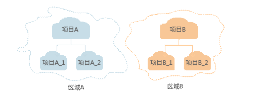

# 使用前必读

## 概述

视频直播服务（Live）是在华为云提供的可信，开放，全球服务直播内容接入与分发网络的基础上，将华为公司在视频领域的多年技术积累和电信级运营和运维能力开放出来，构建了便捷接入、高清流畅、低延迟、高并发的一站式视频直播解决方案。

您可以使用本文档提供API对视频直播进行相关操作，如视频直播流的转码、管理、录制等。支持的全部操作请参见[API概览](API概览.md)。

在调用视频直播API之前，请确保已经充分了解视频直播相关概念，详细信息请参见[产品介绍](https://support.huaweicloud.com/productdesc-live/live030001.html)。

当前视频直播服务仅支持通过控制台对域名进行管理，可创建、查询、修改和删除直播域名。具体操作请参见《用户指南》中的[配置直播域名](https://support.huaweicloud.com/usermanual-live/live010002.html)。

当前视频直播服务仅支持通过控制台配置直播消息通知，使用消息通知服务对直播推流开始时间、直播推流结束时间、直播审核状态等进行实时通知，如需使用该功能，需要先配置消息通知服务。具体操作请参见《用户指南》中的[配置直播消息通知](https://support.huaweicloud.com/usermanual-live/live010004.html)。

当前视频直播服务仅支持通过控制台配置直播播放的Refer防盗链、Key防盗链和IP黑名单，对访问者的身份进行识别和过滤，符合规则的可以顺利播放直播资源，具体操作请参见《用户指南》中的[配置直播鉴权](https://support.huaweicloud.com/usermanual-live/live01000300.html)。

## 调用说明

视频直播服务提供了REST（Representational State Transfer）风格API，支持您通过HTTPS请求调用，调用方法请参见[如何调用API](https://support.huaweicloud.com/api-live/topic_live_04_overview_100003.html)。

## 终端节点

终端节点即调用API的请求地址，视频直播部署时区分物理区域，为项目级服务。不同服务不同区域的终端节点不同，视频直播的终端节点如[表1](#table279809812)所示。您也可以从[地区和终端节点](https://developer.huaweicloud.com/endpoint?Live)中查询服务的终端节点。

**表 1**  视频直播的终端节点

<table><thead align="left"><tr id="row1579916919116"><th class="cellrowborder" valign="top" width="33.33333333333333%" id="mcps1.2.4.1.1">
区域名称

</th>
<th class="cellrowborder" valign="top" width="33.33333333333333%" id="mcps1.2.4.1.2">
区域

</th>
<th class="cellrowborder" valign="top" width="33.33333333333333%" id="mcps1.2.4.1.3">
终端节点（Endpoint）

</th>
</tr>
</thead>
<tbody><tr id="row148003914110"><td class="cellrowborder" valign="top" width="33.33333333333333%" headers="mcps1.2.4.1.1 ">
华北-北京一

</td>
<td class="cellrowborder" valign="top" width="33.33333333333333%" headers="mcps1.2.4.1.2 ">
cn-north-1

</td>
<td class="cellrowborder" valign="top" width="33.33333333333333%" headers="mcps1.2.4.1.3 ">
live.cn-north-1.myhuaweicloud.com

</td>
</tr>
<tr id="row12893172614473"><td class="cellrowborder" valign="top" width="33.33333333333333%" headers="mcps1.2.4.1.1 ">
华北-北京四

</td>
<td class="cellrowborder" valign="top" width="33.33333333333333%" headers="mcps1.2.4.1.2 ">
cn-north-4

</td>
<td class="cellrowborder" valign="top" width="33.33333333333333%" headers="mcps1.2.4.1.3 ">
live.cn-north-4.myhuaweicloud.com

</td>
</tr>
</tbody>
</table>

## 约束限制

目前视频直播暂只支持创建1个应用，即“AppName”默认为“live”，若您需要自定义AppName，请先[提交工单](https://console.huaweicloud.com/ticket/?#/ticketindex/business?productTypeId=ffb4ebf5fb094bc6aef0129c276ce42e)申请。

## 基本概念

-   账号

    用户注册时的账号，账号对其所拥有的资源及云服务具有完全的访问权限，可以重置用户密码、分配用户权限等。由于账号是付费主体，为了确保账号安全，建议您不要直接使用账号进行日常管理工作，而是创建用户并使用创建的用户进行日常管理工作。

-   用户

    由账号在IAM中创建的用户，是云服务的使用人员，具有身份凭证（密码和访问密钥）。

    在[我的凭证](https://console.huaweicloud.com/iam/#/myCredential)下，您可以查看账号ID和用户ID。通常在调用API的鉴权过程中，您需要用到账号、用户和密码等信息。

-   区域

    指云资源所在的物理位置，同一区域内可用区间内网互通，不同区域间内网不互通。通过在不同地区创建云资源，可以将应用程序设计的更接近特定客户的要求，或满足不同地区的法律或其他要求。

-   可用区

    一个可用区是一个或多个物理数据中心的集合，有独立的风火水电，AZ内逻辑上再将计算、网络、存储等资源划分成多个集群。一个Region中的多个AZ间通过高速光纤相连，以满足用户跨AZ构建高可用性系统的需求。

-   项目

    区域默认对应一个项目，这个项目由系统预置，用来隔离物理区域间的资源（计算资源、存储资源和网络资源），以默认项目为单位进行授权，用户可以访问您账号中该区域的所有资源。如果您希望进行更加精细的权限控制，可以在区域默认的项目中创建子项目，并在子项目中购买资源，然后以子项目为单位进行授权，使得用户仅能访问特定子项目中资源，使得资源的权限控制更加精确。

    **图 1**  项目隔离模型  
    

