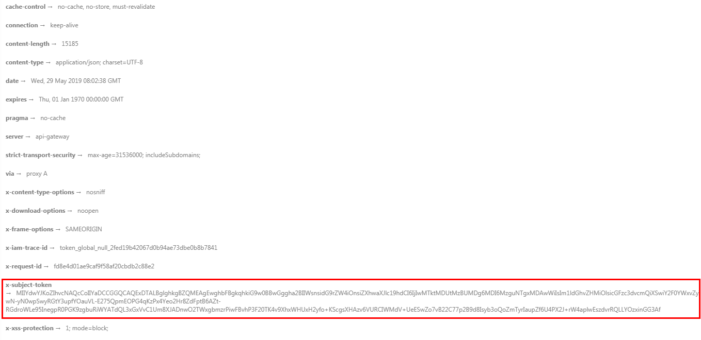

# 示例3：禁止直播推流<a name="live_03_0045"></a>

## 场景描述<a name="section5550124610275"></a>

若您发现您直播业务中存在直播内容不合法或推流地址被非法盗用，您可以调用直播API对直播流进行禁止推流操作，从而保障直播资源的安全。

本章节指导用户如何使用API调用的方式禁推某个直播流。

## 前提条件<a name="section1535328172818"></a>

-   已明确需要被禁推的推流域名所在区域信息，并获取该区域的Endpoint，您可以从[地区和终端节点](https://developer.huaweicloud.com/endpoint?Live)获取。
-   已获取需要被禁推的推流域名所在区域的项目ID，具体获取方法请参见[获取项目ID](获取项目ID.md)。

## 总体流程<a name="section1753716933710"></a>

-   [获取需要被禁推的直播流信息](#li740434110321)
-   [禁止直播推流](#li5605136502)
-   [查询禁止直播推流列表](#li12944123314538)

## 操作步骤<a name="section6562835174311"></a>

1.  <a name="li740434110321"></a>登录视频直播控制台，在“直播管理 \> 直播流管理”中获取需要被禁推的直播流信息，包含推流域名、AppName和StreamName。
2.  <a name="li96031314153313"></a>[获取用户Token](https://support.huaweicloud.com/api-iam/iam_30_0001.html)，用于调用直播接口时进行认证鉴权。

    详细信息请参见[构造请求](构造请求.md)。以“华北-北京四”为示例，若您需要调用其它区域的直播接口，请替换成对应区域的[IAM终端节点](https://developer.huaweicloud.com/endpoint?IAM)。

    ```
    POST https://iam.cn-north-4.myhuaweicloud.com/v3/auth/tokens
    Content-Type: application/json
    {
      "auth": {
        "identity": {
          "methods": [
            "password"
          ],
          "password": {
            "user": {
              "name": "username", 
              "password": "password", 
              "domain": {
                "name": "domainname" 
              }
            }
          }
        },
        "scope": {
          "project": {
             "name": "projectname"      
     }
        }
      }
    }
    ```

    如[图1](#live_03_0026_fig955023251511)所示，红框中的信息为获取用户Token。

    **图 1**  获取用户Token<a name="live_03_0026_fig955023251511"></a>  
    

3.  <a name="li5605136502"></a>调用[禁止直播推流](https://support.huaweicloud.com/api-live/live_03_0010.html)接口，配置禁推参数。
    1.  选择POST请求方法并输入URI。

        ```
        https://{endpoint}/v1/{project_id}/stream/blocks
        ```

    2.  请求消息头中增加“X-Auth-Token”，值设置为[步骤2](#li96031314153313)中获取的用户Token。
    3.  Request Body中传入参数如下：

        ```
        {
          "domain" : "publish.example.huawei.com",
          "app_name" : "live",
          "stream_name" : "huawei",
          "resume_time" : "2020-05-19T21:10:15Z"
        }
        ```

        其中“resume\_time“为恢复流时间，格式：yyyy-mm-ddThh:mm:ssZ，UTC时间，不指定则永久禁推。

    4.  请求响应成功后，无返回参数，返回状态码204。

4.  <a name="li12944123314538"></a>调用[查询禁止直播推流列表](https://support.huaweicloud.com/api-live/topic_retrieveStreamForbidden.html)接口，查看刚被禁推的直播流是否在禁止推流列表中。
    1.  选择GET请求方法并输入URI。

        ```
        https://{endpoint}/v1/{project_id}/stream/blocks?domain=publish.example.huawei.com&app_name=live&stream_name=huawei
        ```

    2.  请求消息头中增加“X-Auth-Token”，值设置为[步骤2](#li96031314153313)中获取的用户Token。
    3.  请求响应成功后，返回查询的直播流禁推信息：

        ```
        {
          "total" : 1,
          "blocks" : [ {
            "app_name" : "live",
            "stream_name" : "huawei",
            "resume_time" : "2020-05-19T21:10:15Z"
          }
        ]
        }
        ```


