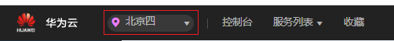
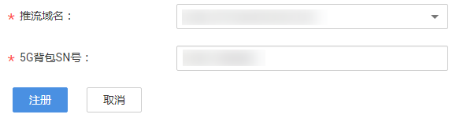

# 5G背包设置

直播服务支持通过SN号实现5G直播背包与推流域名的关联，从而实现超高清视频的高带宽、低延时、高可靠直播需求。

## 注意事项

5G背包设置功能暂只支持“华北-北京四”区域。

## 前提条件

-   已购买5G直播背包，暂只支持高骏5G背包。
-   已完成[推流域名](添加域名.md)配置。

## 操作步骤

1.  登录[视频直播控制台](https://console.huaweicloud.com/live)。

    云导播台功能暂只支持“华北-北京四“区域，请在控制台左上角确认区域。

    **图 1**  切换区域  
    

2.  在左侧导航树中选择“云导播台 \> 5G背包设置”，进入5G背包设置页面。
3.  单击“注册5G背包”，进入注册5G背包页面。
4.  选择需要关联的推流域名并输入5G背包的SN号。

    **图 2**  5G背包设置  
    

5.  单击“注册”，完成5G背包与推流域名的关联。

    5G背包注册后，您可以将5G背包作为推流设备，然后在导播台中将关联的推流域名地址加入通道，作为导播台的输入源。

