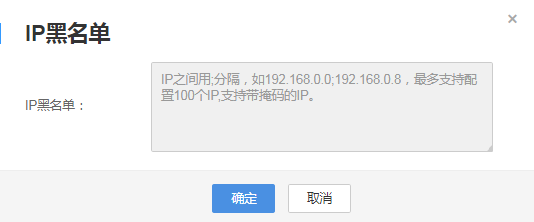

# IP黑名单

您可以将不允许播放的IP地址添加到IP黑名单中，禁止黑名单中的IP地址使用直播加速服务进行播放。

## 配置方法

1.  登录[视频直播控制台](https://console.huaweicloud.com/live)。
2.  在左侧导航树中选择“域名管理“，进入域名管理页面。
3.  在需要配置鉴权信息的播放域名行右侧单击“管理“。
4.  在左侧导航树中选择“基本配置 \> 鉴权配置 \> IP黑名单“，弹出IP黑名单配置界面。

    请按照页面提示输入禁止访问播放域名的具体IP地址。您也可以通过输入IP网段添加黑名单。

    **图 1**  配置IP黑名单  
    

5.  配置完成后，单击“确定“。

