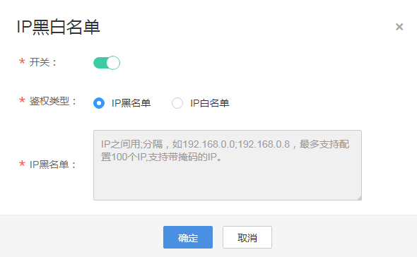

# IP黑白名单

您可以将禁止或允许播放的IP地址添加到IP黑白名单中，CDN会根据名单对播放请求者的IP进行识别和过滤，允许或拒绝播放请求。

## 注意事项

-   该功能为可选项，默认不启用。
-   IP黑名单与IP白名单互斥，不支持同时设置。
-   黑名单或白名单中的IP最多支持配置100个。

## 前提条件

-   已[添加推流域名和播放域名](添加域名.md)，且已完成[域名关联](关联域名.md)。
-   已在域名DNS服务商处完成[CNAME解析配置](配置CNAME.md)。

## 操作步骤

1.  登录[视频直播控制台](https://console.huaweicloud.com/live)。
2.  在左侧导航树中选择“域名管理“，进入域名管理页面。
3.  在需要配置鉴权信息的播放域名行单击“管理“。
4.  在左侧导航树中选择“基本配置 \> 鉴权配置“。
5.  选择“IP黑白名单“，弹出“IP黑白名单”对话框。
6.  单击“开关”，配置IP黑白名单，如[图1](#live01000303_fig1229631411313)所示。

    **图 1**  配置IP黑白名单  
    

7.  根据“鉴权类型”输入禁止或允许访问的播放域名IP地址，您也可以通过输入IP网段添加黑白名单。
8.  配置完成后，单击“确定“。

