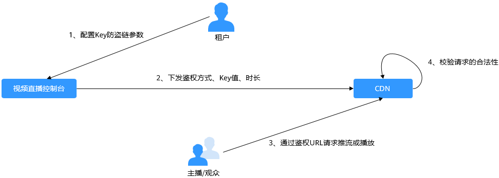

# Key防盗链<a name="live_01_0049"></a>

为保障直播资源不被非法盗用，您可以使用直播的Key防盗链功能，在原始推流或播放地址末尾加上鉴权信息。在主播请求直播推流或观众请求播放时，CDN会对其URL带的加密信息进行合法性判断，仅校验通过的请求会予以响应，其它非法的访问将予以拒绝。

## 工作原理<a name="section762512381161"></a>

**图 1**  Key防盗链工作原理<a name="fig139571941829"></a>  


流程说明如下所示：

1.  租户在直播控制台开启Key防盗链功能，并配置计算鉴权串的方式、Key值和时长。
2.  直播服务将租户配置Key值和时长下发到CDN节点中。
3.  主播/观众通过租户提供的鉴权推流/播放URL向CDN请求推流或播放。
4.  CDN根据推流或播放URL中携带的鉴权信息校验请求的合法性，仅校验通过的请求会被允许。

## 注意事项<a name="section257818139314"></a>

-   该功能为可选项，默认不启用。
-   启用该功能后，原始直播加速URL将无法使用，需要按规则生成合法的防盗链URL。
-   若防盗链URL过期，或者签名不能通过，直播流将播放失败，并返回“403 Forbidden”信息。

## 开启Key防盗链<a name="section176718241440"></a>

1.  登录[视频直播控制台](https://console.huaweicloud.com/live)。
2.  在左侧导航树中选择“域名管理“，进入域名管理页面。
3.  在需要配置鉴权信息的域名行右侧单击“管理“。
4.  在左侧导航树中选择“基础配置 \> 鉴权配置 \> Key防盗链“。在弹出的页面中打开“开关”，并配置Key防盗链参数。

    **图 2**  配置Key防盗链<a name="fig987364825218"></a>  
    

    -   **类型**：计算鉴权串的方式，可选为：方式A、方式B或方式C。
    -   **Key**：鉴权key值，支持自定义设置，由16位的字母和数字组成。
    -   **时长**：URL鉴权信息的超时时长，指的是鉴权信息中携带的请求时间与直播服务收到请求时的时间的最大差值，用于检查直播推流URL或者直播播放URL是否已过期，单位：秒，范围限制：1分钟-30天。

5.  配置完成后，单击“确定“。
6.  根据选择的鉴权方式获取对应的鉴权地址。

    各鉴权方式的对应鉴权地址生成方法请分别参见[鉴权方式A](#section13701955203212)、[鉴权方式B](#section934895818335)和[鉴权方式C](#section175641738343)。

7.  验证防盗链功能。

    使用[视频云APP](https://support.huaweicloud.com/sdkdemo-live/live_09_0001.html)，通过鉴权推流地址和播放地址进行验证，若原始推流地址和播放地址无法成功推流和播放，使用鉴权推流地址和播放地址能成功推流和播放，则表示Key防盗链生效。


## 鉴权方式A<a name="section13701955203212"></a>

鉴权方式A主要通过Key、timestamp、rand（随机数）、uid（设置为0）和URL计算鉴权串。

**鉴权URL格式**

```
原始URL?auth_key={timestamp}-{rand}-{uid}-{md5hash}
```

**md5hash**的计算公式：

```
sstring = "{URI}-{Timestamp}-{rand}-{uid}-{Key}"
HashValue = md5sum(sstring)
```

**表 1**  鉴权字段描述

<a name="table1451161195010"></a>
<table><thead align="left"><tr id="row124516114503"><th class="cellrowborder" valign="top" width="30.709999999999997%" id="mcps1.2.3.1.1"><p id="p1945111165015"><a name="p1945111165015"></a><a name="p1945111165015"></a>字段</p>
</th>
<th class="cellrowborder" valign="top" width="69.28999999999999%" id="mcps1.2.3.1.2"><p id="p12451131155017"><a name="p12451131155017"></a><a name="p12451131155017"></a>描述</p>
</th>
</tr>
</thead>
<tbody><tr id="row1845118113507"><td class="cellrowborder" valign="top" width="30.709999999999997%" headers="mcps1.2.3.1.1 "><p id="p07401351104"><a name="p07401351104"></a><a name="p07401351104"></a>timestamp</p>
</td>
<td class="cellrowborder" valign="top" width="69.28999999999999%" headers="mcps1.2.3.1.2 "><p id="p6740935101019"><a name="p6740935101019"></a><a name="p6740935101019"></a><span>用户定义的有效访问时间起始点，值为1970年1月1日以来的当前时间秒数 。十进制或者十六进制整数。</span></p>
<p id="p1517857125519"><a name="p1517857125519"></a><a name="p1517857125519"></a>示例：1592639100（即2020-06-20 15:45）</p>
</td>
</tr>
<tr id="row7451141116502"><td class="cellrowborder" valign="top" width="30.709999999999997%" headers="mcps1.2.3.1.1 "><p id="p4273179133514"><a name="p4273179133514"></a><a name="p4273179133514"></a>有效时间</p>
</td>
<td class="cellrowborder" valign="top" width="69.28999999999999%" headers="mcps1.2.3.1.2 "><p id="p5509037103515"><a name="p5509037103515"></a><a name="p5509037103515"></a>鉴权有效的时间长度。</p>
<p id="p65094371351"><a name="p65094371351"></a><a name="p65094371351"></a>若设置的有效时间为1800s，则用户可在从timestamp开始的1800s内允许访问直播地址。超出该区间，鉴权失败。</p>
<p id="p914513487250"><a name="p914513487250"></a><a name="p914513487250"></a>示例：若设置的访问时间为2020-6-30 00：00：00，则链接真正失效时间为2020-6-30 00：30：00。</p>
</td>
</tr>
<tr id="row3451141112502"><td class="cellrowborder" valign="top" width="30.709999999999997%" headers="mcps1.2.3.1.1 "><p id="p1774083571010"><a name="p1774083571010"></a><a name="p1774083571010"></a>rand</p>
</td>
<td class="cellrowborder" valign="top" width="69.28999999999999%" headers="mcps1.2.3.1.2 "><p id="p5591518174519"><a name="p5591518174519"></a><a name="p5591518174519"></a>随机数，建议使用UUID，不能包含中划线"-"。</p>
<p id="p16398819112"><a name="p16398819112"></a><a name="p16398819112"></a>示例：477b3bbc253f467b8def6711128c7bec</p>
</td>
</tr>
<tr id="row10203226105"><td class="cellrowborder" valign="top" width="30.709999999999997%" headers="mcps1.2.3.1.1 "><p id="p774003510109"><a name="p774003510109"></a><a name="p774003510109"></a>uid</p>
</td>
<td class="cellrowborder" valign="top" width="69.28999999999999%" headers="mcps1.2.3.1.2 "><p id="p374015353100"><a name="p374015353100"></a><a name="p374015353100"></a><span>userID</span>。暂未使用，直接设置成0即可。</p>
</td>
</tr>
<tr id="row1820318271013"><td class="cellrowborder" valign="top" width="30.709999999999997%" headers="mcps1.2.3.1.1 "><p id="p1374033512102"><a name="p1374033512102"></a><a name="p1374033512102"></a>md5hash</p>
</td>
<td class="cellrowborder" valign="top" width="69.28999999999999%" headers="mcps1.2.3.1.2 "><p id="p8740113512102"><a name="p8740113512102"></a><a name="p8740113512102"></a><span>通过md5算法计算出来的验证串，数字0-9和小写英文字母a-z混合组成，固定长度32。</span></p>
<pre class="screen" id="screen3948530135716"><a name="screen3948530135716"></a><a name="screen3948530135716"></a>sstring = "{URI}-{Timestamp}-{rand}-{uid}-{Key}"
HashValue = md5sum(sstring)</pre>
</td>
</tr>
<tr id="row135955132303"><td class="cellrowborder" valign="top" width="30.709999999999997%" headers="mcps1.2.3.1.1 "><p id="p12431624183011"><a name="p12431624183011"></a><a name="p12431624183011"></a>URI</p>
</td>
<td class="cellrowborder" valign="top" width="69.28999999999999%" headers="mcps1.2.3.1.2 "><p id="p44311024173019"><a name="p44311024173019"></a><a name="p44311024173019"></a>指原始URL中从域名后开始到最后的路径。</p>
<p id="p119565223547"><a name="p119565223547"></a><a name="p119565223547"></a>示例：/livetest/huawei1</p>
</td>
</tr>
<tr id="row183971133144612"><td class="cellrowborder" valign="top" width="30.709999999999997%" headers="mcps1.2.3.1.1 "><p id="p1839714334461"><a name="p1839714334461"></a><a name="p1839714334461"></a>Key</p>
</td>
<td class="cellrowborder" valign="top" width="69.28999999999999%" headers="mcps1.2.3.1.2 "><p id="p1633544795115"><a name="p1633544795115"></a><a name="p1633544795115"></a>在控制台设置的防盗链Key值，具体请参见<a href="Key防盗链.md#section176718241440">开启Key防盗链</a>。</p>
</td>
</tr>
</tbody>
</table>

**鉴权URL示例**

以生成播放鉴权地址为例，推流鉴权地址的生成与播放鉴权地址的生成方法相同。

```
原始URL：rtmp://test-play.example.com/livetest/huawei1
timestamp：1592639100
有效时间：1800s
Key：myPrivateKey
rand：477b3bbc253f467b8def6711128c7bec
uid：0
```

根据计算公式，得到**md5hash**。

```
HashValue = md5sum("/livetest/huawei1-1592639100-477b3bbc253f467b8def6711128c7bec-0-myPrivateKey") = e54b26f57a0e73b366de9bca79bcb628
```

则鉴权播放地址为：

```
rtmp://test-play.example.com/livetest/huawei1?auth_key=1592639100-477b3bbc253f467b8def6711128c7bec-0-e54b26f57a0e73b366de9bca79bcb628
```

## 鉴权方式B<a name="section934895818335"></a>

鉴权方式B主要通过Key、timestamp和StreamName计算鉴权串。

**鉴权URL格式**

```
原始URL?txSecret=md5(Key + StreamName + txTime)&txTime=hex(timestamp)
```

**表 2**  鉴权字段描述

<a name="table192021126107"></a>
<table><thead align="left"><tr id="row18203142151020"><th class="cellrowborder" valign="top" width="30.709999999999997%" id="mcps1.2.3.1.1"><p id="p172031211108"><a name="p172031211108"></a><a name="p172031211108"></a>字段</p>
</th>
<th class="cellrowborder" valign="top" width="69.28999999999999%" id="mcps1.2.3.1.2"><p id="p72031727104"><a name="p72031727104"></a><a name="p72031727104"></a>描述</p>
</th>
</tr>
</thead>
<tbody><tr id="row281614213185"><td class="cellrowborder" valign="top" width="30.709999999999997%" headers="mcps1.2.3.1.1 "><p id="p11186121115014"><a name="p11186121115014"></a><a name="p11186121115014"></a>txTime</p>
</td>
<td class="cellrowborder" valign="top" width="69.28999999999999%" headers="mcps1.2.3.1.2 "><p id="p1718615219504"><a name="p1718615219504"></a><a name="p1718615219504"></a>播放URL的有效时间，为Unix时间戳的十六进制结果。</p>
<p id="p6186192112509"><a name="p6186192112509"></a><a name="p6186192112509"></a>如果当前txTime的值大于当前请求的时间则可以正常播放，否则播放会被后台拒绝。</p>
<p id="p158921437143312"><a name="p158921437143312"></a><a name="p158921437143312"></a>示例：5eed5888（即2020.06.20 08:30:00）</p>
</td>
</tr>
<tr id="row920312241012"><td class="cellrowborder" valign="top" width="30.709999999999997%" headers="mcps1.2.3.1.1 "><p id="p018602119507"><a name="p018602119507"></a><a name="p018602119507"></a>Key</p>
</td>
<td class="cellrowborder" valign="top" width="69.28999999999999%" headers="mcps1.2.3.1.2 "><p id="p918682195014"><a name="p918682195014"></a><a name="p918682195014"></a>在控制台设置的防盗链Key值，具体请参见<a href="Key防盗链.md#section176718241440">开启Key防盗链</a>。</p>
</td>
</tr>
<tr id="row182723919356"><td class="cellrowborder" valign="top" width="30.709999999999997%" headers="mcps1.2.3.1.1 "><p id="p11861321205017"><a name="p11861321205017"></a><a name="p11861321205017"></a>txSecret</p>
</td>
<td class="cellrowborder" valign="top" width="69.28999999999999%" headers="mcps1.2.3.1.2 "><p id="p418613218506"><a name="p418613218506"></a><a name="p418613218506"></a>URL中的加密参数。</p>
<p id="p41866210506"><a name="p41866210506"></a><a name="p41866210506"></a>通过将key，StreamName，txTime依次拼接的字符串进行MD5加密算法得出。</p>
<pre class="screen" id="screen1613419558538"><a name="screen1613419558538"></a><a name="screen1613419558538"></a>txSecret = md5（Key + StreamName + txTime）</pre>
</td>
</tr>
<tr id="row22035251016"><td class="cellrowborder" valign="top" width="30.709999999999997%" headers="mcps1.2.3.1.1 "><p id="p7186321115012"><a name="p7186321115012"></a><a name="p7186321115012"></a>有效时间</p>
</td>
<td class="cellrowborder" valign="top" width="69.28999999999999%" headers="mcps1.2.3.1.2 "><p id="p218632113505"><a name="p218632113505"></a><a name="p218632113505"></a>鉴权URL的有效时间长度。</p>
<p id="p11186142175016"><a name="p11186142175016"></a><a name="p11186142175016"></a>若<strong id="b19819174513382"><a name="b19819174513382"></a><a name="b19819174513382"></a>txTime</strong>设置为当前时间，有效时间设置为1249s，则播放URL过期时间为当前时间+ 1249s。</p>
</td>
</tr>
</tbody>
</table>

**鉴权URL示例**

以生成播放鉴权地址为例，推流鉴权地址的生成与播放鉴权地址的生成同理。

```
原始URL：rtmp://test-play.example.com/livetest/huawei1
Key：myPrivateKey
StreamName：huawei1
txTime：5eed5888
有效时间：12495s
```

根据计算公式，得到**txSecret**。

```
txSecret = md5(myPrivateKeyhuawei15eed5888) = e1af59dafe93ac86b9e01645f0ffea75
```

则鉴权播放地址为：

```
rtmp://test-play.example.com/livetest/huawei1?txSecret=e1af59dafe93ac86b9e01645f0ffea75&txTime=5eed5888
```

## 鉴权方式C<a name="section175641738343"></a>

鉴权方式C主要通过Key、Timestamp、AppName、StreamName和CheckLevel计算鉴权串。

**鉴权URL格式**

```
原始URL?auth_info=加密串.EncodedIV
```

鉴权字段的生成算法如下所示，具体代码示例请参考[代码示例](#section3911050145912)。

-   **LiveID **= <AppName\>+"/"+<StreamName\>
-   **加密串**  = UrlEncode\(Base64\(AES128\(<Key\>,"$"+<Timestamp\>+"$"+<LiveID\>+"$"+<CheckLevel\>\)\)\)
-   **EncodedIV **= Hex\(加密使用的IV\)

算法中各加密参数说明如[表3](#table1447654611349)所示。

**表 3**  加密参数说明

<a name="table1447654611349"></a>
<table><thead align="left"><tr id="row114761146133414"><th class="cellrowborder" valign="top" width="25.1%" id="mcps1.2.3.1.1"><p id="p204767461345"><a name="p204767461345"></a><a name="p204767461345"></a>参数</p>
</th>
<th class="cellrowborder" valign="top" width="74.9%" id="mcps1.2.3.1.2"><p id="p14771946173416"><a name="p14771946173416"></a><a name="p14771946173416"></a>参数说明</p>
</th>
</tr>
</thead>
<tbody><tr id="row3477946133413"><td class="cellrowborder" valign="top" width="25.1%" headers="mcps1.2.3.1.1 "><p id="p20477154633417"><a name="p20477154633417"></a><a name="p20477154633417"></a>AppName</p>
</td>
<td class="cellrowborder" valign="top" width="74.9%" headers="mcps1.2.3.1.2 "><p id="p14771446183417"><a name="p14771446183417"></a><a name="p14771446183417"></a>应用名称，与推流或播放地址中的AppName一致。</p>
</td>
</tr>
<tr id="row6477124623411"><td class="cellrowborder" valign="top" width="25.1%" headers="mcps1.2.3.1.1 "><p id="p447715462342"><a name="p447715462342"></a><a name="p447715462342"></a>StreamName</p>
</td>
<td class="cellrowborder" valign="top" width="74.9%" headers="mcps1.2.3.1.2 "><p id="p947714467344"><a name="p947714467344"></a><a name="p947714467344"></a>流名称，与推流或播放地址中的StreamName一致。</p>
</td>
</tr>
<tr id="row8477124693410"><td class="cellrowborder" valign="top" width="25.1%" headers="mcps1.2.3.1.1 "><p id="p12477104620348"><a name="p12477104620348"></a><a name="p12477104620348"></a>Key</p>
</td>
<td class="cellrowborder" valign="top" width="74.9%" headers="mcps1.2.3.1.2 "><p id="p226917617442"><a name="p226917617442"></a><a name="p226917617442"></a>在控制台设置的防盗链Key值，具体请参见<a href="Key防盗链.md#section176718241440">开启Key防盗链</a>。</p>
</td>
</tr>
<tr id="row2477154619345"><td class="cellrowborder" valign="top" width="25.1%" headers="mcps1.2.3.1.1 "><p id="p194772463344"><a name="p194772463344"></a><a name="p194772463344"></a>LiveID</p>
</td>
<td class="cellrowborder" valign="top" width="74.9%" headers="mcps1.2.3.1.2 "><p id="p14477646153417"><a name="p14477646153417"></a><a name="p14477646153417"></a>直播流ID，用于标识唯一的直播流，由AppName和StreamName组成。</p>
<pre class="screen" id="screen18585131319915"><a name="screen18585131319915"></a><a name="screen18585131319915"></a>LiveID = &lt;AppName&gt;+"/"+&lt;StreamName&gt;</pre>
</td>
</tr>
<tr id="row547711465340"><td class="cellrowborder" valign="top" width="25.1%" headers="mcps1.2.3.1.1 "><p id="p13477154618348"><a name="p13477154618348"></a><a name="p13477154618348"></a>Timestamp</p>
</td>
<td class="cellrowborder" valign="top" width="74.9%" headers="mcps1.2.3.1.2 "><p id="p104771346133417"><a name="p104771346133417"></a><a name="p104771346133417"></a>鉴权参数生成的UTC时间，格式为<span class="parmvalue" id="parmvalue12477134618341"><a name="parmvalue12477134618341"></a><a name="parmvalue12477134618341"></a>“yyyyMMddHHmmss”</span>，用于检查鉴权参数是否已过期，即Timestamp和当前时间差值的绝对值是否大于配置的超时时长。</p>
</td>
</tr>
<tr id="row18477174643416"><td class="cellrowborder" valign="top" width="25.1%" headers="mcps1.2.3.1.1 "><p id="p13477124617342"><a name="p13477124617342"></a><a name="p13477124617342"></a>CheckLevel</p>
</td>
<td class="cellrowborder" valign="top" width="74.9%" headers="mcps1.2.3.1.2 "><p id="p8477144633416"><a name="p8477144633416"></a><a name="p8477144633416"></a>检查级别。取值为3或者5。</p>
<a name="ul1947764623416"></a><a name="ul1947764623416"></a><ul id="ul1947764623416"><li>CheckLevel＝3，只检查LiveID是否匹配，不检查鉴权URL是否过期。</li><li>CheckLevel＝5，检查LiveID是否匹配，Timestamp是否超时。</li></ul>
</td>
</tr>
<tr id="row144778468346"><td class="cellrowborder" valign="top" width="25.1%" headers="mcps1.2.3.1.1 "><p id="p647774683419"><a name="p647774683419"></a><a name="p647774683419"></a>IV</p>
</td>
<td class="cellrowborder" valign="top" width="74.9%" headers="mcps1.2.3.1.2 "><p id="p12477204693416"><a name="p12477204693416"></a><a name="p12477204693416"></a>CBC对称加密算法依赖IV向量，随机生成的16位数字和字母组合，IV值长度为128位；CBC模式，PKCS7填充。</p>
</td>
</tr>
</tbody>
</table>

**鉴权URL示例**

以生成播放鉴权地址为例，推流鉴权地址的生成与播放鉴权地址的生成同理。

原始播放地址：

```
rtmp://test-play.example.com/livetest/huawei1
```

使用鉴权加密算法，得到“加密串“和“EncodedIV“。

```
加密串 = LpB4kdZfnOwfbpIgYVo4ABAU6CRUmV00OEARLlC7NLs%3D
EncodIV = 79436d453636364e335941713330534e
```

则鉴权播放地址为：

```
rtmp://test-play.example.com/livetest/huawei1?auth_info=LpB4kdZfnOwfbpIgYVo4ABAU6CRUmV00OEARLlC7NLs%3D.79436d453636364e335941713330534e
```

## 代码示例<a name="section3911050145912"></a>

以下为鉴权方式C的鉴权串生成代码示例。

```
import javax.crypto.Cipher;
import javax.crypto.spec.IvParameterSpec;
import javax.crypto.spec.SecretKeySpec;

import java.io.UnsupportedEncodingException;
import java.net.URLEncoder;

public class Main {

        public static void main(String[] args) {

		// data="$"+<Timestamp>+"$"+<LiveID>+"$"+<CheckLevel>，具体请参见“鉴权URL生成”
                String data = "$20190428110000$live/stream01$3";

                // 随机生成的16位数字和字母组合
		byte[] ivBytes = "yCmE666N3YAq30SN".getBytes();

                //在直播控制台配置的Key值
		byte[] key = "MyLiveKeyValue01".getBytes();

                String msg = aesCbcEncrypt(data, ivBytes, key);
		try {
			System.out.println(URLEncoder.encode(msg, "UTF-8") + "." + bytesToHexString(ivBytes));
		} catch (UnsupportedEncodingException e) {
			e.printStackTrace();
		}
	}

        private static String aesCbcEncrypt(String data, byte[] ivBytes, byte[] key) {
		try {
			SecretKeySpec sk = new SecretKeySpec(key, "AES");
			Cipher cipher = Cipher.getInstance("AES/CBC/PKCS5Padding");

                        if (ivBytes != null) {
				cipher.init(Cipher.ENCRYPT_MODE, sk, new IvParameterSpec(ivBytes));
			} else {
				cipher.init(Cipher.ENCRYPT_MODE, sk);
			}

                        return Base64.encode(cipher.doFinal(data.getBytes("UTF-8")));
		} catch (Exception e) {
			return null;
		}
	}

        public static String bytesToHexString(byte[] src) {
		StringBuilder stringBuilder = new StringBuilder("");
		if ((src == null) || (src.length <= 0)) {
			return null;
		}

                for (int i = 0; i < src.length; i++) {
			int v = src[i] & 0xFF;
			String hv = Integer.toHexString(v);
			if (hv.length() < 2) {
				stringBuilder.append(0);
			}
			stringBuilder.append(hv);
		}
		return stringBuilder.toString();
	}
}
```

以下是Base64类，用于将加密串进行编码。

```
public class Base64
{

    /** Base64编码表。*/
    private static char base64Code[] =
    {
        'A', 'B', 'C', 'D', 'E', 'F', 'G', 'H', 'I', 'J', 'K', 'L', 'M', 'N', 'O', 'P', 'Q', 'R',
        'S', 'T', 'U', 'V', 'W', 'X', 'Y', 'Z', 'a', 'b', 'c', 'd', 'e', 'f', 'g', 'h', 'i', 'j',
        'k', 'l', 'm', 'n', 'o', 'p', 'q', 'r', 's', 't', 'u', 'v', 'w', 'x', 'y', 'z', '0', '1',
        '2', '3', '4', '5', '6', '7', '8', '9', '+', '/',};

    /**
     * 构造方法私有化，防止实例化。
     */
    private Base64()
    {
        super();
    }

    /**
     * Base64编码。将字节数组中字节3个一组编码成4个可见字符。
     * @param bytes 需要被编码的字节数据。
     * @return 编码后的Base64字符串。
     */
    public static String encode(byte[] bytes)
    {
        int a = 0;

        // 按实际编码后长度开辟内存，加快速度
        StringBuffer buffer = new StringBuffer(((bytes.length - 1) / 3) << 2 + 4);

        // 进行编码
        for (int i = 0; i < bytes.length; i++)
        {
            a |= (bytes[i] << (16 - i % 3 * 8)) & (0xff << (16 - i % 3 * 8));
            if (i % 3 == 2 || i == bytes.length - 1)
            {
                buffer.append(Base64.base64Code[(a & 0xfc0000) >>> 18]);
                buffer.append(Base64.base64Code[(a & 0x3f000) >>> 12]);
                buffer.append(Base64.base64Code[(a & 0xfc0) >>> 6]);
                buffer.append(Base64.base64Code[a & 0x3f]);
                a = 0;
            }
        }

        // 对于长度非3的整数倍的字节数组，编码前先补0，编码后结尾处编码用=代替，
        // =的个数和短缺的长度一致，以此来标识出数据实际长度
        if (bytes.length % 3 > 0)
        {
            buffer.setCharAt(buffer.length() - 1, '=');
        }
        if (bytes.length % 3 == 1)
        {
            buffer.setCharAt(buffer.length() - 2, '=');
        }
        return buffer.toString();
    }

}
```

