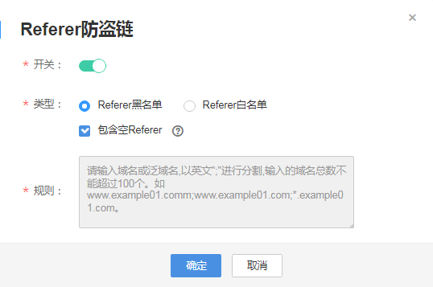

# Referer防盗链

Referer防盗链功能是基于HTTP协议支持的Referer机制，通过播放请求中携带的Referer字段来识别请求来源。配置Referer黑名单或白名单后，CDN会根据名单对请求来源进行过滤，允许或拒绝播放请求。

## 注意事项

-   该功能为可选项，默认不启用。
-   Referer黑名单与Referer白名单互斥，不支持同时设置。
-   黑名单或白名单中的域名最多支持配置100条。
-   黑名单或白名单中配置的域名前不能带协议名，域名为前缀匹配。如填写“example.example01.com“，则“example.example01.com/123“和“example.example01.com.cn“也会匹配成功。

## 前提条件

-   已[添加推流域名和播放域名](添加域名.md)，且已完成[域名关联](关联域名.md)。
-   已在域名DNS服务商处完成[CNAME解析配置](配置CNAME.md)。

## 操作步骤

1.  登录[视频直播控制台](https://console.huaweicloud.com/live)。
2.  在左侧导航树中选择“域名管理“，进入域名管理页面。
3.  在需要配置鉴权信息的播放域名行单击“管理“。
4.  在左侧导航树中选择“基础配置 \> 鉴权配置“。
5.  选择“Referer防盗链“，弹出“Referer防盗链“对话框。
6.  单击“开关“，如[图1](#fig657733201016)所示，配置Referer防盗链参数。

    **图 1**  配置Referer防盗链  
    

    防盗链配置及对应访问权限说明如[表1](#zh-cn_topic_0129356805_table837817528191)所示。

    **表 1**  Referer防盗链配置

    
    <table><thead align="left"><tr id="zh-cn_topic_0129356805_zh-cn_topic_0111450891_row19890101885714"><th class="cellrowborder" valign="top" width="20.03%" id="mcps1.2.3.1.1">
参数名

    </th>
    <th class="cellrowborder" valign="top" width="79.97%" id="mcps1.2.3.1.2">
描述

    </th>
    </tr>
    </thead>
    <tbody><tr id="zh-cn_topic_0129356805_zh-cn_topic_0111450891_row1089016185579"><td class="cellrowborder" valign="top" width="20.03%" headers="mcps1.2.3.1.1 ">
类型

    </td>
    <td class="cellrowborder" valign="top" width="79.97%" headers="mcps1.2.3.1.2 ">
支持黑名单和白名单模式。<ul id="ul1528259181510"><li>Referer黑名单：允许非名单内的域名请求访问资源，拒绝名单中的域名请求访问。</li><li>Referer白名单：允许名单内的域名请求访问资源，拒绝其它域名请求访问。</li></ul>
    

    
您可以设置是否允许空Referer字段访问资源，即是否允许通过浏览器地址栏直接访问资源URL。

    </td>
    </tr>
    <tr id="zh-cn_topic_0129356805_zh-cn_topic_0111450891_row4725335657"><td class="cellrowborder" valign="top" width="20.03%" headers="mcps1.2.3.1.1 ">
规则

    </td>
    <td class="cellrowborder" valign="top" width="79.97%" headers="mcps1.2.3.1.2 ">
黑名单或白名单中的域名。

    <ul id="zh-cn_topic_0129356805_ul1316151174219"><li>规则最多支持100条（最少1条），每一行一条记录，或者以英文“;”分隔。</li><li>域名前不能带协议名（http://和https://）。</li><li>域名为前缀匹配，若填写“example.example01.com”，则“example.example01.com/123”和“example.example01.com.cn”也会匹配成功。</li></ul>
    
示例如下：

    <pre class="screen" id="screen38364143112">example.example01.com
    example.example02.com</pre>
    </td>
    </tr>
    </tbody>
    </table>

7.  配置完成后，单击“确定“。
8.  [提交工单](https://console.huaweicloud.com/ticket/?#/ticketindex/business?productTypeId=ffb4ebf5fb094bc6aef0129c276ce42e)申请Referer防盗链审核，提交的信息需要包含配置的域名及[表1](#zh-cn_topic_0129356805_table837817528191)中的信息。

    审核通过后Referer防盗链功能才会生效。若修改了Referer盗链的配置，也需重新[提交工单](https://console.huaweicloud.com/ticket/?#/ticketindex/business?productTypeId=ffb4ebf5fb094bc6aef0129c276ce42e)审核。

