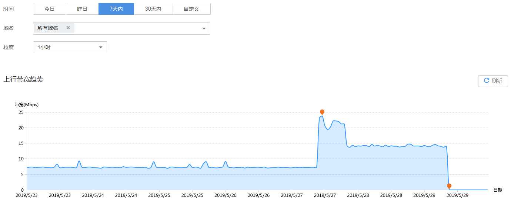

# 上行带宽

您可以根据播放域名查看推流端产生的上行带宽统计。

## 查询说明

-   上行带宽指推流到直播源站的入口带宽。
-   支持查看最近90天的历史数据。
-   支持选择多个域名同时查看，单次查看的域名总数不能超过20个。
-   查询的时间跨度最长为31天。
-   最小统计粒度为1小时，如2019-04-02 8:00:00\~2019-04-02 8:59:59时间段内的数据会统计展示在2019-04-02 8:00:00这个统计点上。

## 查看上行带宽

1.  登录[视频直播控制台](https://console.huaweicloud.com/live)。
2.  在左侧导航树中选择“统计分析 \> 上行带宽”，进入上行带宽统计页面。
3.  您可以选择需要查看的时间，域名及粒度，即可在**上行带宽趋势**区域查看到相关数据。

    **上行带宽趋势**中呈现的是所选域名的总上行带宽趋势，将鼠标指针停留在趋势图上，滚动鼠标滚轮可针对某时间跨度范围内的趋势图时间横轴进行拉大或缩小整体占比。

    **图 1**  上行带宽趋势  
    

