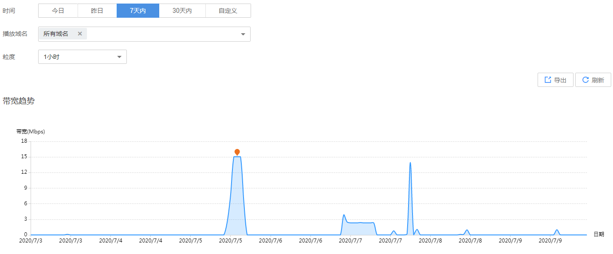

# 下行带宽

您可以查看所有播放域名的带宽使用量统计，并将查看的带宽详情导出到本地。您也可以通过[直播API](https://support.huaweicloud.com/api-live/live_03_0014.html)查询峰值带宽数据。

## 注意事项

由于实际产生的网络流量包括TCP/IP包头和TCP重传消耗，因此账单的计费数据会在趋势图中数据的基础上上浮10%左右。

## 查询说明

-   支持查看最近90天的历史数据。
-   支持选择多个域名同时查看，单次查看的域名总数不能超过20个。
-   查询的时间跨度最长为31天。
-   最小统计粒度为5分钟，如2019-04-02 8:00:00\~2019-04-02 8:04:59时间段内的数据会统计展示在2019-04-02 8:00:00这个统计点上。

## 查看下行带宽

1.  登录[视频直播控制台](https://console.huaweicloud.com/live)。
2.  在左侧导航树中选择“统计分析 \> 下行带宽”，进入下行带宽统计页面。
3.  您可以选择需要查看的时间，域名及粒度，即可在**带宽趋势**和**带宽统计详情**区域查看到相关数据。
    -   **带宽趋势**中呈现的是所选域名的总带宽趋势，将鼠标指针停留在趋势图上，滚动鼠标滚轮可针对某时间跨度范围内的趋势图时间横轴进行拉大或缩小整体占比。

        **图 1**  下行带宽趋势  
        

    -   **带宽统计详情**区域展示的是选择域名在查询时间段内的峰值带宽。

        **图 2**  下行带宽详情  
        

4.  单击**带宽趋势**区域右上角的“导出”，可以导出具体数据。

