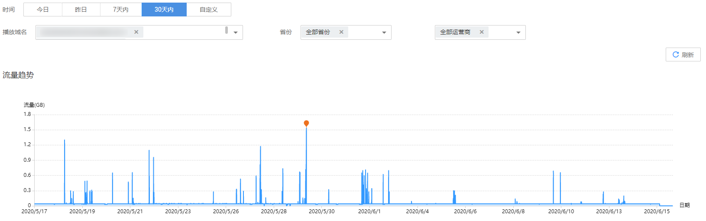
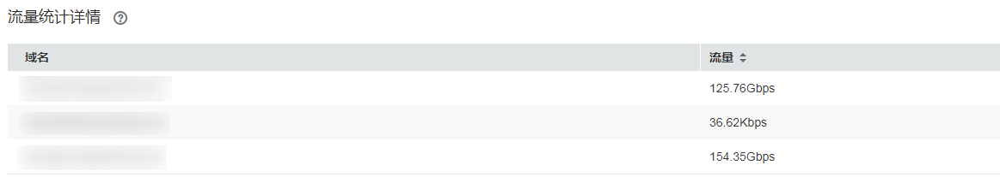

# 下行流量

您可以查看部署在新版视频直播服务下的播放域名的流量使用量统计。

## 注意事项

-   由于实际产生的网络流量包括TCP/IP包头和TCP重传消耗，因此账单的计费数据会在趋势图中数据的基础上上浮10%左右。
-   若您的播放域名仍部署在旧版视频直播服务下，请使用旧版下行流量统计功能查询，具体请参见[下行流量](下行流量.md)。

## 查询说明

-   支持查看最近90天的历史数据。
-   支持选择多个域名同时查看，单次查看的域名总数不能超过10个。
-   查询的时间跨度最长为31天。

## 查看下行流量

1.  登录[视频直播控制台](https://console.huaweicloud.com/live)。
2.  在左侧导航树中选择“统计分析（新版） \> 下行流量”，进入下行流量统计页面。
3.  选择需要查看的时间，域名、省份和运营商，即可在**流量趋势**和**流量统计详情**区域查看到相关数据。

    -   **流量趋势**中呈现的是所选域名的总流量趋势，将鼠标指针停留在趋势图上，滚动鼠标滚轮可针对某时间跨度范围内的趋势图时间横轴进行拉大或缩小整体占比。

        **图 1**  下行流量趋势  
        

    -   **流量统计详情**区域展示的是选择域名在查询时间段内的流量消耗。

        **图 2**  下行流量详情  
        

    > **须知：**   
    >流量表和流量趋势图中呈现的总流量，是将每5分钟粒度统计的流量进行合计（Byte），然后换算成MB，精确到小数点后两位。因此，可能与按5分钟粒度查询导出的流量表中“流量\(MB\)”列的合计值存在稍微的误差，这是由于计算时四舍五入导致。  

