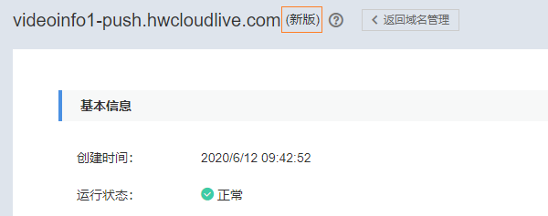

# 使用前必读

新版视频直播服务在旧版的基础上进行了优化升级，提供了更多更强大的直播流处理功能，当前新旧版视频直播的具体功能区别如[表1](#table4611121782011)所示。

> **说明：** 
>-   新版视频直播服务将会持续上线新的功能，在新版上线前添加的推流域名和播放域名后续仍部署在旧版视频直播服务上，不能使用新版的相关功能。
>-   若需要使用新版直播功能，您可以先删除旧版上的域名，然后重新添加。删除旧版上的域名时，相关的配置也将一并删除，您需要在新版上重新进行配置。

**表 1**  新旧版视频直播区别

<table><thead align="left"><tr id="row136116178205"><th class="cellrowborder" valign="top" width="16.181618161816182%" id="mcps1.2.4.1.1">
功能列表

</th>
<th class="cellrowborder" valign="top" width="42.84428442844284%" id="mcps1.2.4.1.2">
新版

</th>
<th class="cellrowborder" valign="top" width="40.97409740974097%" id="mcps1.2.4.1.3">
旧版

</th>
</tr>
</thead>
<tbody><tr id="row861141712013"><td class="cellrowborder" valign="top" width="16.181618161816182%" headers="mcps1.2.4.1.1 ">
域名管理

</td>
<td class="cellrowborder" valign="top" width="42.84428442844284%" headers="mcps1.2.4.1.2 "><ul id="ul1549718684618"><li>支持添加域名。</li><li>支持启用、 停用和删除域名。</li><li>支持关联域名，可以关联部署在旧版或新版上的推流域名。</li></ul>
</td>
<td class="cellrowborder" valign="top" width="40.97409740974097%" headers="mcps1.2.4.1.3 "><ul id="ul168301122104611"><li>支持启用、 停用和删除域名。</li><li>支持关联域名，可以关联部署在旧版或新版上的推流域名。</li></ul>
</td>
</tr>
<tr id="row161171711202"><td class="cellrowborder" valign="top" width="16.181618161816182%" headers="mcps1.2.4.1.1 ">
转码配置

</td>
<td class="cellrowborder" valign="top" width="42.84428442844284%" headers="mcps1.2.4.1.2 ">
支持

</td>
<td class="cellrowborder" valign="top" width="40.97409740974097%" headers="mcps1.2.4.1.3 ">
支持

</td>
</tr>
<tr id="row1611217132012"><td class="cellrowborder" valign="top" width="16.181618161816182%" headers="mcps1.2.4.1.1 ">
录制配置

</td>
<td class="cellrowborder" valign="top" width="42.84428442844284%" headers="mcps1.2.4.1.2 ">
支持

</td>
<td class="cellrowborder" valign="top" width="40.97409740974097%" headers="mcps1.2.4.1.3 ">
支持

</td>
</tr>
<tr id="row5479133711493"><td class="cellrowborder" valign="top" width="16.181618161816182%" headers="mcps1.2.4.1.1 ">
截图配置

</td>
<td class="cellrowborder" valign="top" width="42.84428442844284%" headers="mcps1.2.4.1.2 ">
支持

</td>
<td class="cellrowborder" valign="top" width="40.97409740974097%" headers="mcps1.2.4.1.3 ">
支持

</td>
</tr>
<tr id="row1251012585115"><td class="cellrowborder" valign="top" width="16.181618161816182%" headers="mcps1.2.4.1.1 ">
开停播通知

</td>
<td class="cellrowborder" valign="top" width="42.84428442844284%" headers="mcps1.2.4.1.2 ">
支持

</td>
<td class="cellrowborder" valign="top" width="40.97409740974097%" headers="mcps1.2.4.1.3 ">
不支持

</td>
</tr>
<tr id="row1497518288129"><td class="cellrowborder" valign="top" width="16.181618161816182%" headers="mcps1.2.4.1.1 ">
推流鉴权

</td>
<td class="cellrowborder" valign="top" width="42.84428442844284%" headers="mcps1.2.4.1.2 "><ul id="ul631919914582"><li>支持Key防盗链和IP黑白名单两种推流鉴权，且Key防盗链支持三种鉴权算法。</li><li>可以自行在控制台完成推流鉴权配置。</li></ul>
</td>
<td class="cellrowborder" valign="top" width="40.97409740974097%" headers="mcps1.2.4.1.3 ">
支持Key防盗链，需要提交工单申请后台配置。

</td>
</tr>
<tr id="row169245616162"><td class="cellrowborder" valign="top" width="16.181618161816182%" headers="mcps1.2.4.1.1 ">
延时配置

</td>
<td class="cellrowborder" valign="top" width="42.84428442844284%" headers="mcps1.2.4.1.2 ">
支持

</td>
<td class="cellrowborder" valign="top" width="40.97409740974097%" headers="mcps1.2.4.1.3 ">
不支持

</td>
</tr>
<tr id="row344641219177"><td class="cellrowborder" valign="top" width="16.181618161816182%" headers="mcps1.2.4.1.1 ">
拉流回源配置

</td>
<td class="cellrowborder" valign="top" width="42.84428442844284%" headers="mcps1.2.4.1.2 ">
支持

</td>
<td class="cellrowborder" valign="top" width="40.97409740974097%" headers="mcps1.2.4.1.3 ">
不支持

</td>
</tr>
<tr id="row45169131819"><td class="cellrowborder" valign="top" width="16.181618161816182%" headers="mcps1.2.4.1.1 ">
HTTPS安全加速

</td>
<td class="cellrowborder" valign="top" width="42.84428442844284%" headers="mcps1.2.4.1.2 ">
支持

</td>
<td class="cellrowborder" valign="top" width="40.97409740974097%" headers="mcps1.2.4.1.3 ">
不支持

</td>
</tr>
<tr id="row15693822131813"><td class="cellrowborder" valign="top" width="16.181618161816182%" headers="mcps1.2.4.1.1 ">
播放鉴权

</td>
<td class="cellrowborder" valign="top" width="42.84428442844284%" headers="mcps1.2.4.1.2 "><ul id="ul3896435181912"><li>支持Referer防盗链、Key防盗链、IP黑白名单三种播放鉴权，且Key防盗链支持三种鉴权算法。</li><li>可以自行在控制台完成播放鉴权的配置。</li></ul>
</td>
<td class="cellrowborder" valign="top" width="40.97409740974097%" headers="mcps1.2.4.1.3 "><ul id="ul18354114142014"><li>支持Referer防盗链、Key防盗链。</li><li>控制台完成防盗链配置后，需要提交工单申请后台审核处理。</li></ul>
</td>
</tr>
<tr id="row1470425462010"><td class="cellrowborder" valign="top" width="16.181618161816182%" headers="mcps1.2.4.1.1 ">
下行流量/下行带宽

</td>
<td class="cellrowborder" valign="top" width="42.84428442844284%" headers="mcps1.2.4.1.2 ">
支持按域名、省份和运营商查询。

</td>
<td class="cellrowborder" valign="top" width="40.97409740974097%" headers="mcps1.2.4.1.3 ">
仅支持按域名查询。

</td>
</tr>
<tr id="row9698173012369"><td class="cellrowborder" valign="top" width="16.181618161816182%" headers="mcps1.2.4.1.1 ">
上行带宽/推流路数

</td>
<td class="cellrowborder" valign="top" width="42.84428442844284%" headers="mcps1.2.4.1.2 ">
支持

</td>
<td class="cellrowborder" valign="top" width="40.97409740974097%" headers="mcps1.2.4.1.3 ">
支持

</td>
</tr>
<tr id="row112115257552"><td class="cellrowborder" valign="top" width="16.181618161816182%" headers="mcps1.2.4.1.1 ">
在线观看人数统计

</td>
<td class="cellrowborder" valign="top" width="42.84428442844284%" headers="mcps1.2.4.1.2 ">
支持

</td>
<td class="cellrowborder" valign="top" width="40.97409740974097%" headers="mcps1.2.4.1.3 ">
不支持

</td>
</tr>
<tr id="row020541212414"><td class="cellrowborder" valign="top" width="16.181618161816182%" headers="mcps1.2.4.1.1 ">
转码/录制/截图用量统计

</td>
<td class="cellrowborder" valign="top" width="42.84428442844284%" headers="mcps1.2.4.1.2 ">
支持

</td>
<td class="cellrowborder" valign="top" width="40.97409740974097%" headers="mcps1.2.4.1.3 ">
不支持

</td>
</tr>
<tr id="row199481612194217"><td class="cellrowborder" valign="top" width="16.181618161816182%" headers="mcps1.2.4.1.1 ">
流播放画像信息

</td>
<td class="cellrowborder" valign="top" width="42.84428442844284%" headers="mcps1.2.4.1.2 ">
支持

</td>
<td class="cellrowborder" valign="top" width="40.97409740974097%" headers="mcps1.2.4.1.3 ">
不支持

</td>
</tr>
<tr id="row1769818135714"><td class="cellrowborder" valign="top" width="16.181618161816182%" headers="mcps1.2.4.1.1 ">
HTTP状态码统计

</td>
<td class="cellrowborder" valign="top" width="42.84428442844284%" headers="mcps1.2.4.1.2 ">
支持

</td>
<td class="cellrowborder" valign="top" width="40.97409740974097%" headers="mcps1.2.4.1.3 ">
不支持

</td>
</tr>
<tr id="row181181045152119"><td class="cellrowborder" valign="top" width="16.181618161816182%" headers="mcps1.2.4.1.1 ">
流监控

</td>
<td class="cellrowborder" valign="top" width="42.84428442844284%" headers="mcps1.2.4.1.2 ">
支持

</td>
<td class="cellrowborder" valign="top" width="40.97409740974097%" headers="mcps1.2.4.1.3 ">
不支持

</td>
</tr>
<tr id="row1912515619817"><td class="cellrowborder" valign="top" width="16.181618161816182%" headers="mcps1.2.4.1.1 ">
日志管理

</td>
<td class="cellrowborder" valign="top" width="42.84428442844284%" headers="mcps1.2.4.1.2 ">
支持

</td>
<td class="cellrowborder" valign="top" width="40.97409740974097%" headers="mcps1.2.4.1.3 ">
不支持

</td>
</tr>
<tr id="row099251743210"><td class="cellrowborder" valign="top" width="16.181618161816182%" headers="mcps1.2.4.1.1 ">
跨域使用

</td>
<td class="cellrowborder" valign="top" width="42.84428442844284%" headers="mcps1.2.4.1.2 ">
支持跨域请求，无需后台配置。

</td>
<td class="cellrowborder" valign="top" width="40.97409740974097%" headers="mcps1.2.4.1.3 ">
支持跨域请求，需要提交工单申请后台配置。

</td>
</tr>
<tr id="row1059030191611"><td class="cellrowborder" valign="top" width="16.181618161816182%" headers="mcps1.2.4.1.1 ">
防盗地址生成工具

</td>
<td class="cellrowborder" valign="top" width="42.84428442844284%" headers="mcps1.2.4.1.2 ">
支持自动生成域名对应的鉴权地址

</td>
<td class="cellrowborder" valign="top" width="40.97409740974097%" headers="mcps1.2.4.1.3 ">
不支持

</td>
</tr>
</tbody>
</table>

## 如何查询域名是新版还是旧版？

您可以在视频直播控制台的域名管理中查看现有的域名是否部署在新版视频直播服务上，具体步骤如下所示：

1.  登录视频直播控制台，在左侧导航树中选择“域名管理“。
2.  在需要查看的域名行单击“管理”，进入基本信息页。
3.  您可以在基本信息页的上方查看到该域名是否部署在新版视频直播服务上。

    **图 1**  域名基本信息  
    

