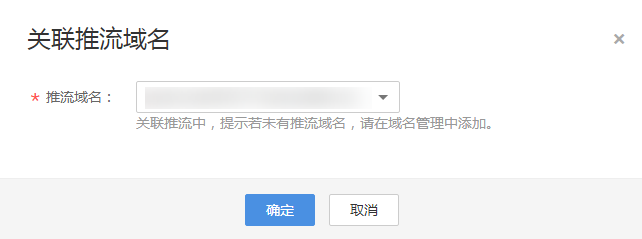

# 关联域名

推流域名和播放域名添加后，需要进行域名的关联才能进行直播推流和播放。

## 注意事项

若播放域名配置了客户源站（域名或IP地址）拉流回源，则不支持关联推流域名。

## 前提条件

已完成推流域名和播放域名的添加，若未添加请参见[添加域名](添加域名.md#section1326884516114)处理。

## 操作步骤

1.  登录[视频直播控制台](https://console.huaweicloud.com/live)。
2.  在左侧导航树中选择“域名管理“，进入域名管理页面。
3.  在添加的播放域名行单击“管理“，进入基本信息页面。
4.  在“推流信息“板块单击“关联推流域名“，选择已添加的推流域名。

    **图 1**  关联域名  
    

5.  单击“确定”，完成关联。

    关联后，即可在基本信息页面查看到对应推流信息。

    

