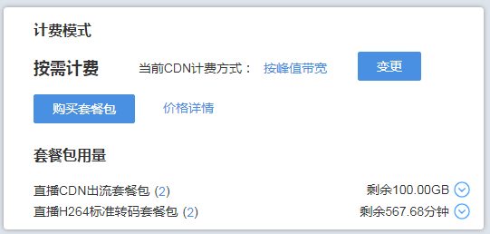

# 功能介绍

在视频直播控制台，您可以快速进行直播域名的管理、直播流管理、转码、录制等基础功能的配置。同时，视频直播控制台还提供了资源监控服务，方便您进行实时数据分析。

## 概览

登录[视频直播控制台](https://console.huaweicloud.com/live)，默认进入“概览”页面，您可以在该页面查看直播今日的下行流量和带宽，查询最近期的下行流量和下行带宽、上行带宽和源站推流路数的趋势。您也可以单击右上角的“快速上手”，查看视频直播入手指南。

**图 1**  概览  

-   今日数据：主要呈现本日视频直播的下行流量和下行带宽峰值用量情况。

    **表 1**  直播今日数据说明

    
    <table><thead align="left"><tr id="row28819454466"><th class="cellrowborder" valign="top" width="28.449999999999996%" id="mcps1.2.3.1.1">
统计项

    </th>
    <th class="cellrowborder" valign="top" width="71.55%" id="mcps1.2.3.1.2">
说明

    </th>
    </tr>
    </thead>
    <tbody><tr id="row288124518462"><td class="cellrowborder" valign="top" width="28.449999999999996%" headers="mcps1.2.3.1.1 ">
下行流量

    </td>
    <td class="cellrowborder" valign="top" width="71.55%" headers="mcps1.2.3.1.2 ">
今日所有播放域名使用播放加速产生的下行流量总和。

    </td>
    </tr>
    <tr id="row988154584619"><td class="cellrowborder" valign="top" width="28.449999999999996%" headers="mcps1.2.3.1.1 ">
下行带宽峰值

    </td>
    <td class="cellrowborder" valign="top" width="71.55%" headers="mcps1.2.3.1.2 ">
今日所有播放域名使用播放加速产生的下行带宽峰值。

    </td>
    </tr>
    </tbody>
    </table>

-   使用趋势：呈现今日、昨日、最近一周或一个月内的直播用量趋势，包括“下行流量“、“下行带宽“、“上行带宽”、“推流路数”。

    **表 2**  统计项说明

    
    <table><thead align="left"><tr id="row28112014817"><th class="cellrowborder" valign="top" width="28.560000000000002%" id="mcps1.2.3.1.1">
统计项

    </th>
    <th class="cellrowborder" valign="top" width="71.44%" id="mcps1.2.3.1.2">
说明

    </th>
    </tr>
    </thead>
    <tbody><tr id="row88111201384"><td class="cellrowborder" valign="top" width="28.560000000000002%" headers="mcps1.2.3.1.1 ">
下行流量

    </td>
    <td class="cellrowborder" valign="top" width="71.44%" headers="mcps1.2.3.1.2 ">
统计所有播放域名在查询的时间段内使用加速服务消耗的总下行流量。

    </td>
    </tr>
    <tr id="row198215205818"><td class="cellrowborder" valign="top" width="28.560000000000002%" headers="mcps1.2.3.1.1 ">
下行带宽

    </td>
    <td class="cellrowborder" valign="top" width="71.44%" headers="mcps1.2.3.1.2 ">
统计所有播放域名在查询的时间段内使用加速服务消耗的总下行带宽峰值。

    </td>
    </tr>
    <tr id="row1782820383"><td class="cellrowborder" valign="top" width="28.560000000000002%" headers="mcps1.2.3.1.1 ">
上行带宽

    </td>
    <td class="cellrowborder" valign="top" width="71.44%" headers="mcps1.2.3.1.2 ">
统计所选播放域名在查询的时间段内对应推流端产生的总上行带宽。

    </td>
    </tr>
    <tr id="row582182014812"><td class="cellrowborder" valign="top" width="28.560000000000002%" headers="mcps1.2.3.1.1 ">
源站推流路数

    </td>
    <td class="cellrowborder" valign="top" width="71.44%" headers="mcps1.2.3.1.2 ">
统计所选播放域名在查询的时间段内对应推流端产生的总推流路数。

    </td>
    </tr>
    </tbody>
    </table>

    > **说明：** 
    >可将鼠标放置到图表上，查看每个所选域名的具体数值，滚动鼠标滚轮可针对某时间跨度范围内的趋势图时间横轴进行拉大或缩小整体占比。

-   计费模式：呈现当前视频直播的“CDN计费方式”及套餐包使用情况。您可以单击“变更”，变更CDN计费方式；单击“购买套餐包”，进入视频直播套餐包购买页面，购买相关套餐包。

    **图 2**  计费模式  
    

## 功能列表

您可以在[视频直播控制台](https://console.huaweicloud.com/live)的左侧导航栏选择对应功能进行配置或使用。

**表 3**  控制台功能介绍

<table><thead align="left"><tr id="row7140183143118"><th class="cellrowborder" valign="top" width="15.17%" id="mcps1.2.4.1.1">
分类

</th>
<th class="cellrowborder" valign="top" width="16.02%" id="mcps1.2.4.1.2">
功能

</th>
<th class="cellrowborder" valign="top" width="68.81%" id="mcps1.2.4.1.3">
功能介绍

</th>
</tr>
</thead>
<tbody><tr id="row13656122694"><td class="cellrowborder" rowspan="2" valign="top" width="15.17%" headers="mcps1.2.4.1.1 ">
直播管理

</td>
<td class="cellrowborder" valign="top" width="16.02%" headers="mcps1.2.4.1.2 ">
<a href="直播流管理.md">直播流管理</a>

</td>
<td class="cellrowborder" valign="top" width="68.81%" headers="mcps1.2.4.1.3 ">
支持用户对直播在线流、历史流的管理，也可以对直播流进行禁止和恢复推流等操作。

</td>
</tr>
<tr id="row1941018201999"><td class="cellrowborder" valign="top" headers="mcps1.2.4.1.1 ">
<a href="管理录制文件.md">录制文件管理</a>

</td>
<td class="cellrowborder" valign="top" headers="mcps1.2.4.1.2 ">
支持用户获取录制文件基本信息并预览录制存储到点播或OBS服务的直播流。

</td>
</tr>
<tr id="row4140731173113"><td class="cellrowborder" valign="top" width="15.17%" headers="mcps1.2.4.1.1 ">
域名管理

</td>
<td class="cellrowborder" valign="top" width="16.02%" headers="mcps1.2.4.1.2 ">
<a href="添加域名.md">域名配置</a>

</td>
<td class="cellrowborder" valign="top" width="68.81%" headers="mcps1.2.4.1.3 ">
支持用户添加并管理自有的加速域名，并对域名进行CNAME配置，Key防盗链、Referer防盗链、IP黑名单配置，支持对直播视频进行录制、截图、转码模板配置。

</td>
</tr>
<tr id="row031541431012"><td class="cellrowborder" rowspan="6" valign="top" width="15.17%" headers="mcps1.2.4.1.1 ">
推流配置

</td>
<td class="cellrowborder" valign="top" width="16.02%" headers="mcps1.2.4.1.2 ">
<a href="直播转码.md">转码模板配置</a>

</td>
<td class="cellrowborder" valign="top" width="68.81%" headers="mcps1.2.4.1.3 ">
支持将推送的直播流转码成多种分辨率和码率规格的，以满足不同网络环境的用户观看需求。

</td>
</tr>
<tr id="row1512614543111"><td class="cellrowborder" valign="top" headers="mcps1.2.4.1.1 ">
<a href="配置录制模板.md">录制至OBS（新版）</a>

</td>
<td class="cellrowborder" valign="top" headers="mcps1.2.4.1.2 ">
支持配置录制规则，直播流按照录制规则进行录制，并存储到OBS桶中。

</td>
</tr>
<tr id="row8588165712118"><td class="cellrowborder" valign="top" headers="mcps1.2.4.1.1 ">
<a href="直播录制.md">录制至VOD（旧版）</a>

</td>
<td class="cellrowborder" valign="top" headers="mcps1.2.4.1.2 ">
支持为直播配置录制规则，直播流将按照录制规则进行录制，并存储到VOD中。

</td>
</tr>
<tr id="row8815141412136"><td class="cellrowborder" valign="top" headers="mcps1.2.4.1.1 ">
<a href="直播截图.md">截图模板配置</a>

</td>
<td class="cellrowborder" valign="top" headers="mcps1.2.4.1.2 ">
支持按配置截图模板在推流过程中截取直播画面，并存储在OBS桶中。

</td>
</tr>
<tr id="row12548239191318"><td class="cellrowborder" valign="top" headers="mcps1.2.4.1.1 ">
<a href="开停播通知.md">直播推断流通知配置</a>

</td>
<td class="cellrowborder" valign="top" headers="mcps1.2.4.1.2 ">
支持用户为推流域名添加接收直播推流或断流通知的回调地址，从而将直播推流和断流的状态信息实时反馈给用户。

</td>
</tr>
<tr id="row283004781315"><td class="cellrowborder" valign="top" headers="mcps1.2.4.1.1 ">
<a href="推流鉴权.md">推流鉴权配置</a>

</td>
<td class="cellrowborder" valign="top" headers="mcps1.2.4.1.2 ">
提供了Key防盗链鉴权机制，对访问者的身份进行识别和过滤，符合规则的才可进行直播服务。

</td>
</tr>
<tr id="row1383901181012"><td class="cellrowborder" rowspan="5" valign="top" width="15.17%" headers="mcps1.2.4.1.1 ">
播流配置

</td>
<td class="cellrowborder" valign="top" width="16.02%" headers="mcps1.2.4.1.2 ">
<a href="直播延时.md">修改直播延时</a>

</td>
<td class="cellrowborder" valign="top" width="68.81%" headers="mcps1.2.4.1.3 ">
支持RTMP、HTTP-FLV播放的延时配置。

</td>
</tr>
<tr id="row116151358164"><td class="cellrowborder" valign="top" headers="mcps1.2.4.1.1 ">
<a href="直播拉流回源.md">直播拉流回源</a>

</td>
<td class="cellrowborder" valign="top" headers="mcps1.2.4.1.2 ">
支持用户将自建源站中的直播内容拉取到华为云直播中心进行加速分发。

</td>
</tr>
<tr id="row168921301610"><td class="cellrowborder" valign="top" headers="mcps1.2.4.1.1 ">
<a href="配置方法.md">安全加速</a>

</td>
<td class="cellrowborder" valign="top" headers="mcps1.2.4.1.2 ">
支持对添加的域名开启HTTPS安全加速，保障您的直播数据在传输过程中受到加密保护。

</td>
</tr>
<tr id="row2568115951512"><td class="cellrowborder" valign="top" headers="mcps1.2.4.1.1 ">
<a href="概述.md">鉴权机制配置（新版）</a>

</td>
<td class="cellrowborder" valign="top" headers="mcps1.2.4.1.2 ">
提供了Referer防盗链、Key防盗链和IP黑名单鉴权机制，对访问者的身份进行识别和过滤，符合规则的才可进行直播服务。

</td>
</tr>
<tr id="row18679714178"><td class="cellrowborder" valign="top" headers="mcps1.2.4.1.1 ">
<a href="概述-0.md">鉴权机制配置（旧版）</a>

</td>
<td class="cellrowborder" valign="top" headers="mcps1.2.4.1.2 ">
提供了Referer防盗链和Key防盗链鉴权机制，对访问者的身份进行识别和过滤，符合规则的才可进行直播服务。

</td>
</tr>
<tr id="row2078816194129"><td class="cellrowborder" rowspan="4" valign="top" width="15.17%" headers="mcps1.2.4.1.1 ">
统计分析

</td>
<td class="cellrowborder" valign="top" width="16.02%" headers="mcps1.2.4.1.2 ">
<a href="下行带宽.md">下行带宽统计</a>

</td>
<td class="cellrowborder" valign="top" width="68.81%" headers="mcps1.2.4.1.3 ">
支持查看所有播放域名的带宽使用量统计，并将查看的带宽详情导出到本地。

</td>
</tr>
<tr id="row3796416141217"><td class="cellrowborder" valign="top" headers="mcps1.2.4.1.1 ">
<a href="下行流量.md">下行流量统计</a>

</td>
<td class="cellrowborder" valign="top" headers="mcps1.2.4.1.2 ">
支持查看所有播放域名的流量使用量统计，并将查看的流量详情导出到本地。

</td>
</tr>
<tr id="row37622144129"><td class="cellrowborder" valign="top" headers="mcps1.2.4.1.1 ">
<a href="上行带宽.md">上行带宽统计</a>

</td>
<td class="cellrowborder" valign="top" headers="mcps1.2.4.1.2 ">
用户可以根据播放域名查看推流端产生的上行带宽统计信息。

</td>
</tr>
<tr id="row19628512131212"><td class="cellrowborder" valign="top" headers="mcps1.2.4.1.1 ">
<a href="推流路数.md">推流路数统计</a>

</td>
<td class="cellrowborder" valign="top" headers="mcps1.2.4.1.2 ">
用户可以根据播放域名查看推流端产生的总推流路数。

</td>
</tr>
<tr id="row15141153113119"><td class="cellrowborder" rowspan="2" valign="top" width="15.17%" headers="mcps1.2.4.1.1 ">
互动直播

</td>
<td class="cellrowborder" valign="top" width="16.02%" headers="mcps1.2.4.1.2 ">
<a href="https://support.huaweicloud.com/iLive/live_11_00183.html" target="_blank" rel="noopener noreferrer">应用管理</a>

</td>
<td class="cellrowborder" valign="top" width="68.81%" headers="mcps1.2.4.1.3 ">
支持用户创建并管理用于连麦互动的应用信息。

<strong id="b1362775171310">说明</strong>：仅支持“华北-北京四”区域。

</td>
</tr>
<tr id="row9817714342"><td class="cellrowborder" valign="top" headers="mcps1.2.4.1.1 ">
<a href="https://support.huaweicloud.com/iLive/live_11_00184.html" target="_blank" rel="noopener noreferrer">用量统计</a>

</td>
<td class="cellrowborder" valign="top" headers="mcps1.2.4.1.2 ">
支持查看用户进行实时音视频交互时使用的时长。

<strong id="b330715835116">说明</strong>：仅支持“华北-北京四”区域。

</td>
</tr>
</tbody>
</table>

