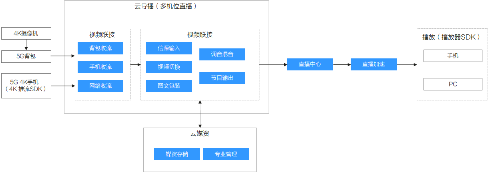

# 功能简介

视频直播提供的云导播台功能，提供了多种信源输入、视频切换、混音调音、图文包装、节目输出等专业功能。

> **说明：** 
>云导播功能需[提交工单](https://console.huaweicloud.com/ticket/?#/ticketindex/business?productTypeId=ffb4ebf5fb094bc6aef0129c276ce42e)申请开通，此功能为计费项，具体价格请参见[产品价格详情](https://www.huaweicloud.com/pricing.html?tab=detail#/live)。

**图 1**  云导播台架构图  

## 功能特性

**表 1**  功能列表

<table><thead align="left"><tr id="row33083313263"><th class="cellrowborder" valign="top" width="13.86%" id="mcps1.2.4.1.1">
<strong id="b430916332610">类别</strong>

</th>
<th class="cellrowborder" valign="top" width="18.29%" id="mcps1.2.4.1.2">
<strong id="b430919311267">特性</strong>

</th>
<th class="cellrowborder" valign="top" width="67.85%" id="mcps1.2.4.1.3">
<strong id="b183091038267">说明</strong>

</th>
</tr>
</thead>
<tbody><tr id="row107968434305"><td class="cellrowborder" valign="top" width="13.86%" headers="mcps1.2.4.1.1 ">
5G背包

</td>
<td class="cellrowborder" valign="top" width="18.29%" headers="mcps1.2.4.1.2 ">
高骏推流

</td>
<td class="cellrowborder" valign="top" width="67.85%" headers="mcps1.2.4.1.3 ">
支持高骏T50背包典型值：4K、H.265、40Mbps每路。

</td>
</tr>
<tr id="row111051947153012"><td class="cellrowborder" rowspan="2" valign="top" width="13.86%" headers="mcps1.2.4.1.1 ">
5G 4K手机

</td>
<td class="cellrowborder" valign="top" width="18.29%" headers="mcps1.2.4.1.2 ">
华为手机推流

</td>
<td class="cellrowborder" valign="top" width="67.85%" headers="mcps1.2.4.1.3 ">
支持华为Mate20x5G 4K推流典型值：4K、H.265、40Mbps每路。

</td>
</tr>
<tr id="row664257163015"><td class="cellrowborder" valign="top" headers="mcps1.2.4.1.1 ">
推流协议

</td>
<td class="cellrowborder" valign="top" headers="mcps1.2.4.1.2 ">
推流SDK支持RTMP。

</td>
</tr>
<tr id="row1330933192616"><td class="cellrowborder" rowspan="4" valign="top" width="13.86%" headers="mcps1.2.4.1.1 ">
信源输入

</td>
<td class="cellrowborder" valign="top" width="18.29%" headers="mcps1.2.4.1.2 ">
4K及以下输入

</td>
<td class="cellrowborder" valign="top" width="67.85%" headers="mcps1.2.4.1.3 ">
50P或25P，H.264或H.265，最高码率40Mbps。动态范围SDR，色域BT.709。

</td>
</tr>
<tr id="row143096322618"><td class="cellrowborder" valign="top" headers="mcps1.2.4.1.1 ">
1080P及以下输入

</td>
<td class="cellrowborder" valign="top" headers="mcps1.2.4.1.2 ">
50P或25P，H.264或H.265，最高码率10Mbps。动态范围SDR，色域BT.709。

</td>
</tr>
<tr id="row10309113152611"><td class="cellrowborder" valign="top" headers="mcps1.2.4.1.1 ">
本地素材

</td>
<td class="cellrowborder" valign="top" headers="mcps1.2.4.1.2 ">
支持2路DDR（Digital Disk Recorder）视频每路DDR可循环播放多个素材。

</td>
</tr>
<tr id="row7309163152615"><td class="cellrowborder" valign="top" headers="mcps1.2.4.1.1 ">
采集（录制）

</td>
<td class="cellrowborder" valign="top" headers="mcps1.2.4.1.2 ">
按原码率录制最多并发录制8路，录制封装格式为MP4和FLV。

</td>
</tr>
<tr id="row930919372613"><td class="cellrowborder" rowspan="3" valign="top" width="13.86%" headers="mcps1.2.4.1.1 ">
视频切换

</td>
<td class="cellrowborder" valign="top" width="18.29%" headers="mcps1.2.4.1.2 ">
切换方式

</td>
<td class="cellrowborder" valign="top" width="67.85%" headers="mcps1.2.4.1.3 "><ul id="ul75422275133"><li>Cut硬切：没有转场特技。</li><li>Auto自动：比如2秒内切完，带选择的转场特技。</li><li>T-bar手工：手工控制推杆速度做切换。</li></ul>
</td>
</tr>
<tr id="row173091830266"><td class="cellrowborder" valign="top" headers="mcps1.2.4.1.1 ">
转场特技

</td>
<td class="cellrowborder" valign="top" headers="mcps1.2.4.1.2 ">
预置20种转场特技，如淡出、溶解等。

</td>
</tr>
<tr id="row1931063142617"><td class="cellrowborder" valign="top" headers="mcps1.2.4.1.1 ">
多视窗

</td>
<td class="cellrowborder" valign="top" headers="mcps1.2.4.1.2 ">
支持最多4个画面组合为多视窗（即画中画、多画面）可自定义多视窗模板。

</td>
</tr>
<tr id="row10310237264"><td class="cellrowborder" rowspan="3" valign="top" width="13.86%" headers="mcps1.2.4.1.1 ">
图文包装

</td>
<td class="cellrowborder" valign="top" width="18.29%" headers="mcps1.2.4.1.2 ">
字幕模板

</td>
<td class="cellrowborder" valign="top" width="67.85%" headers="mcps1.2.4.1.3 ">
预置20种模板。

</td>
</tr>
<tr id="row1931093112618"><td class="cellrowborder" valign="top" headers="mcps1.2.4.1.1 ">
字幕编辑

</td>
<td class="cellrowborder" valign="top" headers="mcps1.2.4.1.2 "><ul id="ul108436135538"><li>支持修改字幕内容。</li><li>支持调整字幕模板在屏幕上的位置、大小、颜色。</li></ul>
</td>
</tr>
<tr id="row173101238263"><td class="cellrowborder" valign="top" headers="mcps1.2.4.1.1 ">
字幕播放

</td>
<td class="cellrowborder" valign="top" headers="mcps1.2.4.1.2 "><ul id="ul76171727549"><li>支持一键上下PVW和PGM多个字幕同时上屏（最多4层）。</li><li>支持字幕循环播放。</li></ul>
</td>
</tr>
<tr id="row12310183202620"><td class="cellrowborder" valign="top" width="13.86%" headers="mcps1.2.4.1.1 ">
调音混音

</td>
<td class="cellrowborder" valign="top" width="18.29%" headers="mcps1.2.4.1.2 ">
音频控制

</td>
<td class="cellrowborder" valign="top" width="67.85%" headers="mcps1.2.4.1.3 "><ul id="ul16351142725413"><li>支持监听、静音、独奏(Solo)和声画分离。</li><li>支持多通道混音输出。</li><li>支持PGM及各通道音量调节。</li></ul>
</td>
</tr>
<tr id="row03113311269"><td class="cellrowborder" rowspan="5" valign="top" width="13.86%" headers="mcps1.2.4.1.1 ">
输出

</td>
<td class="cellrowborder" valign="top" width="18.29%" headers="mcps1.2.4.1.2 ">
PGM输出

</td>
<td class="cellrowborder" valign="top" width="67.85%" headers="mcps1.2.4.1.3 ">
一键推流和停止输出。

</td>
</tr>
<tr id="row1831113314265"><td class="cellrowborder" valign="top" headers="mcps1.2.4.1.1 ">
紧急垫片

</td>
<td class="cellrowborder" valign="top" headers="mcps1.2.4.1.2 ">
一键切换紧急垫片到PGM输出（垫片素材循环播放，不占用信源输入通道）。

</td>
</tr>
<tr id="row33119314262"><td class="cellrowborder" valign="top" headers="mcps1.2.4.1.1 ">
采集（录制）

</td>
<td class="cellrowborder" valign="top" headers="mcps1.2.4.1.2 ">
按原码率录制，录制封装格式为MP4和FLV。

</td>
</tr>
<tr id="row1931111312615"><td class="cellrowborder" valign="top" headers="mcps1.2.4.1.1 ">
延时播出

</td>
<td class="cellrowborder" valign="top" headers="mcps1.2.4.1.2 ">
最长延时5分钟。

</td>
</tr>
<tr id="row131123202619"><td class="cellrowborder" valign="top" headers="mcps1.2.4.1.1 ">
协议

</td>
<td class="cellrowborder" valign="top" headers="mcps1.2.4.1.2 ">
支持RTMP。

</td>
</tr>
<tr id="row142911282319"><td class="cellrowborder" valign="top" width="13.86%" headers="mcps1.2.4.1.1 ">
分发平台

</td>
<td class="cellrowborder" valign="top" width="18.29%" headers="mcps1.2.4.1.2 ">
华为云直播

</td>
<td class="cellrowborder" valign="top" width="67.85%" headers="mcps1.2.4.1.3 ">
PGM输出可分发到华为云直播。

</td>
</tr>
</tbody>
</table>

## 使用限制

-   网络要求：5G背包（或5G 4K手机）到华为云之间的网络rtt <20ms。

-   5G背包：当前只支持高骏T50 5G背包。

