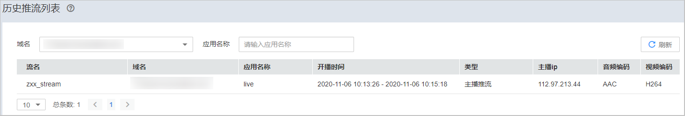

# 历史推流列表

您可以查看部署在新版视频直播服务下的推流域名的历史推流详情。

## 查询说明

-   支持查看最近7天的历史数据。
-   查询的时间跨度最长为1天。

## 查看历史推流信息

1.  登录[视频直播控制台](https://console.huaweicloud.com/live)。
2.  在左侧导航树中选择“流监控 \> 历史推流列表”，进入历史推流列表页面。
3.  选择需要查看的推流域名和应用名称。
4.  单击“刷新”，即可查看到对应推流域名的历史推流信息，如[图1](#fig54591246565)所示。各参数说明如[表1](#table2344152855311)所示。

    **图 1**  历史推流信息  
    

    **表 1**  参数说明

    
    <table><thead align="left"><tr id="row5344102817538"><th class="cellrowborder" valign="top" width="20.86%" id="mcps1.2.3.1.1">
参数名

    </th>
    <th class="cellrowborder" valign="top" width="79.14%" id="mcps1.2.3.1.2">
描述

    </th>
    </tr>
    </thead>
    <tbody><tr id="row2034472820531"><td class="cellrowborder" valign="top" width="20.86%" headers="mcps1.2.3.1.1 ">
流名

    </td>
    <td class="cellrowborder" valign="top" width="79.14%" headers="mcps1.2.3.1.2 ">
直播流名称，即推流地址中自定义的<strong id="b1264192121113">StreamName</strong>。

    </td>
    </tr>
    <tr id="row934410289534"><td class="cellrowborder" valign="top" width="20.86%" headers="mcps1.2.3.1.1 ">
域名

    </td>
    <td class="cellrowborder" valign="top" width="79.14%" headers="mcps1.2.3.1.2 ">
推流域名。

    </td>
    </tr>
    <tr id="row1634432810536"><td class="cellrowborder" valign="top" width="20.86%" headers="mcps1.2.3.1.1 ">
应用名称

    </td>
    <td class="cellrowborder" valign="top" width="79.14%" headers="mcps1.2.3.1.2 ">
即推流地址中默认或自定义的<strong id="b3994155694613">AppName</strong>。

    </td>
    </tr>
    <tr id="row18344152825310"><td class="cellrowborder" valign="top" width="20.86%" headers="mcps1.2.3.1.1 ">
开播时间

    </td>
    <td class="cellrowborder" valign="top" width="79.14%" headers="mcps1.2.3.1.2 ">
直播流开始推流到结束推流的时间段， 格式：YYYY-MM-DD hh:mm:ss - YYYY-MM-DD hh:mm:ss，如2020-11-06 14:39:42 - 2020-11-06 14:39:44。

    </td>
    </tr>
    <tr id="row1134422825317"><td class="cellrowborder" valign="top" width="20.86%" headers="mcps1.2.3.1.1 ">
类型

    </td>
    <td class="cellrowborder" valign="top" width="79.14%" headers="mcps1.2.3.1.2 ">
直播流的推送类型，包含主播推流和第三方CDN回源两种类型。

    </td>
    </tr>
    <tr id="row1134417286537"><td class="cellrowborder" valign="top" width="20.86%" headers="mcps1.2.3.1.1 ">
主播ip

    </td>
    <td class="cellrowborder" valign="top" width="79.14%" headers="mcps1.2.3.1.2 ">
推流端的IP地址。

    </td>
    </tr>
    <tr id="row627121316550"><td class="cellrowborder" valign="top" width="20.86%" headers="mcps1.2.3.1.1 ">
音频编码

    </td>
    <td class="cellrowborder" valign="top" width="79.14%" headers="mcps1.2.3.1.2 ">
音频编码格式。

    </td>
    </tr>
    <tr id="row3573191535518"><td class="cellrowborder" valign="top" width="20.86%" headers="mcps1.2.3.1.1 ">
视频编码

    </td>
    <td class="cellrowborder" valign="top" width="79.14%" headers="mcps1.2.3.1.2 ">
视频编码格式。

    </td>
    </tr>
    </tbody>
    </table>

