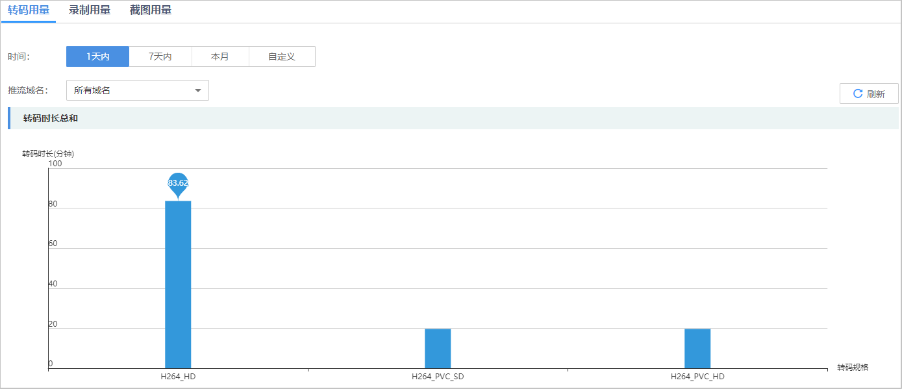
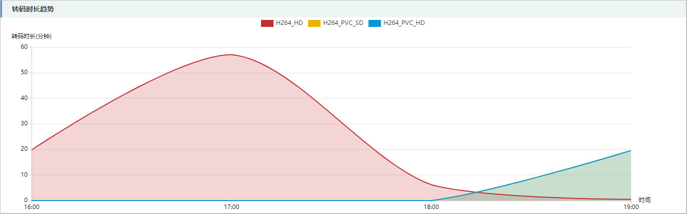
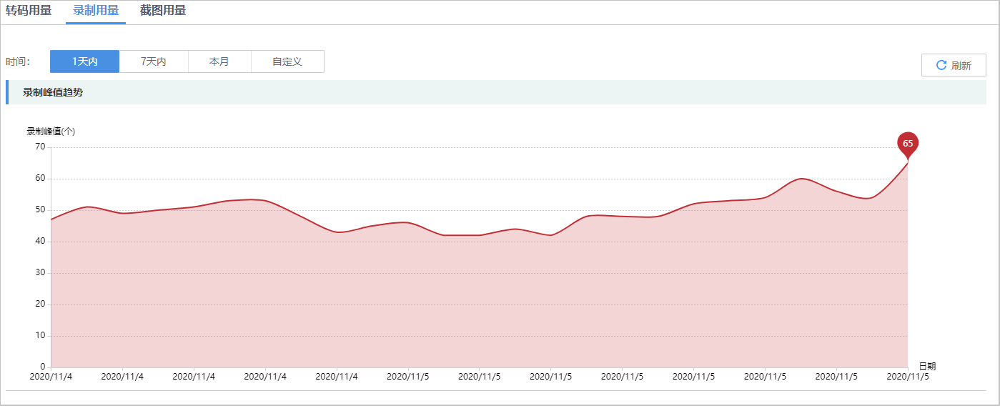
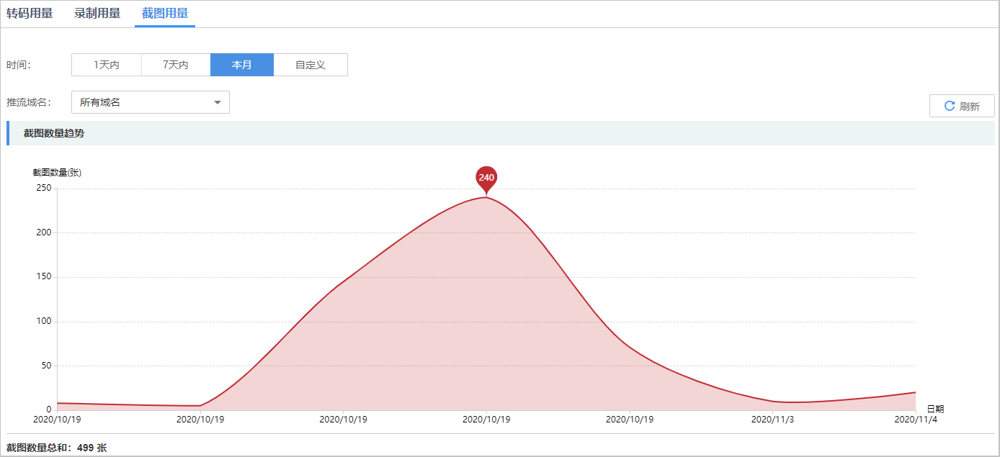

# 增值服务统计

您可以查看部署在新版视频直播服务下的所有推流域名的转码时长、录制最大并发数和截图数量统计信息。

## 查询说明

-   支持查询最近90天的历史数据。
-   查询的时间跨度最长为31天。

## 查询步骤

1.  登录[视频直播控制台](https://console.huaweicloud.com/live)。
2.  在左侧导航树中选择“统计分析（新版） \> 增值服务统计”。
3.  选择“转码用量”、“录制用量”或“截图用量”查看对应的统计数据。

## 转码用量

选择需要查看的时间及推流域名，即可在**转码时长总和**及**转码时长趋势**区域查看到相关数据。

-   **转码时长总和**中呈现的是所选域名在查询时间段内不同转码规格的转码总时长，如[图1](#fig53909471847)所示。

    **图 1**  转码时长总和  
    

-   **转码时长趋势**中呈现的是所选域名在查询时间段内不同转码规格的转码时长，将鼠标指针停留在趋势图上，滚动鼠标滚轮可针对某时间跨度范围内的趋势图时间横轴进行拉大或缩小整体占比。如[图2](#fig1729211117393)所示。

    **图 2**  转码时长趋势  
    

## 录制用量

系统每5分钟统计1个录制并发总路数，每小时得到12个值，取其中最大值作为该小时内的统计点，即该小时内的录制用量。

选择需要查看的时间，即可在**录制峰值趋势**区域查看到相关数据。

**录制峰值趋势**中呈现的是该账户每小时直播流录制的最大并发数，将鼠标指针停留在趋势图上，滚动鼠标滚轮可针对某时间跨度范围内的趋势图时间横轴进行拉大或缩小整体占比。如[图3](#fig211492004917)所示。

**图 3**  录制峰值趋势  

## 截图用量

选择需要查看的时间及推流域名，即可在**截图数量趋势**区域查看到相关数据。

**截图数量趋势**中呈现的是所选域名在推流过程中截取的直播画面张数，将鼠标指针停留在趋势图上，滚动鼠标滚轮可针对某时间跨度范围内的趋势图时间横轴进行拉大或缩小整体占比。如[图4](#fig815085617529)所示。

**图 4**  截图数量趋势  

