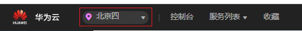
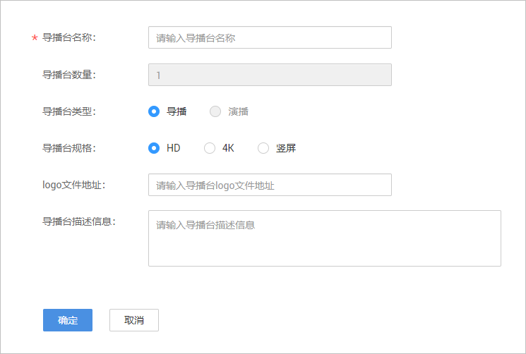
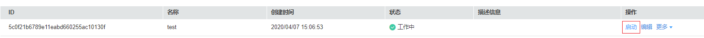
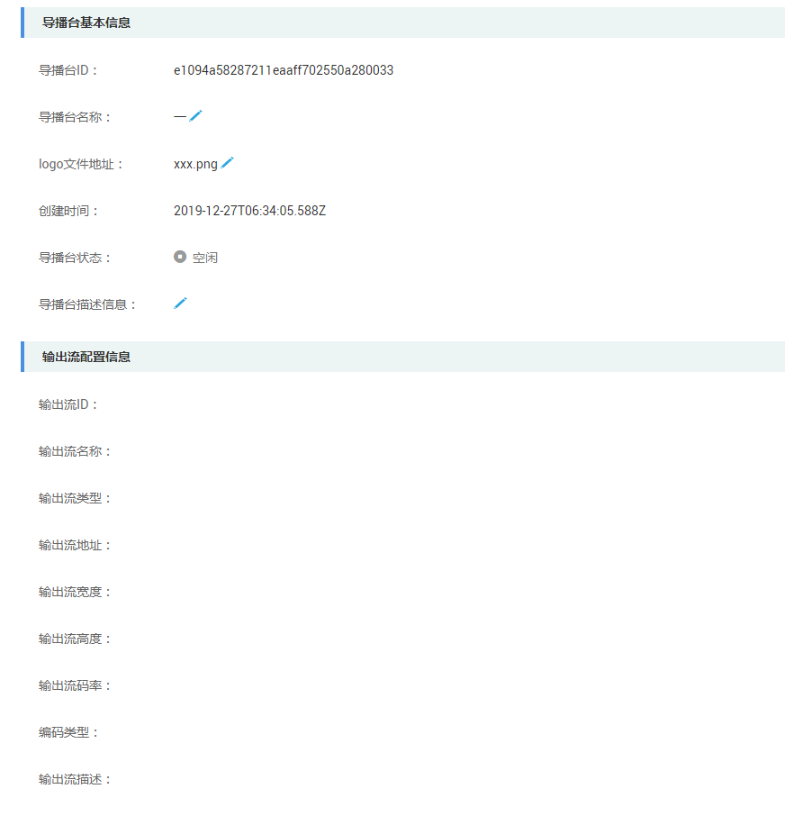

# 导播台管理

在使用导播台功能前，您需要创建一个导播台实例。您也可以对已有导播台进行编辑、复制、启动、停用或删除，同时还可以查看导播台的详细信息。

## 注意事项

云导播台功能暂只支持“华北-北京四”区域。

## 使用流程

**图 1**  云导播台使用流程  

1.  [创建导播台](#section182952512816)：[提交工单](https://console.huaweicloud.com/ticket/?#/ticketindex/business?productTypeId=ffb4ebf5fb094bc6aef0129c276ce42e)开通云导播功能后，在视频直播控制台创建一个新的导播台，并配置相关参数。
2.  准备音视频素材源：云导播台支持视频文件、网络直播源和其它设备作为输入源。
    -   若您需要使用视频文件作为输入源，您可以在启动云导播台前，先在点播控制台中上传音视频素材文件，具体上传方式请参见[音视频上传](https://support.huaweicloud.com/usermanual-vod/vod_01_0076.html#section2)。
    -   若您需要使用网络直播源作为输入源，您可以先在直播控制台完成[直播域名配置](添加域名.md)，然后使用对应的推流地址进行推流。您也可以使用非华为云直播流作为输入源。

3.  [启动导播台](#section4785111816592)：准备好音视频素材后，开始启动云导播台，进入导播台。
4.  开始导播：您可以在导播台中添加通道，并完成直播流输出参数配置，然后开始进行导播。

## 创建导播台

1.  登录[视频直播控制台](https://console.huaweicloud.com/live)。

    云导播台功能暂只支持“华北-北京四“区域，请在控制台左上角确认区域。

    **图 2**  切换区域  
    

2.  在左侧导航树中选择“云导播台 \> 云导播”，进入云导播页面。
3.  单击“创建”，配置导播台参数。

    **图 3**  创建导播台  
    

    -   **导播台类型**：暂只支持“导播”类型。
    -   **导播台规格**：导播台预设分辨率。可选设置为HD、4K或竖屏。
    -   **logo文件地址**：导播台logo文件所在的路径。

4.  单击“确定”，完成导播台的创建。

## 启动导播台

创建导播台后，您可以在导播台行单击“启动”，即可进入导播台操作界面，开始进行导播。具体操作请参见[云导播台指南](https://marketplace.huaweicloud.com/product/00301-499047-0--0)。

**图 4**  启动导播台  

## 管理导播台

-   查看导播台配置：导播台创建后，可以查看导播台的具体配置信息，并支持修改导播台名称、log文件地址及导播台描述信息。

    

-   复制导播台：您可以通过复制功能，快速创建一个新的导播台实例，新建的导播台与原导播台配置一致。
-   停用导播台：您可以选择“停止”，停用已不使用的导播台实例。
-   删除导播台：您可以选择“删除”，删除已不使用的导播台实例。

