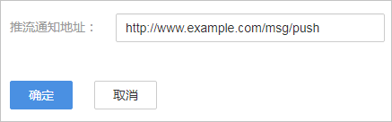
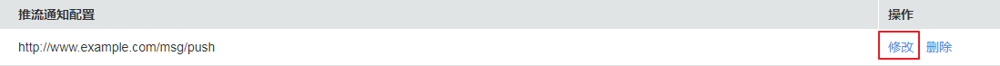
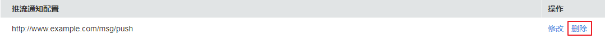

# 开停播通知<a name="live_01_0043"></a>

视频直播提供了开停播通知功能，您可以在直播控制台中为推流域名添加接收直播推流或断流通知的回调地址，通过HTTP接口向用户服务器发送POST请求，将直播推流成功和推流中断的状态实时反馈到用户服务器，用户服务器通过200响应返回接口返回结果。

## 前提条件<a name="section38573451572"></a>

-   已[添加推流域名](添加域名.md)。
-   已在域名DNS服务商处完成[CNAME解析配置](配置CNAME.md)。

## 新增开停播通知<a name="section109875558244"></a>

1.  登录[视频直播控制台](https://console.huaweicloud.com/live)。
2.  在左侧导航树中选择“域名管理“，进入域名管理页面。
3.  在需要配置开停播通知的推流域名行单击“管理”。
4.  在左侧导航树中选择“模板配置 \> 开停播通知“。
5.  单击“新增”，在打开的页面中添加接收直播开停播通知的URL，如[图1](#fig498111416521)所示。

    > **说明：** 
    >通知地址仅支持HTTP和HTTPS协议。

    **图 1**  添加直播开停播通知URL<a name="fig498111416521"></a>  
    

6.  单击“确定”，完成推流通知URL的配置。

    开始或结束直播推流时，都将收到直播状态回调消息，生成的具体事件回调消息请参见[回调示例](#section684411291126)。


## 管理开停播通知<a name="section122071843175012"></a>

直播开停播通知URL配置完成后，还可以根据实际需要进行如下操作。

-   修改开停播通知URL

    直播开停播通知地址创建完成后，若需要修改通知URL，可以通过单击操作列的“修改“，修改接收直播开停播通知的URL，如[图2](#fig53682456561)所示。

    **图 2**  修改直播开停播通知URL<a name="fig53682456561"></a>  
    

-   删除开停播通知URL

    直播开停播通知地址创建完成后，若需要删除通知URL，可以通过单击操作列的“删除“，删除接收直播开停播通知的URL，如[图3](#fig109796427582)所示。

    **图 3**  删除直播开停播通知URL<a name="fig109796427582"></a>  
    


## 回调示例<a name="section684411291126"></a>

直播推流和断流生成事件回调示例如下。回调消息体字段如[表1](#table762632871817)所示。

```
{
    "domain":"push.example.com",
    "app":"live",
    "stream":"example_stream",
    "usr_args":"auth_info=yz1TG0PVN/5isfyrGrRj10gKPCWqSS2X02t6QsRrocH+mEq0gQ0g8k6KhalS84sQ+kDprFyqI0yajbYiFmUO8e45B7ryaS+MpJBlYkhwnuFLnRiKK/IXG7.33436b625354564f6e4d4d434f55&cdn=hw",
    "client_ip":"100.125.58.90",
    "node_ip":"112.12.196.218",
    "publish_timestamp":"1587954134,",
    "event":"PUBLISH"
}
```

**表 1**  消息体字段说明

<a name="table762632871817"></a>
<table><thead align="left"><tr id="row76271228131815"><th class="cellrowborder" valign="top" width="20.47%" id="mcps1.2.3.1.1"><p id="p15627132813181"><a name="p15627132813181"></a><a name="p15627132813181"></a>字段</p>
</th>
<th class="cellrowborder" valign="top" width="79.53%" id="mcps1.2.3.1.2"><p id="p662716283181"><a name="p662716283181"></a><a name="p662716283181"></a>描述</p>
</th>
</tr>
</thead>
<tbody><tr id="row1421195012257"><td class="cellrowborder" valign="top" width="20.47%" headers="mcps1.2.3.1.1 "><p id="p10215500252"><a name="p10215500252"></a><a name="p10215500252"></a>domain</p>
</td>
<td class="cellrowborder" valign="top" width="79.53%" headers="mcps1.2.3.1.2 "><p id="p22212507254"><a name="p22212507254"></a><a name="p22212507254"></a>推流域名。</p>
</td>
</tr>
<tr id="row19487146102216"><td class="cellrowborder" valign="top" width="20.47%" headers="mcps1.2.3.1.1 "><p id="p1178919252314"><a name="p1178919252314"></a><a name="p1178919252314"></a>app</p>
</td>
<td class="cellrowborder" valign="top" width="79.53%" headers="mcps1.2.3.1.2 "><p id="p1653791716238"><a name="p1653791716238"></a><a name="p1653791716238"></a>应用名称。</p>
</td>
</tr>
<tr id="row7487046142211"><td class="cellrowborder" valign="top" width="20.47%" headers="mcps1.2.3.1.1 "><p id="p187891426230"><a name="p187891426230"></a><a name="p187891426230"></a>stream</p>
</td>
<td class="cellrowborder" valign="top" width="79.53%" headers="mcps1.2.3.1.2 "><p id="p1053761722314"><a name="p1053761722314"></a><a name="p1053761722314"></a>流名称。</p>
</td>
</tr>
<tr id="row15518153834012"><td class="cellrowborder" valign="top" width="20.47%" headers="mcps1.2.3.1.1 "><p id="p18519123814019"><a name="p18519123814019"></a><a name="p18519123814019"></a>usr_args</p>
</td>
<td class="cellrowborder" valign="top" width="79.53%" headers="mcps1.2.3.1.2 "><p id="p4519138144018"><a name="p4519138144018"></a><a name="p4519138144018"></a>推流参数。</p>
</td>
</tr>
<tr id="row11487164652214"><td class="cellrowborder" valign="top" width="20.47%" headers="mcps1.2.3.1.1 "><p id="p1878932192315"><a name="p1878932192315"></a><a name="p1878932192315"></a>client_ip</p>
</td>
<td class="cellrowborder" valign="top" width="79.53%" headers="mcps1.2.3.1.2 "><p id="p653731722314"><a name="p653731722314"></a><a name="p653731722314"></a>推流客户端IP。</p>
</td>
</tr>
<tr id="row1248714620228"><td class="cellrowborder" valign="top" width="20.47%" headers="mcps1.2.3.1.1 "><p id="p177894210232"><a name="p177894210232"></a><a name="p177894210232"></a>node_ip</p>
</td>
<td class="cellrowborder" valign="top" width="79.53%" headers="mcps1.2.3.1.2 "><p id="p1837717321351"><a name="p1837717321351"></a><a name="p1837717321351"></a>接受流的节点IP。</p>
</td>
</tr>
<tr id="row1448794642213"><td class="cellrowborder" valign="top" width="20.47%" headers="mcps1.2.3.1.1 "><p id="p4326171017284"><a name="p4326171017284"></a><a name="p4326171017284"></a>publish_timestamp</p>
</td>
<td class="cellrowborder" valign="top" width="79.53%" headers="mcps1.2.3.1.2 "><p id="p11590183413355"><a name="p11590183413355"></a><a name="p11590183413355"></a>推流Unix时间戳，一次推流活动会产生相同时间戳的推流和断流消息。</p>
</td>
</tr>
<tr id="row2048714618226"><td class="cellrowborder" valign="top" width="20.47%" headers="mcps1.2.3.1.1 "><p id="p1878912220231"><a name="p1878912220231"></a><a name="p1878912220231"></a>event</p>
</td>
<td class="cellrowborder" valign="top" width="79.53%" headers="mcps1.2.3.1.2 "><p id="p737511130473"><a name="p737511130473"></a><a name="p737511130473"></a>直播推流和断流标识。</p>
<p id="p9373192414710"><a name="p9373192414710"></a><a name="p9373192414710"></a>取值为：</p>
<a name="ul1476203714716"></a><a name="ul1476203714716"></a><ul id="ul1476203714716"><li>PUBLISH：开播。</li><li>PUBLISH_DONE：停播。</li></ul>
</td>
</tr>
</tbody>
</table>

