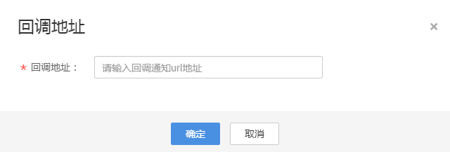

# 录制回调<a name="live_01_0035"></a>

直播服务提供了录制文件生成状态回调设置，支持配置HTTP/HTTPS URL，向用户服务器发送POST请求、消息体JSON格式，将文件生成事件信息实时反馈给用户。

## 操作步骤<a name="section1219814503715"></a>

1.  登录[视频直播控制台](https://console.huaweicloud.com/live)。
2.  在左侧导航树中选择“域名管理“，进入域名管理页面。
3.  在需要创建录制回调的推流域名行单击“管理“。
4.  在左侧导航树中选择“模板配置 \> 录制配置”，进入录制配置页面。
5.  单击“添加”设置回调地址，如[图1](#fig25094261470)所示。

    设置的回调地址中不能携带消息头和参数。

    **图 1**  添加录制回调URL<a name="fig25094261470"></a>  
    


## 回调示例<a name="section83321812146"></a>

录制文件生成事件回调示例如下。回调消息体字段如[表1](#table762632871817)所示。

```
{
    "push_domain": "push.example.com",
    "app_name": "live",
    "stream_name": "test",
    "record_format": "hls",
    "download_url": "https://xxx.obs.cn-north-4.myhwclouds.com:443/record%2Fstage%2Fstage%2Fdev-hw-20200318015%2F2020-03-23-03-56-22_2020-03-23-03-59-11.m3u8",
    "asset_id": "11ace88c90ca73daf708f113dc53e719",
    "play_url": "https://1199-cn-north-4.cdn-vod.huaweicloud.com/asset/11ace88c90ca73daf708f113dc53e719/67fb7eac46e49984e2ec1575323c02fc.m3u8",
    "file_size": 11468000,
    "record_duration": 168,
    "start_time": 1584935782,
    "stop_time": 1584935951,
    "video_width": 0,
    "video_height": 0,
    "cdn": "hw",
    "obs_location": "https://obs.cn-north-4.myhwclouds.com",
    "obs_bucket": "bytedance-obs-beijing-wj-live-douyin",
    "obs_object": "record/stage/stage/dev-hw-20200318015/2020-03-23-03-56-22_2020-03-23-03-59-11.m3u8",
    "customized_data": "vhost=push-rtmp-l26.douyincdn.com&&sign=ff1719fc0cafecae0fcf9dbbf8b69c29&expire=5E7984DA"
}
```

**表 1**  消息体字段说明

<a name="table762632871817"></a>
<table><thead align="left"><tr id="row76271228131815"><th class="cellrowborder" valign="top" width="35%" id="mcps1.2.3.1.1"><p id="p15627132813181"><a name="p15627132813181"></a><a name="p15627132813181"></a>字段</p>
</th>
<th class="cellrowborder" valign="top" width="65%" id="mcps1.2.3.1.2"><p id="p662716283181"><a name="p662716283181"></a><a name="p662716283181"></a>说明</p>
</th>
</tr>
</thead>
<tbody><tr id="row448624602219"><td class="cellrowborder" valign="top" width="35%" headers="mcps1.2.3.1.1 "><p id="p97894214237"><a name="p97894214237"></a><a name="p97894214237"></a>push_domain</p>
</td>
<td class="cellrowborder" valign="top" width="65%" headers="mcps1.2.3.1.2 "><p id="p553711732315"><a name="p553711732315"></a><a name="p553711732315"></a>直播推流域名。</p>
</td>
</tr>
<tr id="row19487146102216"><td class="cellrowborder" valign="top" width="35%" headers="mcps1.2.3.1.1 "><p id="p1178919252314"><a name="p1178919252314"></a><a name="p1178919252314"></a>app_name</p>
</td>
<td class="cellrowborder" valign="top" width="65%" headers="mcps1.2.3.1.2 "><p id="p1653791716238"><a name="p1653791716238"></a><a name="p1653791716238"></a>应用名。</p>
</td>
</tr>
<tr id="row7487046142211"><td class="cellrowborder" valign="top" width="35%" headers="mcps1.2.3.1.1 "><p id="p187891426230"><a name="p187891426230"></a><a name="p187891426230"></a>stream_name</p>
</td>
<td class="cellrowborder" valign="top" width="65%" headers="mcps1.2.3.1.2 "><p id="p1053761722314"><a name="p1053761722314"></a><a name="p1053761722314"></a>录制的流名。</p>
</td>
</tr>
<tr id="row11487164652214"><td class="cellrowborder" valign="top" width="35%" headers="mcps1.2.3.1.1 "><p id="p1878932192315"><a name="p1878932192315"></a><a name="p1878932192315"></a>record_format</p>
</td>
<td class="cellrowborder" valign="top" width="65%" headers="mcps1.2.3.1.2 "><p id="p653731722314"><a name="p653731722314"></a><a name="p653731722314"></a>录制格式，目前仅支持hls。</p>
</td>
</tr>
<tr id="row1248714620228"><td class="cellrowborder" valign="top" width="35%" headers="mcps1.2.3.1.1 "><p id="p177894210232"><a name="p177894210232"></a><a name="p177894210232"></a>download_url</p>
</td>
<td class="cellrowborder" valign="top" width="65%" headers="mcps1.2.3.1.2 "><p id="p1170391215253"><a name="p1170391215253"></a><a name="p1170391215253"></a>录制文件的下载地址。</p>
<div class="note" id="note11674183710111"><a name="note11674183710111"></a><a name="note11674183710111"></a><span class="notetitle"> 说明： </span><div class="notebody"><p id="p17537171717233"><a name="p17537171717233"></a><a name="p17537171717233"></a>该地址为OBS存储地址，由于OBS无加速功能，使用该地址直接播放可能会存在流畅性问题。</p>
</div></div>
</td>
</tr>
<tr id="row1448794642213"><td class="cellrowborder" valign="top" width="35%" headers="mcps1.2.3.1.1 "><p id="p978913215234"><a name="p978913215234"></a><a name="p978913215234"></a>play_url</p>
</td>
<td class="cellrowborder" valign="top" width="65%" headers="mcps1.2.3.1.2 "><p id="p1653718171235"><a name="p1653718171235"></a><a name="p1653718171235"></a>录制文件播放地址，可以直接播放。当<a href="配置直播录制.md#section4159236111015">配置直播录制</a>时，将存储录制文件的OBS桶授权给点播服务，则该字段不为空。</p>
</td>
</tr>
<tr id="row2048714618226"><td class="cellrowborder" valign="top" width="35%" headers="mcps1.2.3.1.1 "><p id="p1878912220231"><a name="p1878912220231"></a><a name="p1878912220231"></a>asset_id</p>
</td>
<td class="cellrowborder" valign="top" width="65%" headers="mcps1.2.3.1.2 "><p id="p653711718235"><a name="p653711718235"></a><a name="p653711718235"></a>媒资ID。若<a href="配置直播录制.md#section4159236111015">配置直播录制</a>时，将存储录制文件的OBS桶授权给点播服务，则为点播的媒资ID。</p>
</td>
</tr>
<tr id="row1862712289187"><td class="cellrowborder" valign="top" width="35%" headers="mcps1.2.3.1.1 "><p id="p578913262316"><a name="p578913262316"></a><a name="p578913262316"></a>file_size</p>
</td>
<td class="cellrowborder" valign="top" width="65%" headers="mcps1.2.3.1.2 "><p id="p156281652205010"><a name="p156281652205010"></a><a name="p156281652205010"></a>文件大小。</p>
<p id="p2537917192315"><a name="p2537917192315"></a><a name="p2537917192315"></a>单位：Byte。</p>
</td>
</tr>
<tr id="row13627328161815"><td class="cellrowborder" valign="top" width="35%" headers="mcps1.2.3.1.1 "><p id="p167893202319"><a name="p167893202319"></a><a name="p167893202319"></a>record_duration</p>
</td>
<td class="cellrowborder" valign="top" width="65%" headers="mcps1.2.3.1.2 "><p id="p459122116523"><a name="p459122116523"></a><a name="p459122116523"></a>录制文件的时长。</p>
<p id="p1853791718231"><a name="p1853791718231"></a><a name="p1853791718231"></a>单位：秒。</p>
</td>
</tr>
<tr id="row1162752871815"><td class="cellrowborder" valign="top" width="35%" headers="mcps1.2.3.1.1 "><p id="p3789023237"><a name="p3789023237"></a><a name="p3789023237"></a>start_time</p>
</td>
<td class="cellrowborder" valign="top" width="65%" headers="mcps1.2.3.1.2 "><p id="p1453761710235"><a name="p1453761710235"></a><a name="p1453761710235"></a>录制文件的开始时间，为UTC时间。</p>
</td>
</tr>
<tr id="row662712814181"><td class="cellrowborder" valign="top" width="35%" headers="mcps1.2.3.1.1 "><p id="p117891423231"><a name="p117891423231"></a><a name="p117891423231"></a>stop_time</p>
</td>
<td class="cellrowborder" valign="top" width="65%" headers="mcps1.2.3.1.2 "><p id="p115371117182314"><a name="p115371117182314"></a><a name="p115371117182314"></a>录制文件的结束时间，为UTC时间。</p>
</td>
</tr>
<tr id="row11627182816180"><td class="cellrowborder" valign="top" width="35%" headers="mcps1.2.3.1.1 "><p id="p13789102172315"><a name="p13789102172315"></a><a name="p13789102172315"></a>cdn</p>
</td>
<td class="cellrowborder" valign="top" width="65%" headers="mcps1.2.3.1.2 "><p id="p15537017122313"><a name="p15537017122313"></a><a name="p15537017122313"></a>CDN标识。</p>
</td>
</tr>
<tr id="row20627728101812"><td class="cellrowborder" valign="top" width="35%" headers="mcps1.2.3.1.1 "><p id="p778912142315"><a name="p778912142315"></a><a name="p778912142315"></a>obs_location</p>
</td>
<td class="cellrowborder" valign="top" width="65%" headers="mcps1.2.3.1.2 "><p id="p1453871722319"><a name="p1453871722319"></a><a name="p1453871722319"></a>存储录制文件的OBS桶所在区域。</p>
</td>
</tr>
<tr id="row862782813188"><td class="cellrowborder" valign="top" width="35%" headers="mcps1.2.3.1.1 "><p id="p57891623232"><a name="p57891623232"></a><a name="p57891623232"></a>obs_bucket</p>
</td>
<td class="cellrowborder" valign="top" width="65%" headers="mcps1.2.3.1.2 "><p id="p8538121720237"><a name="p8538121720237"></a><a name="p8538121720237"></a>存储录制文件的OBS桶。</p>
</td>
</tr>
<tr id="row8418120102317"><td class="cellrowborder" valign="top" width="35%" headers="mcps1.2.3.1.1 "><p id="p1778910219234"><a name="p1778910219234"></a><a name="p1778910219234"></a>obs_object</p>
</td>
<td class="cellrowborder" valign="top" width="65%" headers="mcps1.2.3.1.2 "><p id="p9120163454814"><a name="p9120163454814"></a><a name="p9120163454814"></a>OBS桶存储录制文件的路径。</p>
</td>
</tr>
<tr id="row241816012318"><td class="cellrowborder" valign="top" width="35%" headers="mcps1.2.3.1.1 "><p id="p7789524235"><a name="p7789524235"></a><a name="p7789524235"></a>customized_data</p>
</td>
<td class="cellrowborder" valign="top" width="65%" headers="mcps1.2.3.1.2 "><p id="p153818171235"><a name="p153818171235"></a><a name="p153818171235"></a>自定义扩展信息。</p>
</td>
</tr>
</tbody>
</table>

