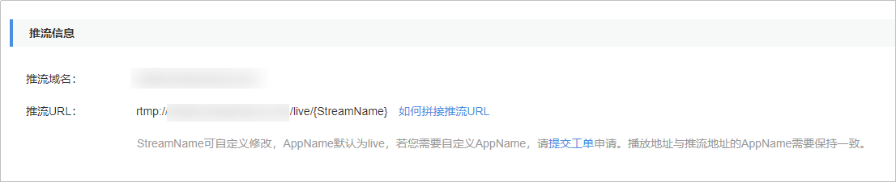

# 拼接推流地址<a name="live010007"></a>

直播域名配置完成后，您可以根据实际情况手动拼接对应的推流地址，然后再使用该地址进行直播推流。

## 前提条件<a name="section17678941576"></a>

-   已添加经过备案的域名，具体请参见[配置直播域名](添加域名.md)。
-   已在域名DNS服务商处完成CNAME解析配置，具体请参见[配置CNAME](配置CNAME.md)。
-   为保障推流地址不被非法盗用，华为云直播服务提供了防盗链功能，对推流地址进行加密鉴权。若有需要，请先[配置Key防盗链](推流鉴权.md)，然后使用鉴权地址进行推流。

## 操作步骤<a name="section15755164125910"></a>

1.  登录[视频直播控制台](https://console.huaweicloud.com/live)。
2.  在左侧导航树中选择“域名管理“，进入域名管理页面。
3.  在添加的推流域名行右侧单击“管理“，进入基本信息页面，即可查看推流信息。

    **图 1**  推流地址<a name="fig118901453733"></a>  
    

    -   您需要根据实际情况自定义“StreamName“，生成对应的原始推流地址，具体请参见[原始推流地址](#section1177854185914)。
    -   若配置了Key防盗链，您可以在原始推流地址后加上鉴权串生成对应的鉴权推流地址，具体请参见[鉴权推流地址](#section96985783812)。


## 原始推流地址<a name="section1177854185914"></a>

**拼接规则**

推流地址格式：

```
rtmp://推流域名/AppName/StreamName
```

-   **推流域名**：在视频直播控制台添加的推流域名。
-   **AppName**：应用名，默认为“live”。
-   **StreamName**：直播流名，每个应用可创建多个直播流，您可以自定义，不支持中文字符。

**拼接示例**

若添加的推流域名为“test-push.example.com“，“StreamName“为“huawei1“，“AppName“为“livetest“，则推流地址如下所示：

```
rtmp://test-push.example.com/livetest/huawei1
```

## 鉴权推流地址<a name="section96985783812"></a>

若您的推流地址开启了[Key防盗链](推流鉴权.md)功能，那么您需要根据获取的鉴权信息拼接鉴权推流地址，然后再使用该鉴权地址进行直播推流。

其中，鉴权推流地址根据您的推流域名是否部署在新版或旧版视频直播服务下所使用的鉴权算法有所不同，生成的鉴权推流地址也会不同。

-   若部署在新版视频直播服务下，鉴权推流地址的拼接规则请参见[播放Key防盗连（新版）](Key防盗链.md)。
-   若部署在旧版视频直播服务下，鉴权推流地址的拼接规则请参见[播放Key防盗连（旧版）](Key防盗链-2.md)。

