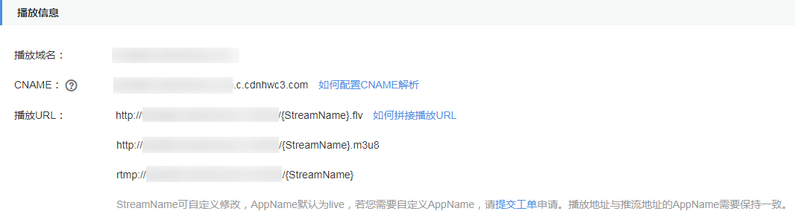

# 拼接播放地址<a name="live010008"></a>

直播域名配置完成后，您可以根据实际情况拼接获取对应的播放地址，然后再使用该地址进行视频播放。

## 前提条件<a name="section17678941576"></a>

-   已添加经过备案的域名，具体请参见[配置直播域名](添加域名.md)。
-   已在域名DNS服务商处完成CNAME解析配置，具体请参见[配置CNAME](配置CNAME.md)。
-   为保障直播资源不被非法盗播，华为云直播服务提供防盗链功能，对播放地址进行加密鉴权。若有需要，请先[配置Key防盗链](Key防盗链.md)，然后使用鉴权地址进行播放。
-   直播服务支持将推送的直播流转码成多种分辨率和码率规格的视频流，以满足不同网络环境的播放需求。若有需要，请先[创建转码模板](直播转码.md#fig1832599141516)，然后使用转码播放地址进行播放。

## 操作步骤<a name="section64918230390"></a>

1.  登录[视频直播控制台](https://console.huaweicloud.com/live)。
2.  在左侧导航树中选择“域名管理“，进入域名管理页面。
3.  在添加的播放域名行右侧单击“管理“，进入基本信息页面，即可查看播放信息。

    **图 1**  查看播放地址<a name="fig118901453733"></a>  
    

    -   您需要根据实际情况自定义“StreamName“，生成对应的原始播放地址，具体请参见[原始播放地址](#section1161893192813)。
    -   若配置了Key防盗链，您可以在原始播放地址后加上鉴权串，生成对应的鉴权播放地址，具体请参见[鉴权播放地址](#section1724192417267)。
    -   若需要使用不同的转码规格进行直播播放，您可以在原始或鉴权播放地址中的“StreamName“后加上“\_转码模板ID“，生成对应的转码播放地址，具体请参见[转码播放地址](#section392313195)。


## 原始播放地址<a name="section1161893192813"></a>

**拼接规则**

目前播放地址支持FLV、M3U8、RTMP三种格式，对应的拼接规则如下所示：

```
RTMP格式：rtmp://播放域名/AppName/StreamName
FLV格式：http://播放域名/AppName/StreamName.flv
M3U8格式：http://播放域名/AppName/StreamName.m3u8
```

-   **播放域名**：在视频直播控制台添加的播放域名。
-   **AppName**：应用名，默认为“live”。
-   **StreamName**：直播流名，每个应用可创建多个直播流，您可以自定义，不支持中文字符。

**拼接示例**：

若添加的播放域名为“test-play.example.com“，“AppName“为“livetest“，“StreamName“为“huawei1“，则不同规格拼接成如下所示的不同的原始播放地址。

```
RTMP格式：rtmp://test-play.example.com/livetest/huawei1
FLV格式：http://test-play.example.com/livetest/huawei1.flv
M3U8格式：http://test-play.example.com/livetest/huawei1.m3u8
```

## 鉴权播放地址<a name="section1724192417267"></a>

[Key防盗链](Key防盗链.md)功能开启后，那么您需要根据获取的鉴权信息生成对应的鉴权播放地址，然后再使用该鉴权地址进行直播播放。

**拼接规则**

播放地址格式为：

```
原始播放地址?auth_info=加密串.EncodedIV
```

鉴权算法如下所示，具体实现代码请参考[代码示例](Key防盗链.md#section632515010576)。

```
LiveID=<AppName>+"/"+<StreamName>
加密串=UrlEncode(Base64(AES128（"$"+<Timestamp>+"$"+<LiveID>+"$"+<CheckLevel>)))
EncodedIV=Hex(加密使用的IV)
```

**拼接示例**

原始播放地址：

```
rtmp://test-play.example.com/livetest/huawei1
```

通过鉴权算法计算“加密串“和“EncodedIV“

```
加密串 = z6uwSWUceM2%2FZeDpc2LqjhEFhhXpjQ5IQJhrLoIARQ2%2Bn%2BJV4DrzGRqXxWxMLQBU
EncodedIV = 44393135353831414132454633374139
```

则鉴权播放地址为：

```
rtmp://test-play.example.com/livetest/huawei1?auth_info=z6uwSWUceM2%2FZeDpc2LqjhEFhhXpjQ5IQJhrLoIARQ2%2Bn%2BJV4DrzGRqXxWxMLQBU.44393135353831414132454633374139
```

## 转码播放地址<a name="section392313195"></a>

在直播推流前若您配置了[直播转码](直播转码.md)，那么您需要根据播放地址是否开启了[Key防盗链](Key防盗链.md)加密的情况拼接转码播放地址。

**拼接规则**

在[原始播放地址](#section1161893192813)和[鉴权播放地址](#section1724192417267)中的“StreamName“字段后加上“\_转码模板ID“即可。

**转码模板ID**：直播转码使用的转码模板的ID，其中预置转码模板ID为固定的，自定义转码模板的ID可自定义。需要进入[视频直播控制台](https://console.huaweicloud.com/live)的“域名管理”页面，在推流域名行的“管理 \> 模板配置 \> 转码配置“页面获取 。

**图 2**  获取转码模板ID<a name="fig67931329105318"></a>  


**拼接示例**：

若**原始播放地址**为“http://test-play.example.com/livetest/huawei1.flv“，“转码模板ID“为“110“。根据播放地址是否开启了Key防盗链加密功能，拼接对应的转码播放地址。

-   若播放地址未开启Key防盗链加密功能，则转码播放地址如下所示：

    ```
    http://test-play.example.com/livetest/huawei1_110.flv
    ```

-   若播放地址开启了Key防盗链加密功能，则需要在未鉴权的转码播放地址后加上鉴权信息，对应的播放地址如下所示：

    ```
    rtmp://test-play.example.com/livetest/huawei1_110.flv?auth_info=z6uwSWUceM2%2FZeDpc2LqjhEFhhXpjQ5IQJhrLoIARQ2%2Bn%2BJV4DrzGRqXxWxMLQBU.44393135353831414132454633374139
    ```

    鉴权信息可以直接参考[鉴权播放地址](#section1724192417267)生成。


