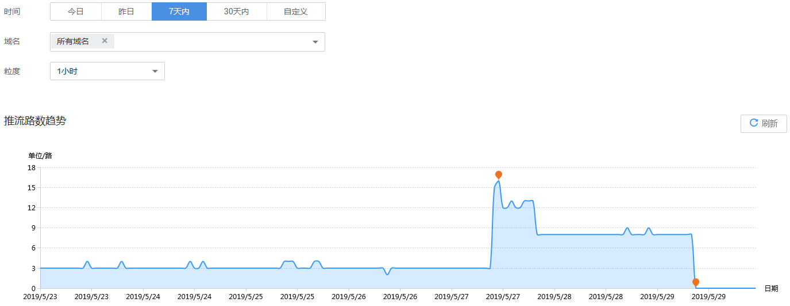

# 推流路数

支持查看部署在新版和旧版视频直播服务下的所有域名在推流端产生的总推流路数。

## 查询说明

-   推流路数指推流到直播源站的总推流路数。
-   支持查看最近90天的历史数据。
-   支持选择多个域名同时查看，单次查看的域名总数不能超过20个。
-   查询的时间跨度最长为31天。
-   最小统计粒度为1小时，如2019-04-02 8:00:00\~2019-04-02 8:59:59时间段内的数据会统计展示在2019-04-02 8:00:00这个统计点上。

## 查看推流路数

1.  登录[视频直播控制台](https://console.huaweicloud.com/live)。
2.  在左侧导航树中选择“统计分析 \> 推流路数”，进入推流路数统计页面。
3.  您可以选择需要查看的时间，域名及粒度，即可在**推流路数趋势**区域查看到相关数据。

    **推流路数趋势**中呈现的是所选域名直播推流到源站的总路数趋势，将鼠标指针停留在趋势图上，滚动鼠标滚轮可针对某时间跨度范围内的趋势图时间横轴进行拉大或缩小整体占比。

    **图 1**  推流路数趋势  
    

