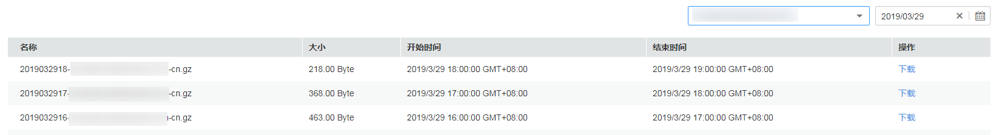

# 日志管理<a name="ZH-CN_TOPIC_0162687300"></a>

日志管理记录了所有播放域名被网络用户访问的详细日志，您可以通过下载指定时段的日志，对您的业务资源被访问情况进行详细分析，支持下载最近14天内的日志数据。

> **须知：**   
>日志中记录的数据仅供数据分析和参考使用，计费数据请以账单为准。  

## 日志说明<a name="section4954538162713"></a>

**日志命名规则**：_日志时间_\__播放域名_-cn.gz

**日志生成规则**：日志默认按小时粒度进行分割，若域名无请求，则不会产生日志数据包；正在进行拉流的直播日志一般5个小时后才能在控制台进行查询。

**日志格式**：\[time\] client\_ip event areferer protocol domain path app\_name streamName code size ua client\_id

> **说明：**   
>若某字段不涉及或为空时，用-表示；若字段信息中存在空格，则需带上英文双引号""。  

**日志示例**：

```
[29/Mar/2019:18:05:36 +0800] 10.12.34.11 disconnected - rtmp live-play.huaweicloud.com /live live 9989 200 1568367476 "-" rtmp-16ed04b44451c6bbe646405b-235563
```

各字段的含义如[表1](#table12231345151615)所示。

**表 1**  日志字段含义说明

<a name="table12231345151615"></a>
<table><thead align="left"><tr id="row42311745191611"><th class="cellrowborder" valign="top" width="23.002300230023003%" id="mcps1.2.4.1.1"><p id="p22321457167"><a name="p22321457167"></a><a name="p22321457167"></a>字段名</p>
</th>
<th class="cellrowborder" valign="top" width="43.66436643664366%" id="mcps1.2.4.1.2"><p id="p06501947172"><a name="p06501947172"></a><a name="p06501947172"></a>字段含义</p>
</th>
<th class="cellrowborder" valign="top" width="33.33333333333333%" id="mcps1.2.4.1.3"><p id="p5232945161611"><a name="p5232945161611"></a><a name="p5232945161611"></a>字段示例</p>
</th>
</tr>
</thead>
<tbody><tr id="row1323214452163"><td class="cellrowborder" valign="top" width="23.002300230023003%" headers="mcps1.2.4.1.1 "><p id="p1384218462572"><a name="p1384218462572"></a><a name="p1384218462572"></a>time</p>
</td>
<td class="cellrowborder" valign="top" width="43.66436643664366%" headers="mcps1.2.4.1.2 "><p id="p56518451716"><a name="p56518451716"></a><a name="p56518451716"></a>日志生成时间。</p>
<p id="p6375947182016"><a name="p6375947182016"></a><a name="p6375947182016"></a>格式：DD/Month /YYYY:HH:MM:SS +0800</p>
</td>
<td class="cellrowborder" valign="top" width="33.33333333333333%" headers="mcps1.2.4.1.3 "><p id="p523418456163"><a name="p523418456163"></a><a name="p523418456163"></a>29/Mar/2019:18:05:36 +0800</p>
</td>
</tr>
<tr id="row126125279219"><td class="cellrowborder" valign="top" width="23.002300230023003%" headers="mcps1.2.4.1.1 "><p id="p230115514577"><a name="p230115514577"></a><a name="p230115514577"></a>client_ip</p>
</td>
<td class="cellrowborder" valign="top" width="43.66436643664366%" headers="mcps1.2.4.1.2 "><p id="p186131227202113"><a name="p186131227202113"></a><a name="p186131227202113"></a>访问IP地址，IPV4或IPV6格式。</p>
</td>
<td class="cellrowborder" valign="top" width="33.33333333333333%" headers="mcps1.2.4.1.3 "><p id="p1161352762114"><a name="p1161352762114"></a><a name="p1161352762114"></a>10.12.34.11</p>
</td>
</tr>
<tr id="row594916271218"><td class="cellrowborder" valign="top" width="23.002300230023003%" headers="mcps1.2.4.1.1 "><p id="p0949192714214"><a name="p0949192714214"></a><a name="p0949192714214"></a>event</p>
</td>
<td class="cellrowborder" valign="top" width="43.66436643664366%" headers="mcps1.2.4.1.2 "><p id="p194952722110"><a name="p194952722110"></a><a name="p194952722110"></a>状态，如连接开始、播放中、连接停止。</p>
</td>
<td class="cellrowborder" valign="top" width="33.33333333333333%" headers="mcps1.2.4.1.3 "><p id="p10949132718212"><a name="p10949132718212"></a><a name="p10949132718212"></a>disconnected</p>
</td>
</tr>
<tr id="row18255132832115"><td class="cellrowborder" valign="top" width="23.002300230023003%" headers="mcps1.2.4.1.1 "><p id="p1255112832118"><a name="p1255112832118"></a><a name="p1255112832118"></a>referer</p>
</td>
<td class="cellrowborder" valign="top" width="43.66436643664366%" headers="mcps1.2.4.1.2 "><p id="p14255122815215"><a name="p14255122815215"></a><a name="p14255122815215"></a>Referer信息。</p>
</td>
<td class="cellrowborder" valign="top" width="33.33333333333333%" headers="mcps1.2.4.1.3 "><p id="p025592816214"><a name="p025592816214"></a><a name="p025592816214"></a>-表示不涉及</p>
</td>
</tr>
<tr id="row16403162882112"><td class="cellrowborder" valign="top" width="23.002300230023003%" headers="mcps1.2.4.1.1 "><p id="p4403128132118"><a name="p4403128132118"></a><a name="p4403128132118"></a>protocol</p>
</td>
<td class="cellrowborder" valign="top" width="43.66436643664366%" headers="mcps1.2.4.1.2 "><p id="p1403132862118"><a name="p1403132862118"></a><a name="p1403132862118"></a>协议标识。</p>
</td>
<td class="cellrowborder" valign="top" width="33.33333333333333%" headers="mcps1.2.4.1.3 "><p id="p84032028162119"><a name="p84032028162119"></a><a name="p84032028162119"></a>HTTP/1.1或RTMP/-</p>
</td>
</tr>
<tr id="row1059692852115"><td class="cellrowborder" valign="top" width="23.002300230023003%" headers="mcps1.2.4.1.1 "><p id="p759692832112"><a name="p759692832112"></a><a name="p759692832112"></a>domain</p>
</td>
<td class="cellrowborder" valign="top" width="43.66436643664366%" headers="mcps1.2.4.1.2 "><p id="p959792812110"><a name="p959792812110"></a><a name="p959792812110"></a>播放域名。</p>
</td>
<td class="cellrowborder" valign="top" width="33.33333333333333%" headers="mcps1.2.4.1.3 "><p id="p18597192818217"><a name="p18597192818217"></a><a name="p18597192818217"></a>live-play.huaweicloud.com</p>
</td>
</tr>
<tr id="row878820287216"><td class="cellrowborder" valign="top" width="23.002300230023003%" headers="mcps1.2.4.1.1 "><p id="p87887282217"><a name="p87887282217"></a><a name="p87887282217"></a>path</p>
</td>
<td class="cellrowborder" valign="top" width="43.66436643664366%" headers="mcps1.2.4.1.2 "><p id="p378852815219"><a name="p378852815219"></a><a name="p378852815219"></a>请求路径，包括路径和查询条件。</p>
</td>
<td class="cellrowborder" valign="top" width="33.33333333333333%" headers="mcps1.2.4.1.3 "><p id="p7700154191517"><a name="p7700154191517"></a><a name="p7700154191517"></a>若播放地址是：http://live-play.huaweicloud.com/live/huawei01.flv?id=3333，则path为：/live/huawei01.flv?id=3333</p>
</td>
</tr>
<tr id="row198992816218"><td class="cellrowborder" valign="top" width="23.002300230023003%" headers="mcps1.2.4.1.1 "><p id="p1099012286218"><a name="p1099012286218"></a><a name="p1099012286218"></a>app_name</p>
</td>
<td class="cellrowborder" valign="top" width="43.66436643664366%" headers="mcps1.2.4.1.2 "><p id="p79907285219"><a name="p79907285219"></a><a name="p79907285219"></a>应用名称。</p>
</td>
<td class="cellrowborder" valign="top" width="33.33333333333333%" headers="mcps1.2.4.1.3 "><p id="p9990142892114"><a name="p9990142892114"></a><a name="p9990142892114"></a>live</p>
</td>
</tr>
<tr id="row617417296211"><td class="cellrowborder" valign="top" width="23.002300230023003%" headers="mcps1.2.4.1.1 "><p id="p3174152911217"><a name="p3174152911217"></a><a name="p3174152911217"></a>streamName</p>
</td>
<td class="cellrowborder" valign="top" width="43.66436643664366%" headers="mcps1.2.4.1.2 "><p id="p1317419298214"><a name="p1317419298214"></a><a name="p1317419298214"></a>流名称。</p>
</td>
<td class="cellrowborder" valign="top" width="33.33333333333333%" headers="mcps1.2.4.1.3 "><p id="p1617492932110"><a name="p1617492932110"></a><a name="p1617492932110"></a>9989</p>
</td>
</tr>
<tr id="row0369152913211"><td class="cellrowborder" valign="top" width="23.002300230023003%" headers="mcps1.2.4.1.1 "><p id="p237052972118"><a name="p237052972118"></a><a name="p237052972118"></a>code</p>
</td>
<td class="cellrowborder" valign="top" width="43.66436643664366%" headers="mcps1.2.4.1.2 "><p id="p83702295216"><a name="p83702295216"></a><a name="p83702295216"></a>HTTP状态码。</p>
</td>
<td class="cellrowborder" valign="top" width="33.33333333333333%" headers="mcps1.2.4.1.3 "><p id="p1370102911217"><a name="p1370102911217"></a><a name="p1370102911217"></a>200</p>
</td>
</tr>
<tr id="row17597122913215"><td class="cellrowborder" valign="top" width="23.002300230023003%" headers="mcps1.2.4.1.1 "><p id="p1259862952120"><a name="p1259862952120"></a><a name="p1259862952120"></a>size</p>
</td>
<td class="cellrowborder" valign="top" width="43.66436643664366%" headers="mcps1.2.4.1.2 "><p id="p659862962111"><a name="p659862962111"></a><a name="p659862962111"></a>服务器到客户端的流量。</p>
<p id="p1833252111"><a name="p1833252111"></a><a name="p1833252111"></a>单位：Byte。</p>
</td>
<td class="cellrowborder" valign="top" width="33.33333333333333%" headers="mcps1.2.4.1.3 "><p id="p6598142911213"><a name="p6598142911213"></a><a name="p6598142911213"></a>1568367476</p>
</td>
</tr>
<tr id="row07741829102119"><td class="cellrowborder" valign="top" width="23.002300230023003%" headers="mcps1.2.4.1.1 "><p id="p13774142962115"><a name="p13774142962115"></a><a name="p13774142962115"></a>ua</p>
</td>
<td class="cellrowborder" valign="top" width="43.66436643664366%" headers="mcps1.2.4.1.2 "><p id="p16775122913211"><a name="p16775122913211"></a><a name="p16775122913211"></a>User-Agent信息。</p>
</td>
<td class="cellrowborder" valign="top" width="33.33333333333333%" headers="mcps1.2.4.1.3 "><p id="p19775429102112"><a name="p19775429102112"></a><a name="p19775429102112"></a>"-" 表示不涉及</p>
</td>
</tr>
<tr id="row14245153020214"><td class="cellrowborder" valign="top" width="23.002300230023003%" headers="mcps1.2.4.1.1 "><p id="p1524593019210"><a name="p1524593019210"></a><a name="p1524593019210"></a>client_id</p>
</td>
<td class="cellrowborder" valign="top" width="43.66436643664366%" headers="mcps1.2.4.1.2 "><p id="p1824553032114"><a name="p1824553032114"></a><a name="p1824553032114"></a>客户端id。</p>
</td>
<td class="cellrowborder" valign="top" width="33.33333333333333%" headers="mcps1.2.4.1.3 "><p id="p3245173010213"><a name="p3245173010213"></a><a name="p3245173010213"></a>rtmp-16ed04b44451c6bbe646405b-235563</p>
</td>
</tr>
</tbody>
</table>

## 日志下载<a name="section1335503472716"></a>

1.  登录[视频直播控制台](https://console.huaweicloud.com/live)。
2.  在左侧导航树中选择“日志管理“，进入日志管理页面。
3.  选择需要查询的域名和日期。

    系统将在日志列表中显示出指定日期内的所有日志，每小时生成一个日志文件。

    **图 1**  日志下载<a name="fig154644120716"></a>  
    

4.  在需要下载的日志行单击“下载”，将日志下载到本地。

