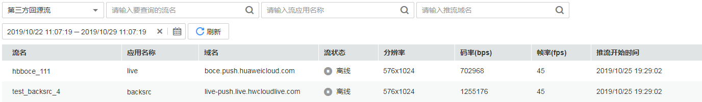

# 流详情

在流详情中您可以查看的直播流详细信息包括：使用了直播加速服务的直播流、使用第三方CDN推送至直播源站的直播流以及使用了转码模板后推送到直播源站的直播流。

## 查询说明

-   支持查看最近90天的历史数据。
-   可查询离线和在线的直播流信息。
-   在[CDN流详情](#section672304981410)中，通过推流域名可查看直播流的码率、帧率、原始帧率、丢帧率、延迟及推流时间。
-   在[CDN流详情](#section672304981410)中，通过播放域名只可查看直播流的观众人数。
-   在[源站推流详情](#section41041629175716)中，可查看推送的直播流的分辨率、码率、帧率及推流时间。
-   在[源站推流详情](#section41041629175716)中，若查询时间为空，则显示为实时的在线直播流数据。

## 查看CDN流详情

您可以在“CDN流详情”页签中，查看使用了直播加速服务的直播流详细信息。

1.  登录[视频直播控制台](https://console.huaweicloud.com/live)。
2.  在左侧导航树中选择“统计分析 \> 流详情”，进入流详情页面。
3.  在“CDN流详情”页签，您可以选择直播流状态、流名称、推流或播放域名进行搜索。

    **图 1**  CDN流详情  
    

    > **说明：** 
    >“--”表示不支持该字段的查看。

    详情列表可查看到流的名称、域名、流状态等信息，如[表1](#table972011313392)所示。

    **表 1**  参数说明

    
    <table><thead align="left"><tr id="row16719171319397"><th class="cellrowborder" valign="top" width="23.23%" id="mcps1.2.3.1.1">
参数名

    </th>
    <th class="cellrowborder" valign="top" width="76.77000000000001%" id="mcps1.2.3.1.2">
描述

    </th>
    </tr>
    </thead>
    <tbody><tr id="row27197135390"><td class="cellrowborder" valign="top" width="23.23%" headers="mcps1.2.3.1.1 ">
流名

    </td>
    <td class="cellrowborder" valign="top" width="76.77000000000001%" headers="mcps1.2.3.1.2 ">
直播流名称，与推流和播放地址中的StreamName一致。

    </td>
    </tr>
    <tr id="row177197133392"><td class="cellrowborder" valign="top" width="23.23%" headers="mcps1.2.3.1.1 ">
域名

    </td>
    <td class="cellrowborder" valign="top" width="76.77000000000001%" headers="mcps1.2.3.1.2 ">
推拉流域名。

    </td>
    </tr>
    <tr id="row77191013113911"><td class="cellrowborder" valign="top" width="23.23%" headers="mcps1.2.3.1.1 ">
流状态

    </td>
    <td class="cellrowborder" valign="top" width="76.77000000000001%" headers="mcps1.2.3.1.2 ">
直播流状态，分别为在线和离线。

    </td>
    </tr>
    <tr id="row1871901333918"><td class="cellrowborder" valign="top" width="23.23%" headers="mcps1.2.3.1.1 ">
在线人数

    </td>
    <td class="cellrowborder" valign="top" width="76.77000000000001%" headers="mcps1.2.3.1.2 ">
观看直播流的观众人数。

    </td>
    </tr>
    <tr id="row12719813193919"><td class="cellrowborder" valign="top" width="23.23%" headers="mcps1.2.3.1.1 ">
码率（bps）

    </td>
    <td class="cellrowborder" valign="top" width="76.77000000000001%" headers="mcps1.2.3.1.2 ">
直播推流的码率。

    </td>
    </tr>
    <tr id="row27192133392"><td class="cellrowborder" valign="top" width="23.23%" headers="mcps1.2.3.1.1 ">
帧率（fps）

    </td>
    <td class="cellrowborder" valign="top" width="76.77000000000001%" headers="mcps1.2.3.1.2 ">
直播推流的帧率。

    </td>
    </tr>
    <tr id="row147201613173918"><td class="cellrowborder" valign="top" width="23.23%" headers="mcps1.2.3.1.1 ">
原始帧率（fps）

    </td>
    <td class="cellrowborder" valign="top" width="76.77000000000001%" headers="mcps1.2.3.1.2 ">
直播推流的原始帧率。

    </td>
    </tr>
    <tr id="row1472031314399"><td class="cellrowborder" valign="top" width="23.23%" headers="mcps1.2.3.1.1 ">
丢帧率（%）

    </td>
    <td class="cellrowborder" valign="top" width="76.77000000000001%" headers="mcps1.2.3.1.2 ">
直播推流的丢帧率。

    </td>
    </tr>
    <tr id="row772011314394"><td class="cellrowborder" valign="top" width="23.23%" headers="mcps1.2.3.1.1 ">
延迟（ms）

    </td>
    <td class="cellrowborder" valign="top" width="76.77000000000001%" headers="mcps1.2.3.1.2 ">
直播推流的延迟时间。

    </td>
    </tr>
    <tr id="row16720201343918"><td class="cellrowborder" valign="top" width="23.23%" headers="mcps1.2.3.1.1 ">
推流时间

    </td>
    <td class="cellrowborder" valign="top" width="76.77000000000001%" headers="mcps1.2.3.1.2 ">
直播开始推流的时间。

    </td>
    </tr>
    </tbody>
    </table>

## 查看源站推流详情

您可以在“源站推流详情”页签中，查看第三方源站回流和转码流的详细信息。

1.  登录[视频直播控制台](https://console.huaweicloud.com/live)。
2.  在左侧导航树中选择“统计分析 \> 流详情”，进入流详情页面。
3.  在“源站”页签，您可以在下拉框中选择查看“第三方回源流”或“转码推流”的详细信息。

    “第三方回源流”或“转码推流”均可以按照直播流名称、应用名称或推流域名进行搜索。

    **图 2**  第三方回源流  
    

    **图 3**  转码推流  
    

    详情列表可查看到直播流的名称、域名、流状态等信息，如[表2](#table34771951165119)所示。

    **表 2**  参数说明

    
    <table><thead align="left"><tr id="row347755117516"><th class="cellrowborder" valign="top" width="23.23%" id="mcps1.2.3.1.1">
参数名

    </th>
    <th class="cellrowborder" valign="top" width="76.77000000000001%" id="mcps1.2.3.1.2">
描述

    </th>
    </tr>
    </thead>
    <tbody><tr id="row147717516518"><td class="cellrowborder" valign="top" width="23.23%" headers="mcps1.2.3.1.1 ">
流名

    </td>
    <td class="cellrowborder" valign="top" width="76.77000000000001%" headers="mcps1.2.3.1.2 ">
直播流名称，与推流地址中的StreamName一致。

    </td>
    </tr>
    <tr id="row15477251175113"><td class="cellrowborder" valign="top" width="23.23%" headers="mcps1.2.3.1.1 ">
应用名称

    </td>
    <td class="cellrowborder" valign="top" width="76.77000000000001%" headers="mcps1.2.3.1.2 ">
直播流的应用名称，与推流地址中的AppName一致。

    </td>
    </tr>
    <tr id="row347717515519"><td class="cellrowborder" valign="top" width="23.23%" headers="mcps1.2.3.1.1 ">
域名

    </td>
    <td class="cellrowborder" valign="top" width="76.77000000000001%" headers="mcps1.2.3.1.2 ">
推流域名。

    </td>
    </tr>
    <tr id="row447712512513"><td class="cellrowborder" valign="top" width="23.23%" headers="mcps1.2.3.1.1 ">
流状态

    </td>
    <td class="cellrowborder" valign="top" width="76.77000000000001%" headers="mcps1.2.3.1.2 ">
直播流状态，分别为在线和离线。

    </td>
    </tr>
    <tr id="row947765115515"><td class="cellrowborder" valign="top" width="23.23%" headers="mcps1.2.3.1.1 ">
分辨率

    </td>
    <td class="cellrowborder" valign="top" width="76.77000000000001%" headers="mcps1.2.3.1.2 ">
转码视频的分辨率，宽高。

    </td>
    </tr>
    <tr id="row154771514518"><td class="cellrowborder" valign="top" width="23.23%" headers="mcps1.2.3.1.1 ">
码率（bps）

    </td>
    <td class="cellrowborder" valign="top" width="76.77000000000001%" headers="mcps1.2.3.1.2 ">
直播推流的码率。

    </td>
    </tr>
    <tr id="row4477451125110"><td class="cellrowborder" valign="top" width="23.23%" headers="mcps1.2.3.1.1 ">
帧率（fps）

    </td>
    <td class="cellrowborder" valign="top" width="76.77000000000001%" headers="mcps1.2.3.1.2 ">
直播推流的帧率。

    </td>
    </tr>
    <tr id="row154777518513"><td class="cellrowborder" valign="top" width="23.23%" headers="mcps1.2.3.1.1 ">
推流时间

    </td>
    <td class="cellrowborder" valign="top" width="76.77000000000001%" headers="mcps1.2.3.1.2 ">
直播开始推流的时间。

    </td>
    </tr>
    </tbody>
    </table>

