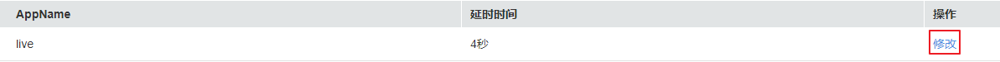

# 直播延时

华为云直播播放延时默认为4秒，您可以根据实际需求在控制台中修改播放延时。

## 注意事项

-   目前暂只支持RTMP、HTTP-FLV播放的延时配置，推流端GOP值不能大于配置的延时，播放的实际延时受播放端的网络情况等因素影响。
-   若修改了播放的延时配置需重新推流后才生效。

## 前提条件

-   已添加经过备案的域名，具体请参见[配置直播域名](添加域名.md)。
-   已在域名DNS服务商处完成CNAME解析配置，具体请参见[配置CNAME](配置CNAME.md)。

## 操作步骤

1.  登录[视频直播控制台](https://console.huaweicloud.com/live)。
2.  在左侧导航树中选择“域名管理“，进入域名管理页面。
3.  在需要修改直播延时的播放域名行右侧单击“管理”。
4.  在左侧导航树中选择“模板配置 \> 延时配置“。
5.  在目标应用右侧单击“修改”，如[图1](#fig1454514315368)所示。

    **图 1**  修改操作  
    

6.  在打开的页面中配置直播延时，如[图2](#fig53085448313)所示。

    直播播放延时默认为4秒，您可以根据实际情况修改延时。

    **图 2**  修改延时  
    

7.  单击“确定”，完成直播延时的配置。

