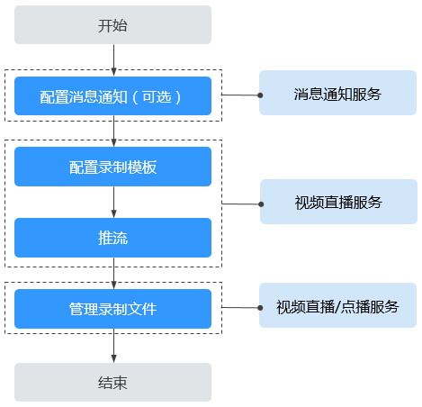
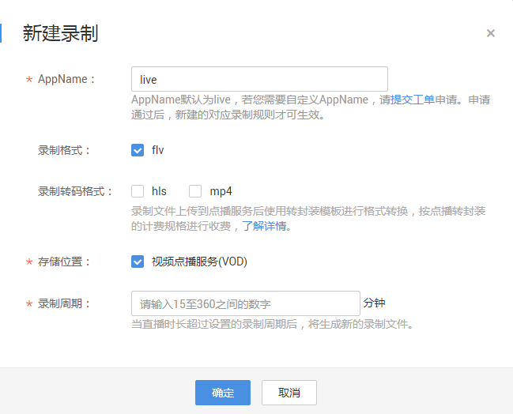
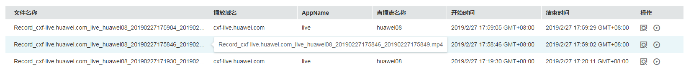
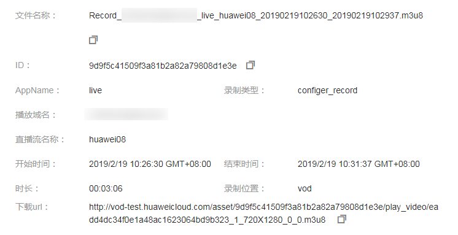
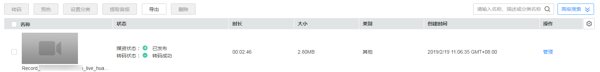

# 直播录制

直播服务支持将直播内容进行录制并将录制的视频存储到VOD（视频点播 Video on Demand）中，您可以在VOD中对录制的直播视频进行剪辑、拼接、转码、音频提取等处理。暂只支持在“华北-北京一”区域使用。

> **说明：** 
>公测功能，已停止演进，仅做基础维护，不保障SLA，请及时迁移至商用新版录制系统。

## 录制流程

直播录制管理相关操作流程，如[图1](#fig10775176165115)所示。

**图 1**  直播录制至VOD流程图  

1.  [配置消息通知（可选）](#section13330152141320)：若您需要实时了解录制的状态，可以在直播开始录制前，配置录制通知。若您不需要消息通知，可直接跳转到[2](#li1235910237132)。
2.  [配置录制模板](#section19658102215144)：为直播配置录制规则，配置完成后，域名下所有直播流将按照录制规则进行录制。
3.  [推流](#section0782322163112)：录制规则配置完成后，获取[推流地址](拼接推流地址.md)进行直播推流，直播服务会根据配置的录制规则对正在直播的视频进行录制。
4.  [管理录制文件](#section18880152891418)：直播录制完成后，可以在直播服务中获取录制文件基本信息并预览，也可以在点播服务中管理录制文件，如预览、发布、转码和播放等。

## 前提条件

-   已添加经过备案的域名，具体请参见[配置直播域名](添加域名.md)。
-   已在域名DNS服务商处完成CNAME解析配置，具体请参见[配置CNAME](配置CNAME.md)。
-   因直播录制生成的视频文件是存储在视频点播服务中的，因此，您需要先开通视频点播（VOD）服务，才能将视频存储至VOD，具体请参见[快速使用点播服务](https://support.huaweicloud.com/qs-vod/vod020001.html)。

## 注意事项

-   暂不支持对编码格式为H.265的原始直播流进行录制。
-   直播录制过程中，若直播推流因网络抖动等问题中断，则直播服务将中止录制。当推流重新启动时，直播服务将重新开启新的录制任务。
-   配置录制后，启动推流即开始录制，结束推流才可停止录制，暂无法按需停启；若在推流过程中删除录制规则，录制仍然会继续，直到推流结束 。
-   点播服务未因欠费停服，否则会导致直播录制失败，建议您[购买点播存储套餐包](https://account.huaweicloud.com/usercenter/#/buyservice/commonCloud?pkgCode=vod)。

## 费用说明

-   直播的消息通知将用到消息通知服务，实际使用的消息通知费用由消息通知服务单独收取，具体价格详情请参见[SMN价格详情](https://www.huaweicloud.com/pricing.html?tab=detail#/smn)。
-   直播录制生成的视频文件是存储在点播服务中，因此，产生的相关费用是按点播的价格进行计费收取的，具体价格详情请参见[VOD价格详情](https://www.huaweicloud.com/pricing.html?tab=detail#/vod)。
    -   录制文件存储费用

        按录制文件的实际大小收费，若配置了录制转码，原始录制文件和转码录制文件都将产生存储费用。

    -   录制文件转封装费用

        仅在勾选了“录制转码格式”时才产生该项费用。录制文件上传点播系统后，点播将使用转封装模板对录制文件的格式进行转换，将产生转封装费用。若勾选多种格式，则产生多份转封装费用。

## 步骤一：配置消息通知

若您需要了解直播录制的状态，请参考[配置直播消息通知](配置消息通知.md)或[视频指导](https://bbs.huaweicloud.com/videos/d5f05b5bb22c47dd8fb3217a2c74d6d1)在直播录制前配置录制通知，配置后，直播录制完成后会通知用户相应的结果以及录制状态。

## 步骤二：配置录制模板

若您需要对直播流进行录制回看，请配置直播录制规则。配置完成后，域名下所有直播流将按照录制规则进行录制。

1.  登录[视频直播控制台](https://console.huaweicloud.com/live)。
2.  在左侧导航树中选择“域名管理“，进入域名管理页面。
3.  在创建录制任务的推流域名行单击“管理“。
4.  在左侧导航树中选择“模板配置 \> 录制配置”。
5.  单击“新建录制“，进入录制配置页面。
6.  请您按照实际需求配置录制参数。

    **图 2**  配置录制规则  
    

    -   **AppName**：应用名称，默认为“live”，若您需要自定义AppName，请[提交工单](https://console.huaweicloud.com/ticket/?#/ticketindex/business?productTypeId=ffb4ebf5fb094bc6aef0129c276ce42e)申请。
    -   **录制格式**：录制文件的格式，暂只支持“flv”格式。
    -   **录制转码格式**：录制文件上传到点播系统后，点播将使用转封装模板进行格式转换，生成的录制文件将包含录制格式和转换后的格式。该项选择是属于收费项，按点播转封装计费项进行收费。
    -   **存储位置**：录制文件转存储的位置，暂只支持录制到视频点播系统中。
    -   **录制周期**：时长支持15-360分钟，最大支持录制6小时。超过6小时，系统将按照录制命名规则生成新文件。

7.  单击“确定“，在录制列表中增加一条录制规则。

    您可以创建多条录制规则，直播录制时，与推流地址中的AppName相同的录制规则生效。

8.  录制规则配置完成后，您可以开始直播推流。

    生成的原始录制文件的分辨率及码率与直播源流保持一致。

## 步骤三：推流

录制规则配置完成后，获取[推流地址](拼接推流地址.md)进行直播推流，直播服务会根据配置的录制规则对正在直播的视频进行录制。此步骤的详细操作本节内容不做介绍，具体请参见[快速入门](https://support.huaweicloud.com/qs-live/live020004.html)中推流的相关操作。

## 步骤四：管理录制文件

您可以在直播控制台和点播控制台中查看录制文件，也可以通过点播API获取录制文件列表进行查看。

若您有配置“录制通知”，录制完成后订阅终端将收到消息通知。您可在消息内容的“download\_url”字段中获取录制文件的播放地址。

-   通过控制台管理录制文件
    1.  登录[视频直播控制台](https://console.huaweicloud.com/live)。
    2.  在左侧导航树中选择“直播管理 \> 录制管理“，进入录制管理页面。
    3.  选择您需要查看的日期、播放域名、AppName，并单击“确定”。

        列表中显示您查看的录制文件的相关信息。

        **图 3**  录制文件信息  
        

        **录制文件命名规则**：Record\_推流域名\_AppName\_StreamName\_录制开始时间\_录制结束时间

        **示例**：Record\_live.huaweitest.com\_live/huawei\_201808151856\_201808151926

    4.  单击操作列的图标，可以对录制文件进行预览。

        > **须知：** 
        >录制文件是存储在视频点播服务中的，因此，预览录制文件将会产生点播下行流量费用，具体价格详情请参见[VOD价格详情](https://www.huaweicloud.com/pricing.html?tab=detail#/vod)。

    5.  若您需要查看录制文件的详细信息，可单击对应录制文件行的。

        可查看ID、录制类型、时长，播放地址等信息。

        **图 4**  录制文件详细信息  
        

-   通过点播服务管理录制文件
    1.  在[视频点播控制台](https://console.huaweicloud.com/vod)的“音视频管理”页面单击右上角的“高级搜索“，按照录制日期或名称关键字查询录制好的文件。

        **图 5**  在点播控制台查看录制文件  
        

    2.  单击对应录制文件行的“管理“，您可在详情页面对已录制的视频文件进行转码、分类、添加封面、上传字幕等操作。具体操作指导请参见[视频点播用户指南](https://support.huaweicloud.com/usermanual-vod/vod010010.html)》。

-   调用点播API获取录制文件列表

    调用[查询媒资列表](https://support.huaweicloud.com/api-vod/vod_04_0203.html)接口，将请求参数“query\_string“设置为“Record\_“，即可获取所有录制文件的详细信息。

