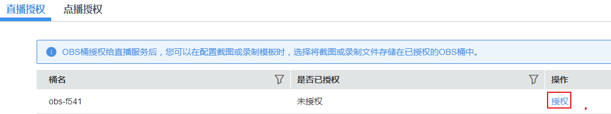
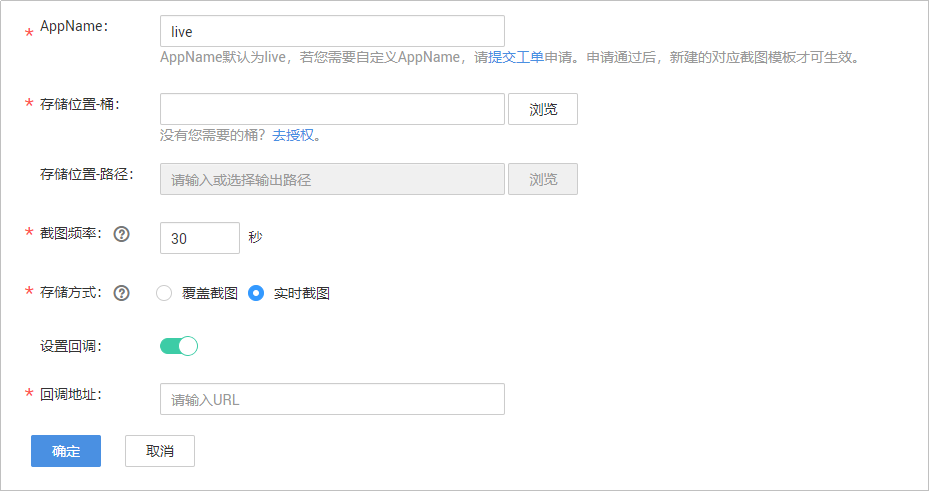

# 直播截图<a name="live010021"></a>

视频直播提供了截图功能，支持按配置截图模板在推流过程中截取直播画面，并存储在OBS桶中。一个推流域名下可以配置多个不同AppName的截图模板，即当推流开始时，启动直播截图功能，其中与推流地址中的AppName相同的截图模板生效。

## 截图流程<a name="section15514186319"></a>

直播服务截图模板的配置流程，如[图1](#fig167571747143910)所示。

**图 1**  截图模板配置流程图<a name="fig167571747143910"></a>  


1.  [创建桶（可选）](#section1490915204417)：创建用于存储直播截图文件的OBS桶，若已有OBS桶，可直接跳转到[2](#li1092613610429)。

    > **说明：**   
    >存储直播截图的OBS桶必须与使用的直播服务在同一区域，如使用“华北-北京四”的直播服务，则直播截图只能存储在“华北-北京四”区域的OBS桶。  

2.  <a name="li1092613610429"></a>[桶授权](#section2063161673213)：在直播服务中对存储截图的OBS桶进行授权，允许直播服务将截图存储在对应的OBS桶中。
3.  [配置截图模板](#section396563910236)：直播视频将按照设定的间隔时间对正在直播的视频进行画面截图操作，并以.jpg文件保存至指定的OBS存储位置。
4.  [查看直播截图](#section2828104492318)：直播截图模板配置成功后，启动直播推流，可以通过截图的输出路径快速进入到OBS桶中查看存储的直播截图。

## 注意事项<a name="section123731551249"></a>

-   直播截图产生的截图文件最终是存储在OBS服务中的，因此在配置直播截图模板前，您需要确保已开通OBS服务。
-   直播服务所在区域与存储截图的OBS桶需在同一区域。
-   一个域名可配置多个截图模板，与推流地址中的AppName相同的截图模板生效。
-   暂只支持截图生成JPG格式的图片文件。

## 费用说明<a name="section44151049183412"></a>

-   直播截图功能为计费项，视频直播服务将根据实际产生的视频截图数量收取费用。具体价格详情请参见[Live产品价格详情](https://www.huaweicloud.com/pricing.html?tab=detail#/live)。
-   直播截图生成的截图文件最终存储在对象存储服务中，因此，产生的存储使用量费用将由对象存储服务单独收取。具体价格详情请参见[OBS价格详情](https://www.huaweicloud.com/pricing.html?tab=detail#/obs)。

## 步骤一：创建桶（可选）<a name="section1490915204417"></a>

若您还未在OBS服务中创建用于存储文件的桶，或者您需要新创建桶用于存储直播截图文件，请参见[OBS帮助中心](https://support.huaweicloud.com/qs-obs/obs_qs_0007.html)创建与使用的直播服务同一区域的OBS桶。否则，请直接跳转到[步骤二：OBS桶授权](#section2063161673213)。

## 步骤二：OBS桶授权<a name="section2063161673213"></a>

OBS桶创建后，您需要按照如下步骤在直播服务中对相关的桶进行授权，允许直播服务将截图存储在对应的OBS桶中。

1.  登录[视频直播控制台](https://console.huaweicloud.com/live)。
2.  在左侧导航树中选择“云资源授权”，进入桶授权页面。
3.  在需要设置直播截图存储的OBS桶的操作列，单击“授权”，如[图2](#fig1560322818569)所示。

    **图 2**  云资源授权<a name="fig1560322818569"></a>  
    


## 步骤三：配置直播截图<a name="section396563910236"></a>

OBS授权成功后，您可以开始配置直播截图模板。

1.  登录[视频直播控制台](https://console.huaweicloud.com/live)。
2.  在左侧导航树中选择“域名管理“，进入域名管理页面。
3.  在需要进行直播截图的推流域名行单击“管理”。
4.  在左侧导航树中选择“模板配置 \> 截图配置”。
5.  单击“添加”，进入截图模板参数配置页面。

    **图 3**  配置直播截图模板<a name="fig194033692415"></a>  
    

    具体参数配置说明请参见[表1](#table711813464812)。

    **表 1**  截图参数配置

    <a name="table711813464812"></a>
    <table><thead align="left"><tr id="row141199344487"><th class="cellrowborder" valign="top" width="22.220000000000002%" id="mcps1.2.3.1.1"><p id="p1711918346485"><a name="p1711918346485"></a><a name="p1711918346485"></a>参数名</p>
    </th>
    <th class="cellrowborder" valign="top" width="77.78%" id="mcps1.2.3.1.2"><p id="p10119123454813"><a name="p10119123454813"></a><a name="p10119123454813"></a>描述</p>
    </th>
    </tr>
    </thead>
    <tbody><tr id="row20119934194817"><td class="cellrowborder" valign="top" width="22.220000000000002%" headers="mcps1.2.3.1.1 "><p id="p11199345489"><a name="p11199345489"></a><a name="p11199345489"></a>AppName</p>
    </td>
    <td class="cellrowborder" valign="top" width="77.78%" headers="mcps1.2.3.1.2 "><p id="p7176241399"><a name="p7176241399"></a><a name="p7176241399"></a>应用名称，默认为“live”，若您需要自定义AppName，请<a href="https://console.huaweicloud.com/ticket/?#/ticketindex/business?productTypeId=ffb4ebf5fb094bc6aef0129c276ce42e" target="_blank" rel="noopener noreferrer">提交工单</a>申请。</p>
    </td>
    </tr>
    <tr id="row511913413486"><td class="cellrowborder" valign="top" width="22.220000000000002%" headers="mcps1.2.3.1.1 "><p id="p1911917346488"><a name="p1911917346488"></a><a name="p1911917346488"></a>存储位置-桶</p>
    </td>
    <td class="cellrowborder" valign="top" width="77.78%" headers="mcps1.2.3.1.2 "><p id="p17119103494812"><a name="p17119103494812"></a><a name="p17119103494812"></a>存储直播截图的OBS桶。</p>
    </td>
    </tr>
    <tr id="row1511933454817"><td class="cellrowborder" valign="top" width="22.220000000000002%" headers="mcps1.2.3.1.1 "><p id="p1812083414489"><a name="p1812083414489"></a><a name="p1812083414489"></a>存储位置-路径</p>
    </td>
    <td class="cellrowborder" valign="top" width="77.78%" headers="mcps1.2.3.1.2 "><p id="p9120163454814"><a name="p9120163454814"></a><a name="p9120163454814"></a>OBS桶存储直播截图的路径。</p>
    </td>
    </tr>
    <tr id="row41201934204817"><td class="cellrowborder" valign="top" width="22.220000000000002%" headers="mcps1.2.3.1.1 "><p id="p1912012347482"><a name="p1912012347482"></a><a name="p1912012347482"></a>截图频率</p>
    </td>
    <td class="cellrowborder" valign="top" width="77.78%" headers="mcps1.2.3.1.2 "><p id="p6538172613365"><a name="p6538172613365"></a><a name="p6538172613365"></a>截图频率。</p>
    <p id="p103455620524"><a name="p103455620524"></a><a name="p103455620524"></a>单位为秒。</p>
    <p id="p93418567522"><a name="p93418567522"></a><a name="p93418567522"></a>取值范围：5-3600。</p>
    </td>
    </tr>
    <tr id="row126861655194910"><td class="cellrowborder" valign="top" width="22.220000000000002%" headers="mcps1.2.3.1.1 "><p id="p19688055134920"><a name="p19688055134920"></a><a name="p19688055134920"></a>存储方式</p>
    </td>
    <td class="cellrowborder" valign="top" width="77.78%" headers="mcps1.2.3.1.2 "><p id="p1468811556491"><a name="p1468811556491"></a><a name="p1468811556491"></a>在OBS桶存储截图的方式，可选为<strong id="b97471544561"><a name="b97471544561"></a><a name="b97471544561"></a>覆盖截图</strong>或<strong id="b09981414571"><a name="b09981414571"></a><a name="b09981414571"></a>实时截图</strong>。</p>
    <a name="ul17824164912367"></a><a name="ul17824164912367"></a><ul id="ul17824164912367"><li>覆盖截图：只保存最新的截图文件，有新的截图会覆盖原来的截图文件，命名如下所示。<pre class="screen" id="screen9683524382"><a name="screen9683524382"></a><a name="screen9683524382"></a>{domain}/{app_name}/{stream_name}.jpg</pre>
    </li><li>实时截图：以时间戳命名截图文件，保存所有截图文件到OBS桶，命名如下所示。<pre class="screen" id="screen866816385388"><a name="screen866816385388"></a><a name="screen866816385388"></a>{domain}/{app_name}/{stream_name}/{UTCTimestamp}.jpg</pre>
    </li></ul>
    </td>
    </tr>
    <tr id="row16733583315"><td class="cellrowborder" valign="top" width="22.220000000000002%" headers="mcps1.2.3.1.1 "><p id="p11732513337"><a name="p11732513337"></a><a name="p11732513337"></a>设置回调</p>
    </td>
    <td class="cellrowborder" valign="top" width="77.78%" headers="mcps1.2.3.1.2 "><p id="p207345183314"><a name="p207345183314"></a><a name="p207345183314"></a>回调开关。</p>
    </td>
    </tr>
    <tr id="row1835114267354"><td class="cellrowborder" valign="top" width="22.220000000000002%" headers="mcps1.2.3.1.1 "><p id="p335142653516"><a name="p335142653516"></a><a name="p335142653516"></a>回调地址</p>
    </td>
    <td class="cellrowborder" valign="top" width="77.78%" headers="mcps1.2.3.1.2 "><p id="p1491820512495"><a name="p1491820512495"></a><a name="p1491820512495"></a>回调开关打开后，输入回调地址。回调地址中不能携带消息头和参数。</p>
    <p id="p335152616352"><a name="p335152616352"></a><a name="p335152616352"></a>截图回调消息体请参见<a href="#li970013128523">回调示例</a>。</p>
    </td>
    </tr>
    </tbody>
    </table>

6.  单击“确定”，完成直播截图模板的配置。

    截图模板配置后，即可开始直播推流，推流过程中，直播服务会根据创建的截图模板对直播流进行截图。

7.  您可以单击操作列的“修改”，修改直播截图模板的相关参数，其中，AppName不支持修改。

## 步骤四：查看直播截图<a name="section2828104492318"></a>

若您已配置直播截图模板，启动直播推流后，可以通过截图的输出路径快速进入到OBS桶中查看存储的直播截图，您还可以通过回调消息查看直播截图。

-   通过控制台查看直播截图
    1.  登录[视频直播控制台](https://console.huaweicloud.com/live)。
    2.  在左侧导航树中选择“域名管理“，进入域名管理页面。
    3.  在需要查看直播截图的推流域名行单击“管理”。
    4.  在左侧导航树中选择“模板配置 \> 截图配置”。
    5.  在需要查看直播截图的应用行单击输出路径，进入OBS桶中查看存储的直播截图详情。

        **图 4**  查看截图详情<a name="fig668718372220"></a>  
        

        您可以对直播截图进行下载、分享等操作，具体请参见[OBS帮助中心](https://support.huaweicloud.com/usermanual-obs/obs_03_0303.html)。


-   <a name="li970013128523"></a>通过回调消息查看直播截图

    若您在[配置直播截图模板](#section396563910236)时，设置了回调地址，则每生成一张截图都将收到截图回调消息。回调消息字段如[表2](#table8156185614581)所示。

    ```
    { 
        "domain": "play.example.com",
        "app": "live",
        "stream_name": "test001",
        "snapshot_url": "https://xxx.obs.cn-north-4.myhuaweicloud.com:443...",
        "width": 720,
        "height": 1280,
        "obs_addr": {
            "bucket": "xxx",
            "location": "cn-north-4",
            "object": "xxx.jpg"
        }
    }
    ```

    **表 2**  消息体字段说明

    <a name="table8156185614581"></a>
    <table><thead align="left"><tr id="row3211175665811"><th class="cellrowborder" valign="top" width="35%" id="mcps1.2.3.1.1"><p id="p13211195645815"><a name="p13211195645815"></a><a name="p13211195645815"></a>参数</p>
    </th>
    <th class="cellrowborder" valign="top" width="65%" id="mcps1.2.3.1.2"><p id="p7211205616584"><a name="p7211205616584"></a><a name="p7211205616584"></a>说明</p>
    </th>
    </tr>
    </thead>
    <tbody><tr id="row42113566580"><td class="cellrowborder" valign="top" width="35%" headers="mcps1.2.3.1.1 "><p id="p3211205617585"><a name="p3211205617585"></a><a name="p3211205617585"></a>domain</p>
    </td>
    <td class="cellrowborder" valign="top" width="65%" headers="mcps1.2.3.1.2 "><p id="p12111456175818"><a name="p12111456175818"></a><a name="p12111456175818"></a><span>推流域名。</span></p>
    </td>
    </tr>
    <tr id="row10211556195818"><td class="cellrowborder" valign="top" width="35%" headers="mcps1.2.3.1.1 "><p id="p15211256125815"><a name="p15211256125815"></a><a name="p15211256125815"></a>app</p>
    </td>
    <td class="cellrowborder" valign="top" width="65%" headers="mcps1.2.3.1.2 "><p id="p182112569581"><a name="p182112569581"></a><a name="p182112569581"></a><span>应用名称。</span></p>
    </td>
    </tr>
    <tr id="row621112561588"><td class="cellrowborder" valign="top" width="35%" headers="mcps1.2.3.1.1 "><p id="p0211165665815"><a name="p0211165665815"></a><a name="p0211165665815"></a>stream_name</p>
    </td>
    <td class="cellrowborder" valign="top" width="65%" headers="mcps1.2.3.1.2 "><p id="p112119567581"><a name="p112119567581"></a><a name="p112119567581"></a><span>流名称。</span></p>
    </td>
    </tr>
    <tr id="row1021185618584"><td class="cellrowborder" valign="top" width="35%" headers="mcps1.2.3.1.1 "><p id="p19211056125811"><a name="p19211056125811"></a><a name="p19211056125811"></a>snapshot_url</p>
    </td>
    <td class="cellrowborder" valign="top" width="65%" headers="mcps1.2.3.1.2 "><p id="p19211135615589"><a name="p19211135615589"></a><a name="p19211135615589"></a>截图下载链接。</p>
    </td>
    </tr>
    <tr id="row82111556125814"><td class="cellrowborder" valign="top" width="35%" headers="mcps1.2.3.1.1 "><p id="p18211155625812"><a name="p18211155625812"></a><a name="p18211155625812"></a>width</p>
    </td>
    <td class="cellrowborder" valign="top" width="65%" headers="mcps1.2.3.1.2 "><p id="p1257314466590"><a name="p1257314466590"></a><a name="p1257314466590"></a>图片宽度。</p>
    <p id="p521125645810"><a name="p521125645810"></a><a name="p521125645810"></a>单位：像素。</p>
    </td>
    </tr>
    <tr id="row1321120566583"><td class="cellrowborder" valign="top" width="35%" headers="mcps1.2.3.1.1 "><p id="p19211165635812"><a name="p19211165635812"></a><a name="p19211165635812"></a>height</p>
    </td>
    <td class="cellrowborder" valign="top" width="65%" headers="mcps1.2.3.1.2 "><p id="p14898114845917"><a name="p14898114845917"></a><a name="p14898114845917"></a>图片高度。</p>
    <p id="p11211656165810"><a name="p11211656165810"></a><a name="p11211656165810"></a>单位：像素。</p>
    </td>
    </tr>
    <tr id="row162117560584"><td class="cellrowborder" valign="top" width="35%" headers="mcps1.2.3.1.1 "><p id="p1421155685816"><a name="p1421155685816"></a><a name="p1421155685816"></a>obs_addr</p>
    </td>
    <td class="cellrowborder" valign="top" width="65%" headers="mcps1.2.3.1.2 "><div class="p" id="p12121756105817"><a name="p12121756105817"></a><a name="p12121756105817"></a><span>截图所在的OBS</span><span>桶地址</span>，具体结构体说明如下所示：<a name="ul71340207417"></a><a name="ul71340207417"></a><ul id="ul71340207417"><li><span>bucket</span>：<span>OBS</span><span>的</span>桶<span>名称</span>。</li><li><span>location</span>：<span>OBS桶</span><span>所在数据中心。</span></li><li><span>object</span>：<span>OBS</span><span>对象路径。</span></li></ul>
    </div>
    </td>
    </tr>
    </tbody>
    </table>


