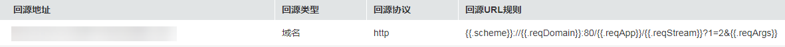
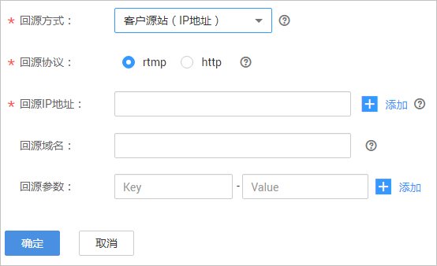

# 直播拉流回源

在视频直播服务中创建的播放域名，默认拉取的是华为源站的直播内容，若需要通过华为云播放非华为源站的直播内容，可以按照实际需求在直播控制台中配置回源拉流地址，将自有源站中的直播内容拉取到华为云直播中心进行加速分发。

## 注意事项

若拉流回源方式为客户源站（域名或IP地址），则该播放域名不支持关联推流域名，且无法使用转码、录制和截图等流处理的相关功能。

## 前提条件

-   已[添加推流域名和播放域名](添加域名.md)，且已完成[域名关联](关联域名.md)。
-   已在域名DNS服务商处完成[CNAME解析配置](配置CNAME.md)。

## 操作步骤

1.  登录[视频直播控制台](https://console.huaweicloud.com/live)。
2.  在左侧导航树中选择“域名管理“，进入域名管理页面。
3.  在需要配置直播拉流回源的播放域名行单击“管理”。
4.  在左侧导航树中选择“模板配置 \> 拉流回源配置“。
5.  在拉流回源列表中可以查看当前拉流回源配置信息，如[图1](#fig15541193518243)所示。

    **图 1**  查看拉流回源信息  
    

6.  若需要修改拉流回源配置的相关信息，单击“修改”，进入拉流回源配置页面，如[图2](#fig756415319273)所示。

    **图 2**  配置拉流回源信息  
    

    具体参数配置说明请参见[表1](#table711813464812)。

    **表 1**  拉流回源参数配置

    
    <table><thead align="left"><tr id="row141199344487"><th class="cellrowborder" valign="top" width="22.220000000000002%" id="mcps1.2.3.1.1">
参数名

    </th>
    <th class="cellrowborder" valign="top" width="77.78%" id="mcps1.2.3.1.2">
描述

    </th>
    </tr>
    </thead>
    <tbody><tr id="row20119934194817"><td class="cellrowborder" valign="top" width="22.220000000000002%" headers="mcps1.2.3.1.1 ">
回源方式

    </td>
    <td class="cellrowborder" valign="top" width="77.78%" headers="mcps1.2.3.1.2 ">
回源方式有以下三种：<ul id="ul1765644154012"><li>华为源站：默认方式，从华为源站拉取直播流。</li><li>客户源站（域名）：回源到自有源站拉取直播流，支持配置多个源站域名。</li><li>客户源站（IP地址）：回源到自有源站拉取直播流，支持配置多个源站IP地址和1个源站域名。</li></ul>
    

    </td>
    </tr>
    <tr id="row511913413486"><td class="cellrowborder" valign="top" width="22.220000000000002%" headers="mcps1.2.3.1.1 ">
回源协议

    </td>
    <td class="cellrowborder" valign="top" width="77.78%" headers="mcps1.2.3.1.2 ">
支持直播中心向源站拉流的协议，回源方式为非“华为源站”时必选。

    
 说明： 

若配置拉流回源，则播放协议暂只支持RTMP和HTTP-FLV。

    

    </td>
    </tr>
    <tr id="row20848144512507"><td class="cellrowborder" valign="top" width="22.220000000000002%" headers="mcps1.2.3.1.1 ">
回源IP地址

    </td>
    <td class="cellrowborder" valign="top" width="77.78%" headers="mcps1.2.3.1.2 ">
回源IP地址，最多可配置10个。

    
当回源方式是“客户源站（IP地址）”时，此参数必选，IP配置多个时，如果回源失败，将按照配置顺序进行轮循。

    </td>
    </tr>
    <tr id="row41201934204817"><td class="cellrowborder" valign="top" width="22.220000000000002%" headers="mcps1.2.3.1.1 ">
回源域名

    </td>
    <td class="cellrowborder" valign="top" width="77.78%" headers="mcps1.2.3.1.2 "><ul id="ul175791820195011"><li>当回源方式是“客户源站（域名）”时，此参数必选，最多可配置10个回源域名。若配置了多个回源域名，回源失败时，将按照配置顺序进行轮循。</li><li>当回源方式是“客户源站（IP地址）”时，此参数可选，最多可配置1个回源域名。若配置了回源域名，则回源时HTTP-FLV HOST头填该回源域名，RTMP tcurl字段填该回源域名，否则，将当前IP地址作为HOST。</li></ul>
    </td>
    </tr>
    <tr id="row126861655194910"><td class="cellrowborder" valign="top" width="22.220000000000002%" headers="mcps1.2.3.1.1 ">
回源参数

    </td>
    <td class="cellrowborder" valign="top" width="77.78%" headers="mcps1.2.3.1.2 ">
回源客户源站时，在URL中携带的参数，此参数可选。

    
若参数设置为：

    <ul id="ul6224412114118"><li><strong id="b181016552402">key</strong>：vhost、<strong id="b10182135911402">value</strong>：www.example.huawei.com</li><li><strong id="b91239810419">key</strong>：cdn_type、<strong id="b12123168184114">value</strong>：huawei</li></ul>
    
则回源URL格式为：

    <pre class="screen" id="screen982003112453">{{.scheme}}://{{.reqDomain}}:80/{{.reqApp}}/{{.reqStream}}?vhost=www.example.huawei.com&amp;cdn_type=huawei&amp;{{.reqArgs}}</pre>
    </td>
    </tr>
    </tbody>
    </table>

7.  单击“确定”，完成拉流回源配置。

