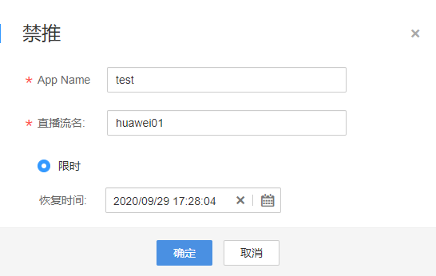

# 直播流管理

您可以查看实时的在线推流情况，若您需要中断某个直播流，可以将推流地址加入禁推名单，加入后，后续该推流地址将被限制推流，您也可以恢复直播流的推送。

## 查看推流信息

> **注意：** 
>直播推流成功后，大概需要2-4分钟才能看到直播流信息，请刷新页面查看。

1.  登录[视频直播控制台](https://console.huaweicloud.com/live)。
2.  在左侧导航树中选择“直播管理 \> 直播流管理“，进入直播流管理页面。
3.  选择您需要查看的域名，即可查看该域名下正在推流的直播流信息。

    **图 1**  查看推流信息  
    

## 禁止直播推流

**注意**：只有正在进行推流的直播流才可被禁用，禁用后，该推流地址将无法进行直播推流。

若您需要对某一个域名进行禁止直播流推送，请进行如下操作：

1.  登录[视频直播控制台](https://console.huaweicloud.com/live)。
2.  在左侧导航树中选择“直播管理 \> 直播流管理“，进入直播流管理页面。
3.  选择需要禁止直播推流的域名。
4.  在需要禁推的直播流行单击“禁推”，弹出“禁推”框。

    **图 2**  禁推  
    

5.  在弹出的“禁推”框中选择禁推类型。

    禁止推流后的直播流信息可以在“禁推流”页签进行查看。

    **图 3**  禁推配置  
    

    **限时**：最长支持禁推90天，在恢复时间前，该直播流无法进行推流活动。

## 恢复直播推流

若您需要恢复某一个域名的直播流推送，请进行如下操作：

1.  登录[视频直播控制台](https://console.huaweicloud.com/live)。
2.  在左侧导航树中选择“直播管理 \> 直播流管理“，进入直播流管理页面。
3.  在下拉框中选择需要恢复直播流推送的域名。
4.  选择“禁推流”页签。
5.  在对应直播流行单击“操作“列中的“恢复“。

    **图 4**  禁推流恢复  
    

