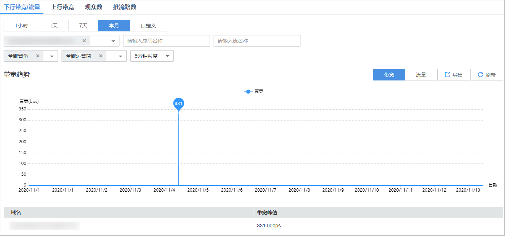
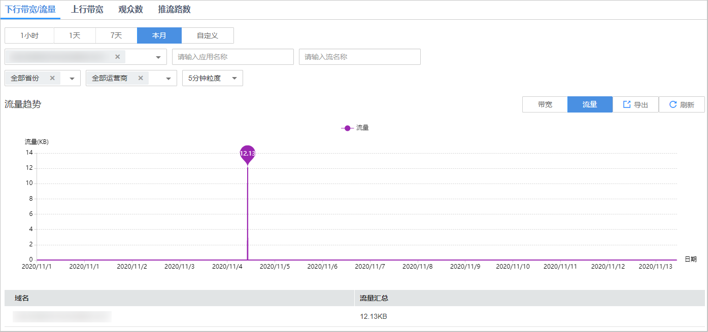
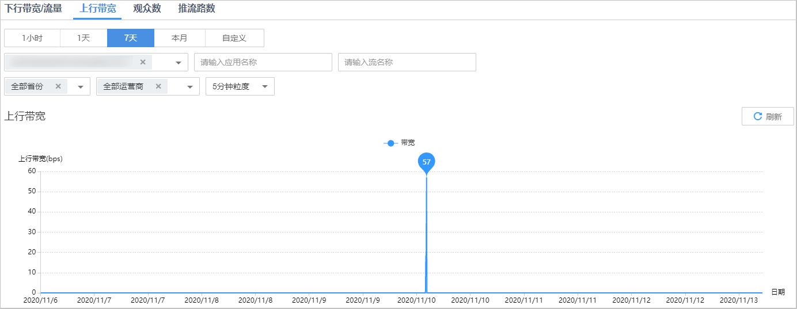
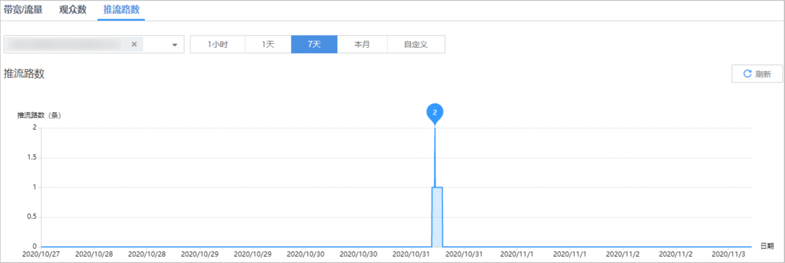

# 直播统计

您可以查看部署在新版视频直播服务下的播放域名的下行带宽/流量使用量和对应直播流的在线观看人数，以及对应推流域名的上行带宽和总推流路数的统计信息。并支持将查看的下行带宽/流量详情导出到本地。

## 注意事项

-   此功能暂只支持“华北-北京四”区域。
-   由于实际产生的网络流量包括TCP/IP包头和TCP重传消耗，因此账单的计费数据会在趋势图中数据的基础上上浮10%左右。
-   若您的域名仍部署在旧版视频直播服务下，请使用旧版[下行带宽](下行带宽.md)、[下行流量](下行流量.md)、[上行带宽](上行带宽.md)、[推流路数](推流路数.md)统计功能进行查询。

## 查询说明

-   支持查询最近90天的历史数据。
-   查询的时间跨度最长为31天。
-   [下行带宽/流量](#section328212582115)、[上行带宽](#section2116312227)和[推流路数](#section911243131514)支持选择多个域名同时查询，单次查询的域名总数不能超过10个。[观众数](#section5250481047)仅支持选择单个域名进行查询。
-   [下行带宽/流量](#section328212582115)、[上行带宽](#section2116312227)和[推流路数](#section911243131514)的最小统计粒度为5分钟，如2020-11-06 8:00:00\~2020-11-06 8:04:59时间段内的数据会统计展示在2020-11-06 8:00:00这个统计点上，其中，展示的数据为用户所选粒度时间段内的最大值。
-   [观众数](#section5250481047)统计的是独立IP数，最小统计粒度为1分钟，如2020-11-06 8:00:00\~2020-11-06 8:00:59时间段内的数据会统计展示在2020-11-06 8:01:00这个统计点上。

## 查询步骤

1.  登录[视频直播控制台](https://console.huaweicloud.com/live)。
2.  在左侧导航树中选择“统计分析（新版） \> 直播统计”。
3.  选择“下行带宽/流量”、“上行带宽”、“观众数”或“推流路数”查看对应的统计数据。

## 下行带宽/流量

选择需要查看的时间、播放域名、应用名称、流名称、省份、运营商和统计粒度。在页面右侧单击“带宽”或“流量”，可以选择查看带宽或流量的相关统计数据。在带宽趋势或流量趋势区域右上角，单击“导出”，可以导出具体数据。

-   **带宽趋势**中呈现的是所选域名的总带宽趋势，将鼠标指针停留在趋势图上，滚动鼠标滚轮可针对某时间跨度范围内的趋势图时间横轴进行拉大或缩小整体占比。您还可以在带宽趋势区域的下方，查看所选域名在查询时间段内的带宽峰值。如[图1](#fig2888101910138)所示。

    **图 1**  下行带宽统计详情  
    

-   **流量趋势**中呈现的是所选域名的总流量趋势，将鼠标指针停留在趋势图上，滚动鼠标滚轮可针对某时间跨度范围内的趋势图时间横轴进行拉大或缩小整体占比。您还可以在流量趋势区域的下方，查看所选域名在查询时间段内的流量消耗。如[图2](#fig88881196137)所示。

    **图 2**  下行流量统计详情  
    

    > **须知：** 
    >流量表和流量趋势图中呈现的总流量，是将每5分钟粒度统计的流量进行合计（Byte），然后换算成MB，精确到小数点后两位。因此，可能与按5分钟粒度查询导出的流量表中“流量\(MB\)”列的合计值存在稍微的误差，这是由于计算时四舍五入导致。

## 上行带宽

选择需要查看的时间、推流域名、应用名称、流名称、省份、运营商和统计粒度，即可在**上行带宽**区域查看到相关数据。

**上行带宽**中呈现的是所选域名的总上行带宽趋势，将鼠标指针停留在趋势图上，滚动鼠标滚轮可针对某时间跨度范围内的趋势图时间横轴进行拉大或缩小整体占比。如[图3](#fig10296020192215)所示。

**图 3**  上行带宽趋势  

## 观众数

选择需要查看的时间、播放域名、应用名称、流名称、省份、运营商和统计粒度，即可在**观众数**区域查看到相关数据。

**观众数**中呈现的是所选域名的在线独立访客数趋势，将鼠标指针停留在趋势图上，滚动鼠标滚轮可针对某时间跨度范围内的趋势图时间横轴进行拉大或缩小整体占比。如[图4](#fig211492004917)所示。

**图 4**  在线独立访客数趋势  

## 推流路数

选择需要查看的推流域名及时间，即可在**推流路数**区域查看到相关数据。

**推流路数**中呈现的是所选域名推流到直播源站的总路数趋势，将鼠标指针停留在趋势图上，滚动鼠标滚轮可针对某时间跨度范围内的趋势图时间横轴进行拉大或缩小整体占比。如[图5](#fig815085617529)所示。

**图 5**  推流路数趋势  

