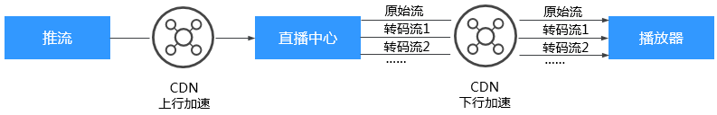
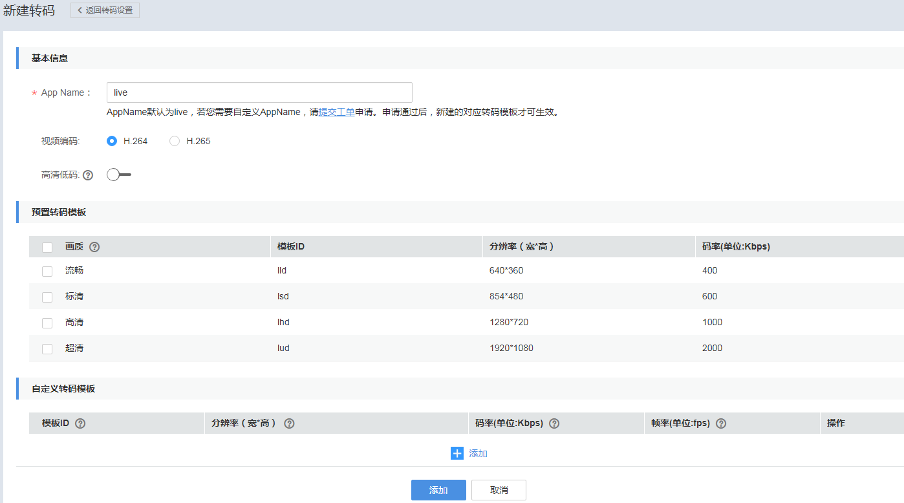
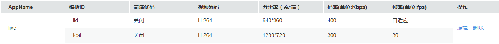
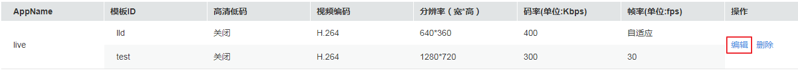
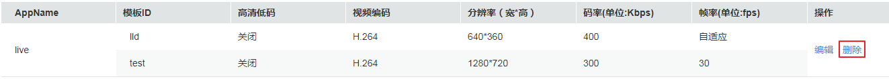

# 直播转码

视频直播支持直播转码功能，支持将推送的直播流转码成多种分辨率和码率规格的视频流，以满足不同网络环境的用户观看需求。系统提供了预置转码模板和自定义转码模板两种模板类型，配置转码后，当开始推流时，启动直播转码功能。

**图 1**  直播转码架构图  

## 功能介绍

转码功能可以帮助您处理如下问题：

-   适配不同播放终端：您可以将原始音视频转码为更适应于各终端播放的格式。
-   适配不同网络环境：您可以根据不同的网络带宽设置转码输出的码率，以适应不同的网络播放环境。
-   降低分发成本：支持压缩率更高的H.265编码格式，您也可以在转码时开启高清低码功能，在分辨率不变的情况下，码率下降20%左右，从而降低直播流的分发成本。

视频直播服务提供预置转码和自定义转码两种转码模板。两种模板均支持开启高清低码。

-   预置转码模板：支持选择视频画质，视频画质内置了常用的流畅、标清、高清和超清四种视频清晰度的标准模板和高清低码模板。
-   自定义转码模板：支持自定义配置模板ID、分辨率、码率和帧率。若系统预置转码模板无法满足您的实际需求，您可以选择自定义转码模板。

## 注意事项

-   一个域名可以配置多个转码模板，当直播推流启动后，与推流地址中的AppName一致的转码模板生效，开始进行转码，若不需要转码，请在直播推流前[删除转码模板](#section7753104920501)。
-   转码模板中的高清低码默认是关闭的，若您开启，直播转码将按高清低码标准计费，价格详情请参见[产品价格详情](https://www.huaweicloud.com/pricing.html?tab=detail#/live)。
-   暂不支持上采样转码，若转码模板中设置的分辨率高于推流分辨率，对应分辨率的播放地址可以成功播放，但播放视频的分辨率为原始分辨率。

## 前提条件

-   已[添加推流域名](添加域名.md)。
-   已在域名DNS服务商处完成[CNAME解析配置](配置CNAME.md)。

## 费用说明

直播转码功能为计费项，按实际使用的编码标准、转码分辨率和转码时长收取费用。其中，标准转码和高清低码转码产生的费用不同，具体价格详情请参见[产品价格详情](https://www.huaweicloud.com/pricing.html?tab=detail#/live)。若您比较常使用直播转码功能，建议您优先选择[购买直播转码套餐包](https://account.huaweicloud.com/usercenter/#/buyservice/commonCloud?pkgCode=live)。

## 新增转码模板

支持通过直播控制台或[直播API](https://support.huaweicloud.com/api-live/live_03_0006.html)配置预置转码模板和自定义转码模板。配置后，您若需要播放转码直播流，请先获取转码播放地址，具体请参见[转码播放地址](拼接播放地址.md#section392313195)。

1.  登录[视频直播控制台](https://console.huaweicloud.com/live)。
2.  在左侧导航树中选择“域名管理“，进入域名管理页面。
3.  在需要配置转码模板的推流域名行单击“管理“。
4.  在左侧导航树中选择“模板配置 \> 转码配置“，您可以查看目前推流域名下的转码模板信息。
5.  单击“新建转码“，弹出如[图2](#fig85334601411)所示的新建转码页面。

    **图 2**  新建转码  
    

6.  配置转码参数，参数说明如[表1](#table103061641153118)。

    **表 1**  转码模板参数说明

    
    <table><thead align="left"><tr id="row0305441103117"><th class="cellrowborder" valign="top" width="18.07%" id="mcps1.2.4.1.1">
区域

    </th>
    <th class="cellrowborder" valign="top" width="23.03%" id="mcps1.2.4.1.2">
参数名

    </th>
    <th class="cellrowborder" valign="top" width="58.9%" id="mcps1.2.4.1.3">
描述

    </th>
    </tr>
    </thead>
    <tbody><tr id="row430519418319"><td class="cellrowborder" rowspan="3" valign="top" width="18.07%" headers="mcps1.2.4.1.1 ">
基本信息

    </td>
    <td class="cellrowborder" valign="top" width="23.03%" headers="mcps1.2.4.1.2 ">
App Name

    </td>
    <td class="cellrowborder" valign="top" width="58.9%" headers="mcps1.2.4.1.3 ">
应用名称，默认为“live”，可以根据实际需求进行自定义，支持大小写字母、数字、下划线（_）中划线（-）。

    </td>
    </tr>
    <tr id="row1430524143117"><td class="cellrowborder" valign="top" headers="mcps1.2.4.1.1 ">
视频编码

    </td>
    <td class="cellrowborder" valign="top" headers="mcps1.2.4.1.2 ">
支持<strong id="b1030514193116">H.264</strong>和<strong id="b2305194173115">H.265</strong>两种标准的视频编码格式。

    </td>
    </tr>
    <tr id="row163051541163111"><td class="cellrowborder" valign="top" headers="mcps1.2.4.1.1 ">
高清低码

    </td>
    <td class="cellrowborder" valign="top" headers="mcps1.2.4.1.2 ">
高清低码是指画质不变的情况下，码率更低。开启后，将按高清低码标准计费。价格详情请参见<a href="https://www.huaweicloud.com/pricing.html?tab=detail#/live" target="_blank" rel="noopener noreferrer">产品价格详情</a>。

    </td>
    </tr>
    <tr id="row129911283912"><td class="cellrowborder" valign="top" width="18.07%" headers="mcps1.2.4.1.1 ">
预置转码模板

    </td>
    <td class="cellrowborder" valign="top" width="23.03%" headers="mcps1.2.4.1.2 ">
画质

    </td>
    <td class="cellrowborder" valign="top" width="58.9%" headers="mcps1.2.4.1.3 ">
支持选择流畅、标清、高清和超清四种视频画质，四种画质的分辨率和码率如<a href="#table3149102962218">表2</a>所示。

    </td>
    </tr>
    <tr id="row20306194119319"><td class="cellrowborder" rowspan="4" valign="top" width="18.07%" headers="mcps1.2.4.1.1 ">
自定义转码模板

    </td>
    <td class="cellrowborder" valign="top" width="23.03%" headers="mcps1.2.4.1.2 ">
模板ID

    </td>
    <td class="cellrowborder" valign="top" width="58.9%" headers="mcps1.2.4.1.3 ">
拼接转码播放地址的参数，具体参数拼接规则请参见<a href="拼接播放地址.md">播放地址</a><strong id="b41402151359">。</strong>

    </td>
    </tr>
    <tr id="row2306104114315"><td class="cellrowborder" valign="top" headers="mcps1.2.4.1.1 ">
分辨率（宽*高）

    </td>
    <td class="cellrowborder" valign="top" headers="mcps1.2.4.1.2 ">
视频的宽度和高度，单位为像素，若宽和高都设置为0，则按原始分辨率输出；若只设置了宽或高，则另一边会根据设置的一边自适应。

    
<strong id="b01939316242">取值范围</strong>：

    <ul id="ul138237512410"><li>宽度：32-3840，设置的数值必须为2的倍数或为0。</li><li>高度：32-3840，设置的数值必须为2的倍数或为0。</li></ul>
    </td>
    </tr>
    <tr id="row183066412311"><td class="cellrowborder" valign="top" headers="mcps1.2.4.1.1 ">
码率（单位：Kbps）

    </td>
    <td class="cellrowborder" valign="top" headers="mcps1.2.4.1.2 ">
输出直播流的平均码率。

    
<strong id="b862594015416">取值范围</strong>：40-30000。

    </td>
    </tr>
    <tr id="row193061141103116"><td class="cellrowborder" valign="top" headers="mcps1.2.4.1.1 ">
帧率（单位：fps）

    </td>
    <td class="cellrowborder" valign="top" headers="mcps1.2.4.1.2 ">
输出直播流的帧率。

    
<strong id="b1545923515418">取值范围</strong>：0-60，若设置的数值为0，则表示自适应。

    </td>
    </tr>
    </tbody>
    </table>

    **表 2**  预置转码模板的分辨率和码率

    
    <table><thead align="left"><tr id="row161491029162218"><th class="cellrowborder" valign="top" width="28.57%" id="mcps1.2.4.1.1">
视频画质

    </th>
    <th class="cellrowborder" valign="top" width="28.57%" id="mcps1.2.4.1.2">
分辨率

    </th>
    <th class="cellrowborder" valign="top" width="42.86%" id="mcps1.2.4.1.3">
码率（Kbps）

    </th>
    </tr>
    </thead>
    <tbody><tr id="row105571153151814"><td class="cellrowborder" valign="top" width="28.57%" headers="mcps1.2.4.1.1 ">
流畅

    </td>
    <td class="cellrowborder" valign="top" width="28.57%" headers="mcps1.2.4.1.2 ">
640*360

    </td>
    <td class="cellrowborder" valign="top" width="42.86%" headers="mcps1.2.4.1.3 ">
400

    </td>
    </tr>
    <tr id="row3493175619185"><td class="cellrowborder" valign="top" width="28.57%" headers="mcps1.2.4.1.1 ">
标清

    </td>
    <td class="cellrowborder" valign="top" width="28.57%" headers="mcps1.2.4.1.2 ">
854*480

    </td>
    <td class="cellrowborder" valign="top" width="42.86%" headers="mcps1.2.4.1.3 ">
600

    </td>
    </tr>
    <tr id="row17383105820186"><td class="cellrowborder" valign="top" width="28.57%" headers="mcps1.2.4.1.1 ">
高清

    </td>
    <td class="cellrowborder" valign="top" width="28.57%" headers="mcps1.2.4.1.2 ">
1280*720

    </td>
    <td class="cellrowborder" valign="top" width="42.86%" headers="mcps1.2.4.1.3 ">
1000

    </td>
    </tr>
    <tr id="row151501829162211"><td class="cellrowborder" valign="top" width="28.57%" headers="mcps1.2.4.1.1 ">
超清

    </td>
    <td class="cellrowborder" valign="top" width="28.57%" headers="mcps1.2.4.1.2 ">
1920*1080

    </td>
    <td class="cellrowborder" valign="top" width="42.86%" headers="mcps1.2.4.1.3 ">
2000

    </td>
    </tr>
    </tbody>
    </table>

7.  配置完转码模板参数后，单击“添加“。

    如[图3](#fig1832599141516)所示，转码模板列表中新增转码模板信息。

    **图 3**  新增转码模板  
    

8.  配置转码模板后，若您需要使用转码播放地址进行视频的播放，请参考[转码播放地址](拼接播放地址.md#section392313195)获取转码播放地址。

## 管理转码

转码模板配置完成后，您还可以根据实际需要进行如下操作。

-   修改转码模板

    转码模板创建完成后，若您需要修改部分参数，可以通过单击操作列的“编辑“，修改转码模板中的相关参数。其中，AppName不支持修改。

    **图 4**  修改转码模板信息  
    

-   删除转码模板

    转码模板创建完成后，若您需要删除转码模板，可以通过单击操作列的“删除“，删除该转码模板。

    **图 5**  删除转码模板信息  
    

