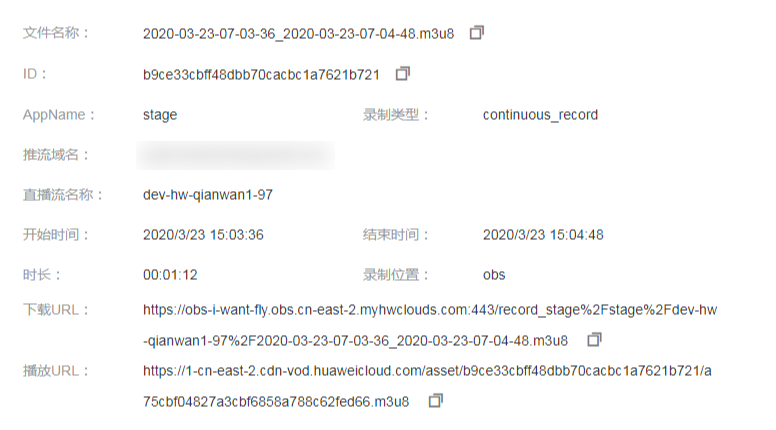

# 管理录制文件

直播录制完成后，您可以在直播控制台和OBS控制台中查看录制文件，若设置了[点播授权](配置直播录制.md#section4159236111015)，还可以在点播控制台查看录制文件或通过点播API获取录制文件列表进行查看。

## 通过直播服务管理录制文件

1.  登录[视频直播控制台](https://console.huaweicloud.com/live)。
2.  在左侧导航树中选择“直播管理 \> 录制管理“，进入录制管理页面。
3.  选择您需要查看的日期、推流域名、AppName，并单击“确定”。

    列表中显示您查看的录制文件的相关信息。

    **图 1**  查看录制文件信息  
    

4.  若您需要查看录制文件的详细信息，可单击对应录制文件行的。

    可查看ID、录制类型、时长等信息，若设置了[点播授权](#section86334514328)，还可以查看播放地址。

    **图 2**  查看录制文件详细信息  
    

## 通过OBS服务管理录制文件

1.  在OBS管理控制台左侧导航栏选择“对象存储”。
2.  在桶列表单击存储录制文件的桶，进入“概览”页面。
3.  在左侧导航栏，单击“对象”。

    您可对录制文件进行下载、分享等操作。

## 通过点播服务管理录制文件

-   通过控制台查看
    1.  在[视频点播控制台](https://console.huaweicloud.com/vod)的“音视频管理”页面单击右上角的“高级搜索“，按照录制日期或名称关键字查询录制好的文件。

        **图 3**  在控制台中查看录制文件  
        

    2.  单击对应录制文件行的“管理“，您可在详情页面对已录制的视频文件进行转码、分类、添加封面、上传字幕等操作，若您有配置录制通知，具体操作指导请参见《[视频点播用户指南](https://support.huaweicloud.com/usermanual-vod/vod010010.html)》。

-   调用点播API获取录制文件列表

    调用[查询媒资列表](https://support.huaweicloud.com/api-vod/vod_04_0203.html)接口，将请求参数“query\_string“设置为“Record\_“，即可获取所有录制文件的详细信息。

