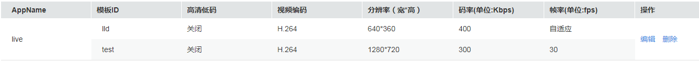
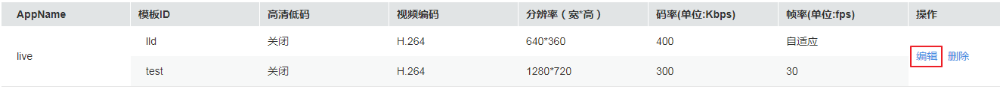

# 转码管理

视频直播支持直播转码功能，支持将推送的直播流转码成多种分辨率和码率规格的视频流，以满足不同网络环境的用户观看需求。系统提供了预置转码模板和自定义转码模板两种模板类型，配置转码后，当开始推流时，启动直播转码功能。

**图 1**  直播转码架构图  

## 功能介绍

转码功能可以帮助您处理如下问题：

-   适配不同播放终端：您可以将原始音视频转码为更适应于各终端播放的格式。
-   适配不同网络环境：您可以根据不同的网络带宽设置转码输出的码率，以适应不同的网络播放环境。
-   降低分发成本：支持压缩率更高的H.265编码格式，您也可以在转码时开启高清低码功能，在分辨率不变的情况下，码率下降20%左右，从而降低直播流的分发成本。

视频直播服务提供预置转码和自定义转码两种转码模板。两种模板均支持开启高清低码。

-   预置转码模板：支持选择视频画质，视频画质内置了常用的流畅、标清、高清和超清四种视频清晰度的标准模板和高清低码模板。
-   自定义转码模板：支持自定义配置模板ID、分辨率、码率和帧率。若系统预置转码模板无法满足您的实际需求，您可以选择自定义转码模板。

## 注意事项

-   一个域名可以配置多个转码模板，转码模板中的AppName默认为“live”，若您需要自定义AppName，请先[提交工单](https://console.huaweicloud.com/ticket/?#/ticketindex/business?productTypeId=ffb4ebf5fb094bc6aef0129c276ce42e)申请，申请通过后，创建的对应转码模板才会生效。
-   每个AppName可配置多条转码模板，直播推流启动后，与推流地址中的AppName一致的转码模板生效，开始进行转码，若不需要转码，请在直播推流前[删除转码模板](#section7753104920501)。
-   两种转码模板中的高清低码默认是关闭的，若您开启，直播转码将按高清低码标准计费，价格详情请参见[价格说明](https://support.huaweicloud.com/price-live/live040001.html#section2)。
-   暂不支持上采样转码，若转码模板中设置的分辨率高于推流分辨率，对应分辨率的播放地址可以成功播放，但播放视频的分辨率为原始分辨率。

## 费用说明

直播转码功能为计费项，按实际使用的编码标准、转码分辨率和转码时长收取费用。其中，标准转码和高清低码转码产生的费用不同，具体价格详情请参见[价格说明](https://support.huaweicloud.com/price-live/live040001.html#section2)。若您比较常使用直播转码功能，建议您优先选择[购买直播转码套餐包](https://account.huaweicloud.com/usercenter/#/buyservice/commonCloud?pkgCode=live)。

不同的分辨率档位对应不同的价格，分辨率档位如下：

-   HD：（1920X1080）及以下
-   SD ：\(1280 x 720\) 及以下
-   LD：（640X480）及以下

分辨率档位判定规则：输出规格按输出视频分辨率的长边或短边是否属于输出规格划定的范围进行判定。

示例：以输出SD（1280 x 720）规格为例，若输出视频的分辨率长边小于等于1280或短小于等于720则属于该输出规格，则按“SD ：\(1280 x 720\) 及以下”档位的单价进行计费。若输出视频的长边大于1280且短边也大于720，则按更高的档位单位进行计费。

**说明**：按照直播画面的宽高来区分，取宽和高的绝对值更大的定义为长边。

## 新增转码模板

支持配置预置转码模板和自定义转码模板，配置后，您若需要播放转码直播流，请先获取转码播放地址，具体请参见[转码播放地址](拼接播放地址.md#section392313195)。

1.  登录[视频直播控制台](https://console.huaweicloud.com/live)。
2.  在左侧导航树中选择“域名管理“，进入域名管理页面。
3.  在需要配置转码模板的域名行右侧单击“管理“。
4.  选择“转码设置“页签，您可以查看目前域名下的转码模板信息。
5.  单击“新建转码“，弹出如[图2](#fig85334601411)所示的新建转码页面。

    **图 2**  新建转码  
    

6.  配置转码参数，参数说明如[表1](#table103061641153118)。

    **表 1**  转码模板参数说明

    
    <table><thead align="left"><tr id="row0305441103117"><th class="cellrowborder" valign="top" width="18.07%" id="mcps1.2.4.1.1">
区域

    </th>
    <th class="cellrowborder" valign="top" width="23.03%" id="mcps1.2.4.1.2">
参数名

    </th>
    <th class="cellrowborder" valign="top" width="58.9%" id="mcps1.2.4.1.3">
描述

    </th>
    </tr>
    </thead>
    <tbody><tr id="row430519418319"><td class="cellrowborder" rowspan="3" valign="top" width="18.07%" headers="mcps1.2.4.1.1 ">
基本信息

    </td>
    <td class="cellrowborder" valign="top" width="23.03%" headers="mcps1.2.4.1.2 ">
App Name

    </td>
    <td class="cellrowborder" valign="top" width="58.9%" headers="mcps1.2.4.1.3 ">
应用名称，默认为“live”，若您需要自定义App Name，请<a href="https://console.huaweicloud.com/ticket/?#/ticketindex/business?productTypeId=ffb4ebf5fb094bc6aef0129c276ce42e" target="_blank" rel="noopener noreferrer">提交工单</a>申请，申请通过后，对应的转码模板才可生效。

    </td>
    </tr>
    <tr id="row1430524143117"><td class="cellrowborder" valign="top" headers="mcps1.2.4.1.1 ">
视频编码

    </td>
    <td class="cellrowborder" valign="top" headers="mcps1.2.4.1.2 ">
支持<strong id="b1030514193116">H.264</strong>和<strong id="b2305194173115">H.265</strong>两种标准的视频编码格式。

    </td>
    </tr>
    <tr id="row163051541163111"><td class="cellrowborder" valign="top" headers="mcps1.2.4.1.1 ">
高清低码

    </td>
    <td class="cellrowborder" valign="top" headers="mcps1.2.4.1.2 ">
高清低码是指画质不变的情况下，码率更低。开启后，将按高清低码标准计费。价格详情请参见<a href="https://support.huaweicloud.com/price-live/live040001.html#section2" target="_blank" rel="noopener noreferrer">价格说明</a>。

    
预置转码模板提供了超清、高清、标清、流畅四个转码模板，您可以选择是否开启高清低码。若开启，则使用预置的高清低码模板，否则，使用预置的标准模板。

    </td>
    </tr>
    <tr id="row129911283912"><td class="cellrowborder" valign="top" width="18.07%" headers="mcps1.2.4.1.1 ">
预置转码模板

    </td>
    <td class="cellrowborder" valign="top" width="23.03%" headers="mcps1.2.4.1.2 ">
画质

    </td>
    <td class="cellrowborder" valign="top" width="58.9%" headers="mcps1.2.4.1.3 ">
支持选择流畅、标清、高清和超清四种视频画质。

    
在“基本信息”区域，选择开启高清低码，则预置转码模板显示为高清低码模板，否则，显示为标准模板。

    </td>
    </tr>
    <tr id="row20306194119319"><td class="cellrowborder" rowspan="4" valign="top" width="18.07%" headers="mcps1.2.4.1.1 ">
自定义转码模板

    </td>
    <td class="cellrowborder" valign="top" width="23.03%" headers="mcps1.2.4.1.2 ">
模板ID

    </td>
    <td class="cellrowborder" valign="top" width="58.9%" headers="mcps1.2.4.1.3 ">
拼接转码播放地址的参数，具体参数拼接规则请参见<a href="拼接播放地址.md">播放地址</a><strong id="b41402151359">。</strong>

    </td>
    </tr>
    <tr id="row2306104114315"><td class="cellrowborder" valign="top" headers="mcps1.2.4.1.1 ">
分辨率（宽*高）

    </td>
    <td class="cellrowborder" valign="top" headers="mcps1.2.4.1.2 ">
视频的宽度和高度，单位为像素，若宽和高都未设置，则按原始分辨率输出；若只设置了宽或高，则另一边会根据设置的一边自适应。

    
<strong id="b1554173217545">取值范围</strong>：32-3840，设置的数值必须为2的倍数。

    </td>
    </tr>
    <tr id="row183066412311"><td class="cellrowborder" valign="top" headers="mcps1.2.4.1.1 ">
码率（单位：Kbps）

    </td>
    <td class="cellrowborder" valign="top" headers="mcps1.2.4.1.2 ">
输出平均码率，单位为千比特每秒。

    
<strong id="b862594015416">取值范围</strong>：40-30000。

    </td>
    </tr>
    <tr id="row193061141103116"><td class="cellrowborder" valign="top" headers="mcps1.2.4.1.1 ">
帧率（单位：fps）

    </td>
    <td class="cellrowborder" valign="top" headers="mcps1.2.4.1.2 ">
帧率，单位为帧每秒。

    
<strong id="b1545923515418">取值范围</strong>：0-60，若设置的数值为0，则表示自适应。

    </td>
    </tr>
    </tbody>
    </table>

7.  配置完转码模板参数后，单击“添加“。

    如[图3](#fig1832599141516)所示，转码模板列表中新增转码模板信息。

    **图 3**  新增转码模板  
    

8.  配置转码模板后，若您需要使用转码播放地址进行视频的播放，请参考[转码播放地址](拼接播放地址.md#section392313195)获取转码播放地址。

## 管理转码

转码模板配置完成后，您还可以根据实际需要进行如下操作。

-   修改转码模板

    转码模板创建完成后，若您需要修改部分参数，可以通过单击操作列的“编辑“，修改转码模板中的相关参数。其中，AppName不支持修改。

    **图 4**  修改转码模板信息  
    

-   删除转码模板

    转码模板创建完成后，若您需要删除转码模板，可以通过单击操作列的“删除“，删除该转码模板。

    **图 5**  删除转码模板信息  
    

-   查看转码直播流

    开始直播推流后，大概等待2-4分钟，如[图6](#fig7871753155714)所示，您可以在“统计分析 \> 流详情“中查看转码后的直播流信息，其中，转码后的直播流名称会拼接对应的模板ID。

    **图 6**  查看转码直播流信息  
    

