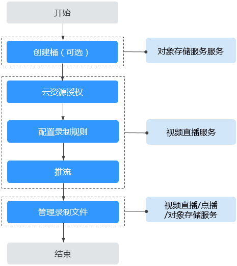
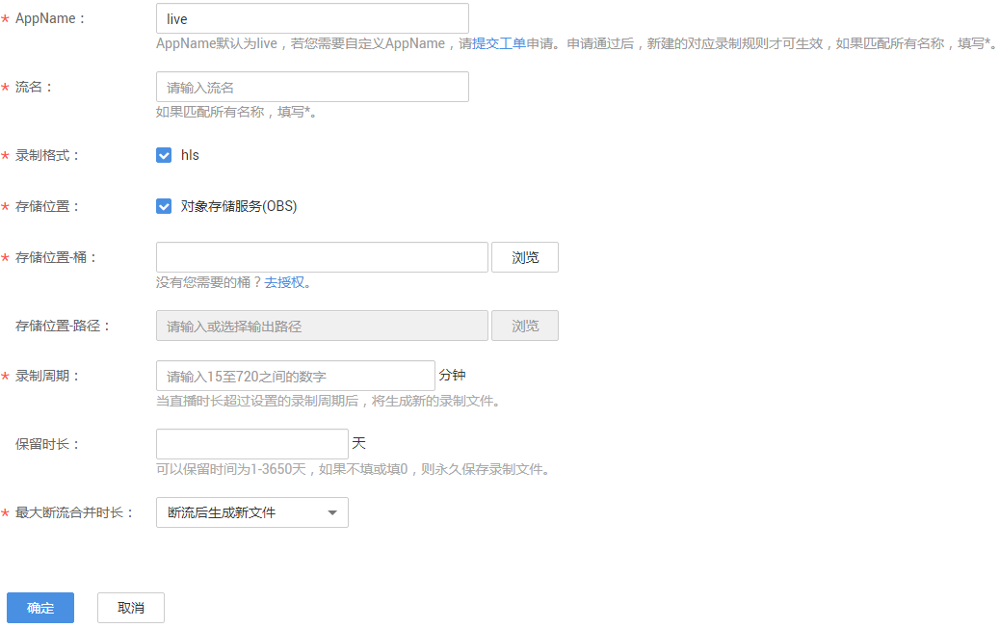

# 配置录制模板

直播服务支持将直播内容进行录制并将录制的视频存储到OBS（对象存储服务 Object Storage Service）中，您可以在OBS中对录制的直播视频进行下载、分享等处理。

直播录制至OBS的相关操作流程，如[图1](#fig152911421191217)所示。

**图 1**  直播录制至OBS流程图  

1.  [创建桶（可选）](#section1439935553015)：创建用于存储直播录制文件的OBS桶，若已有OBS桶，请直接执行[2](#li63809264279)。
2.  [云资源授权](#section4159236111015)：在直播服务中对存储录制文件的OBS桶进行授权，允许直播服务将录制文件存储在对应的OBS桶中。还可以授权给点播服务，将存储在OBS桶中的录制文件托管给点播服务，在点播服务中处理录制文件。
3.  [配置录制模板](#section19658102215144)：为直播配置录制规则，配置完成后，域名下所有直播流将按照录制规则进行录制。还可以通过设置回调地址获取录制状态通知。
4.  推流：录制规则配置完成后，获取[推流地址](拼接推流地址.md)进行直播推流，直播服务会根据配置的录制规则对正在直播的视频进行录制。
5.  [管理录制文件](管理录制文件.md)：直播录制完成后，可以在直播服务中获取录制文件基本信息，也可以在OBS中管理录制文件，如下载、分享、删除等，还可以通过授权点播服务，将OBS桶中的录制文件托管至点播服务，在点播服务中管理录制文件，如预览、发布、转码和播放等。

## 前提条件

-   已添加经过备案的域名，具体请参见[配置直播域名](添加域名.md)。且已完成CNAME解析配置，具体请参见[配置CNAME](配置CNAME.md)。
-   录制至OBS功能暂只支持在“华北-北京四“区域使用。因直播录制生成的视频文件是存储在对象存储（OBS）服务中的，因此，您需要先开通对象存储（OBS）服务，才能将视频存储至OBS，具体请参见[OBS快速入门](https://support.huaweicloud.com/qs-obs/obs_qs_1000.html)。

## 注意事项

-   直播录制过程中，若直播推流因网络抖动等问题中断，则直播服务将中止录制。当推流重新启动时，直播服务将重新开启新的录制任务。
-   配置录制后，启动推流即开始录制，结束推流才可停止录制，暂无法按需停启；若在推流过程中删除录制规则，录制仍然会继续，直到推流结束 。
-   OBS服务未因欠费停服，否则会导致直播录制失败，建议您[购买OBS存储包](https://storage.huaweicloud.com/obs/?#/obs/buy?status=1)。

## 费用说明

-   直播录制生成的视频文件及托管给点播服务后进行转码或转封装后的视频文件最终是存储在OBS中的，因此，产生的存储费用由OBS单独收取，具体价格详情请参见[OBS-产品价格详情](https://www.huaweicloud.com/pricing.html?tab=detail#/obs)。
-   OBS桶授权给点播服务后，在点播服务侧对托管的录制文件进行转码或转封装处理所产生的相关费用由点播单独收取，具体价格详情请参见[视频点播-产品价格详情](https://www.huaweicloud.com/pricing.html?tab=detail#/vod)。

## 步骤一：创建桶（可选）

若您还未在OBS服务中创建用于存储录制文件的桶，或者您需要新创建桶用于存储直播录制文件，请参见[OBS帮助中心](https://support.huaweicloud.com/qs-obs/obs_qs_0007.html)创建桶。否则，请直接执行[步骤二：云资源授权](#section4159236111015)。

## 步骤二：云资源授权

OBS桶授权直播服务，允许直播录制文件存储在OBS桶中，若您需要对存储的录制文件进行转码或转封装处理，可选择授权点播服务，将存储在OBS桶中的录制文件托管给点播服务。

1.  登录[视频直播控制台](https://console.huaweicloud.com/live)。
2.  在左侧导航树中选择“云资源授权”，进入桶授权页面。
3.  请您根据实际需求选择以下操作。
    -   授权直播服务

        在“直播授权”页签中，找到需要存储直播录制文件的OBS桶，在右侧“操作”列，单击“授权”即可。

    -   授权点播服务

        在“点播授权”页签中，找到需要存储直播录制文件并托管给点播服务的OBS桶，在右侧“操作”列，单击“授权”即可。

## 步骤三：配置录制模板

若您需要对直播流进行录制回看，请配置直播录制规则。配置完成后，域名下所有直播流将按照录制规则进行录制。

1.  登录[视频直播控制台](https://console.huaweicloud.com/live)。
2.  在左侧导航树中选择“域名管理“，进入域名管理页面。
3.  在创建录制任务的推流域名行单击“管理“。
4.  在左侧导航树中选择“模板配置 \> 录制配置”，进入录制配置页面。
5.  单击“新建录制“。
6.  请您按照实际需求配置录制参数，参数说明如[表1](#table1985784519104)所示。

    **图 2**  配置录制参数  
    

    **表 1**  参数说明

    
    <table><thead align="left"><tr id="row785754501010"><th class="cellrowborder" valign="top" width="24.29%" id="mcps1.2.3.1.1">
参数

    </th>
    <th class="cellrowborder" valign="top" width="75.71%" id="mcps1.2.3.1.2">
说明

    </th>
    </tr>
    </thead>
    <tbody><tr id="row4857184531018"><td class="cellrowborder" valign="top" width="24.29%" headers="mcps1.2.3.1.1 ">
AppName

    </td>
    <td class="cellrowborder" valign="top" width="75.71%" headers="mcps1.2.3.1.2 ">
应用名称，默认为“live”，若您需要自定义AppName，请<a href="https://console.huaweicloud.com/ticket/?#/ticketindex/business?productTypeId=ffb4ebf5fb094bc6aef0129c276ce42e" target="_blank" rel="noopener noreferrer">提交工单</a>申请。若填写为“*”，则录制规则适用于该域名下的所有应用。

    </td>
    </tr>
    <tr id="row1285854519102"><td class="cellrowborder" valign="top" width="24.29%" headers="mcps1.2.3.1.1 ">
流名

    </td>
    <td class="cellrowborder" valign="top" width="75.71%" headers="mcps1.2.3.1.2 ">
直播流名称，若需要将录制规则用于该域名下的所有直播流，则填写为“*”。

    </td>
    </tr>
    <tr id="row178581145151010"><td class="cellrowborder" valign="top" width="24.29%" headers="mcps1.2.3.1.1 ">
存储位置

    </td>
    <td class="cellrowborder" valign="top" width="75.71%" headers="mcps1.2.3.1.2 ">
录制文件转存储的位置。

    </td>
    </tr>
    <tr id="row49001231151420"><td class="cellrowborder" valign="top" width="24.29%" headers="mcps1.2.3.1.1 ">
存储位置-桶

    </td>
    <td class="cellrowborder" valign="top" width="75.71%" headers="mcps1.2.3.1.2 ">
存储录制文件的OBS桶。

    </td>
    </tr>
    <tr id="row1175495515138"><td class="cellrowborder" valign="top" width="24.29%" headers="mcps1.2.3.1.1 ">
存储位置-路径

    </td>
    <td class="cellrowborder" valign="top" width="75.71%" headers="mcps1.2.3.1.2 ">
OBS桶存储录制文件的路径。

    </td>
    </tr>
    <tr id="row0250101319416"><td class="cellrowborder" valign="top" width="24.29%" headers="mcps1.2.3.1.1 ">
录制格式

    </td>
    <td class="cellrowborder" valign="top" width="75.71%" headers="mcps1.2.3.1.2 ">
录制文件的格式，支持将直播视频录制为HLS、FLV和MP4三种文件格式。

    </td>
    </tr>
    <tr id="row1858245161015"><td class="cellrowborder" valign="top" width="24.29%" headers="mcps1.2.3.1.1 ">
TS

    </td>
    <td class="cellrowborder" valign="top" width="75.71%" headers="mcps1.2.3.1.2 ">
录制TS文件名的前缀，录制格式为“HLS”时必选。

    <pre class="screen" id="screen588263262715">{file_start_time_unix}_{file_end_time_unix}_{ts_sequence_number}</pre>
    </td>
    </tr>
    <tr id="row4719142768"><td class="cellrowborder" valign="top" width="24.29%" headers="mcps1.2.3.1.1 ">
命名规则

    </td>
    <td class="cellrowborder" valign="top" width="75.71%" headers="mcps1.2.3.1.2 ">
录制HLS、FLV和MP4文件含路径和文件名的前缀。

    <pre class="screen" id="screen364913802712">Record/{publish_domain}/{app}/{record_type}/{record_format}/{stream}_{file_start_time}/{stream}_{file_start_time}</pre>
    </td>
    </tr>
    <tr id="row3230175616419"><td class="cellrowborder" valign="top" width="24.29%" headers="mcps1.2.3.1.1 ">
录制周期

    </td>
    <td class="cellrowborder" valign="top" width="75.71%" headers="mcps1.2.3.1.2 ">
录制时长支持15-720分钟，最大支持录制12小时。超过12小时，系统将按照录制命名规则生成新文件。

    </td>
    </tr>
    <tr id="row185820459107"><td class="cellrowborder" valign="top" width="24.29%" headers="mcps1.2.3.1.1 ">
最大断流合并时长

    </td>
    <td class="cellrowborder" valign="top" width="75.71%" headers="mcps1.2.3.1.2 "><ul id="ul11327439151219"><li>断流后生成新文件：是指录制的直播流中断后，会立即生成新的录制文件。</li><li>断流后不生成新文件：是指录制的直播流中断后，会和之前录制的文件合并为一个文件。</li><li>其他数值：是指录制的直播流中断时间在设置范围内，则和之前录制的文件合并为一个文件，否则，生成新的录制文件。</li></ul>
    
断流合并时长最大为3个月。

    </td>
    </tr>
    </tbody>
    </table>

7.  单击“确定“，在录制列表中增加一条录制规则。

    您可以创建多条录制规则，直播录制时，与推流地址中的AppName相同的录制规则生效。

8.  录制规则配置完成后，您可以获取[推流地址](拼接推流地址.md)开始直播推流。推流相关操作请参见[快速入门](https://support.huaweicloud.com/qs-live/live020004.html)。

    直播服务会根据配置的录制规则对正在直播的视频进行录制，生成的原始录制文件的分辨率及码率与直播源流保持一致。

直播录制完成后，您可以在直播、OBS或点播服务中[管理录制文件](管理录制文件.md)，如预览、下载、分享、发布、转码和播放等。

## 相关链接

-   [直播录制的中断机制是什么？](https://support.huaweicloud.com/live_faq/live_08_0070.html)
-   [已经删除录制规则，为什么还会生成录制文件？](https://support.huaweicloud.com/live_faq/live_08_0073.html)
-   [配置了录制规则，为什么在录制管理中无录制文件？](https://support.huaweicloud.com/live_faq/live_08_0129.html)

