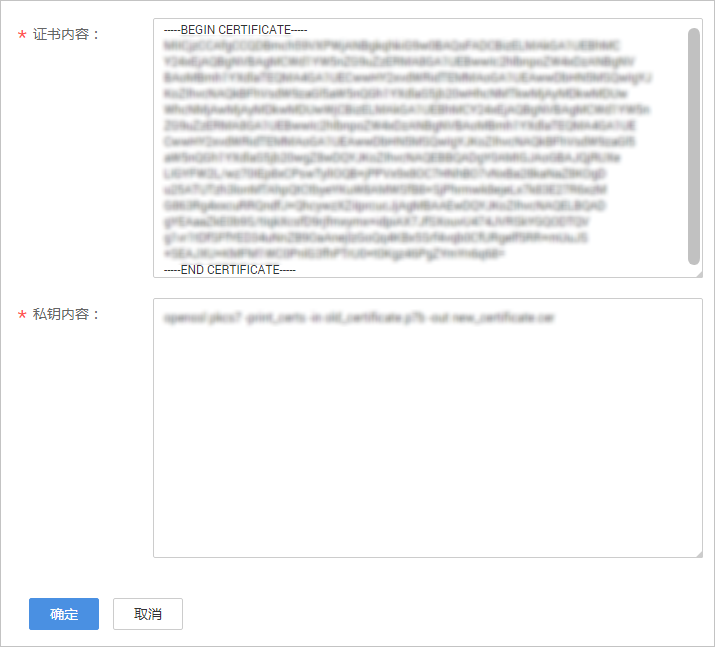

# 配置方法

视频直播支持配置并开启HTTPS安全加速，保障您的直播数据在传输过程中受到加密保护。

## 背景信息

**强制跳转HTTPS**：配置HTTPS后，开启强制跳转HTTPS，若用户发起HTTP请求，服务端会返回302重定向响应，原来的HTTP请求将会被强制重定向为HTTPS请求。

相比HTTP协议，HTTPS具有如下优势：

-   HTTPS协议是由SSL+HTTP协议构建的可进行加密传输、身份认证的网络协议，要比HTTP协议安全，可防止数据在传输过程中不被窃取、改变，确保数据的完整性。
-   在HTTPS协议中，会对用户的关键信息进行加密，避免Session ID或Cookie内容被攻击者捕获，导致敏感信息泄露。

## 前提条件

-   已添加经过备案的域名，具体请参见[配置直播域名](添加域名.md)。
-   已在域名DNS服务商处完成CNAME解析配置，具体请参见[配置CNAME](配置CNAME.md)。

-   已准备HTTPS证书。若还未有HTTPS证书。您可以在华为云[SSL证书管理](https://www.huaweicloud.com/product/scm.html)中购买。
-   HTTPS证书格式满足[HTTPS证书要求](HTTPS证书要求.md)，若您的证书为非PEM格式，请参照HTTPS证书要求进行[格式转换](HTTPS证书要求.md#zh-cn_topic_0175227673_zh-cn_topic_0064907759_section6645502812116)。

## 启用HTTPS

1.  登录[视频直播控制台](https://console.huaweicloud.com/live)。
2.  在左侧导航树中选择“域名管理“，进入域名管理页面。
3.  在需要配置HTTPS安全加速的播放域名行右侧单击“管理”。
4.  在左侧导航树中选择“模板配置 \> HTTPS证书配置“。
5.  单击“新增”，在打开的页面中配置HTTPS参数，如[图1](#fig139510615338)所示。

    **图 1**  配置HTTPS证书  
    

    将获取的证书文件、私钥文件以文本工具打开，并将证书内容和私钥内容复制到对应的文本框中。不同机构颁布的证书，存在如下差异：

    -   若证书是Root CA机构颁发的，则证书是一份完整的证书，复制该证书内容即可。

        **图 2**  HTTPS证书  
        

    -   若证书是中级CA机构颁发的，则证书文件会包含多份证书，您需要将所有证书拼接在一起组成一份完整的证书。具体拼接方法请参见[中级CA机构颁发的证书](HTTPS证书要求.md#zh-cn_topic_0175227673_zh-cn_topic_0064907759_section23934614192754)。

6.  选择是否开启“强制跳转HTTPS”。

    开启此项配置后，当您访问直播视频时，所有访问请求方式都将强制跳转为HTTPS访问。

7.  验证HTTPS安全加速是否生效。

    HTTPS开启后，您可以使用HTTPS方式的播放地址播放直播视频，若播放成功，则表示HTTPS安全加速生效。

## 更新证书

若您的域名证书进行了变更，您需要将新的证书内容同步到HTTPS配置中，具体更新方法同[启用HTTPS](#section6823114212434)。

