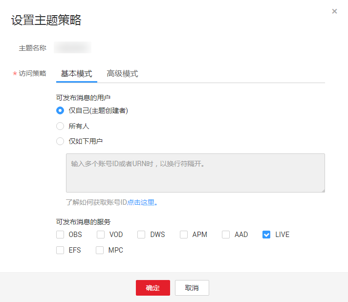

# 配置消息通知<a name="live010004"></a>

直播服务使用消息通知服务对直播录制状态进行实时通知，如需使用该功能，需要先配置消息通知服务。由于消息通知由消息通知服务（SMN）完成，所以SMN将对发送的消息通知进行单独计费，具体的计费标准请参考[SMN价格详情](https://www.huaweicloud.com/pricing.html?tab=detail#/smn)。

## 背景介绍<a name="section116376383513"></a>

-   主题是消息发布或客户端订阅通知的特定事件类型。它作为发送消息和订阅通知的信道，为发布者和订阅者提供一个可以相互交流的通道。在配置直播消息订阅前必须定制主题。
-   消息订阅是客户将订阅者注册到主题的操作，客户可以拥有多个主题，每个主题有多个订阅者。
-   消息订阅暂以项目ID进行区分，即同一个项目ID的域名暂只能使用同一个消息订阅，消息订阅配置对同一个项目ID的所有域名生效。

## 配置流程<a name="section20182152215314"></a>

消息订阅的配置流程，如[图1](#fig8572102817556)所示。

**图 1**  消息订阅配置流程图<a name="fig8572102817556"></a>  


1.  [创建消息主题](#section16170717182712)：在消息通知服务控制台新建消息主题，用于消息发送和订阅通知。
2.  [添加订阅](#section161721317142713)：将消息主题添加到订阅中接收发布至主题的消息，在订阅主题且确认订阅后，终端节点能够接收到向该主题发布的所有消息。
3.  [设置主题策略](#section4175121752719)：授权直播服务可对该主题发布消息。
4.  [配置直播消息订阅](#section121771517142718)：在直播控制台配置消息订阅，在直播推流开始和结束，以及录制时收到对应的消息通知。

## 前提条件<a name="section14521489378"></a>

-   已[添加推流域名](添加域名.md)。
-   已在域名DNS服务商处完成[CNAME解析配置](配置CNAME.md)。

## 步骤一：创建消息主题<a name="section16170717182712"></a>

1.  登录[消息通知服务](https://console.huaweicloud.com/smn)控制台。
2.  在左侧导航树中选择“主题管理 \> 主题“，进入主题页面。
3.  单击“创建主题“，设置主题名称等参数。

    **图 2**  创建主题<a name="fig159603281531"></a>  
    

4.  单击“确定”，消息主题创建成功。

## 步骤二：添加订阅<a name="section161721317142713"></a>

1.  在[消息通知服务](https://console.huaweicloud.com/smn)控制台的左侧导航树中，选择“主题管理 \> 主题“，进入主题页面。
2.  在已创建的主题行单击“操作“列的“添加订阅“，进入添加订阅页面。
3.  配置消息通知的类型和对象。

    **图 3**  添加订阅<a name="fig1025763516313"></a>  
    

    参数说明如[表1](#zh-cn_topic_0129313184_table7895120104519)所示。

    **表 1**  添加订阅参数说明

    <a name="zh-cn_topic_0129313184_table7895120104519"></a>
    <table><thead align="left"><tr id="zh-cn_topic_0133683185_zh-cn_topic_0128969723_zh-cn_topic_0129029645_zh-cn_topic_0129313184_row1389740134510"><th class="cellrowborder" valign="top" width="18%" id="mcps1.2.3.1.1"><p id="zh-cn_topic_0133683185_zh-cn_topic_0128969723_zh-cn_topic_0129029645_zh-cn_topic_0129313184_p7897100184512"><a name="zh-cn_topic_0133683185_zh-cn_topic_0128969723_zh-cn_topic_0129029645_zh-cn_topic_0129313184_p7897100184512"></a><a name="zh-cn_topic_0133683185_zh-cn_topic_0128969723_zh-cn_topic_0129029645_zh-cn_topic_0129313184_p7897100184512"></a>参数名</p>
    </th>
    <th class="cellrowborder" valign="top" width="82%" id="mcps1.2.3.1.2"><p id="zh-cn_topic_0133683185_zh-cn_topic_0128969723_zh-cn_topic_0129029645_zh-cn_topic_0129313184_p289880104513"><a name="zh-cn_topic_0133683185_zh-cn_topic_0128969723_zh-cn_topic_0129029645_zh-cn_topic_0129313184_p289880104513"></a><a name="zh-cn_topic_0133683185_zh-cn_topic_0128969723_zh-cn_topic_0129029645_zh-cn_topic_0129313184_p289880104513"></a>描述</p>
    </th>
    </tr>
    </thead>
    <tbody><tr id="zh-cn_topic_0133683185_zh-cn_topic_0128969723_zh-cn_topic_0129029645_zh-cn_topic_0129313184_row389810034519"><td class="cellrowborder" valign="top" width="18%" headers="mcps1.2.3.1.1 "><p id="zh-cn_topic_0133683185_zh-cn_topic_0128969723_zh-cn_topic_0129029645_zh-cn_topic_0129313184_p28981503453"><a name="zh-cn_topic_0133683185_zh-cn_topic_0128969723_zh-cn_topic_0129029645_zh-cn_topic_0129313184_p28981503453"></a><a name="zh-cn_topic_0133683185_zh-cn_topic_0128969723_zh-cn_topic_0129029645_zh-cn_topic_0129313184_p28981503453"></a>主题名称</p>
    </td>
    <td class="cellrowborder" valign="top" width="82%" headers="mcps1.2.3.1.2 "><p id="zh-cn_topic_0133683185_zh-cn_topic_0128969723_zh-cn_topic_0129029645_zh-cn_topic_0129313184_p489980134514"><a name="zh-cn_topic_0133683185_zh-cn_topic_0128969723_zh-cn_topic_0129029645_zh-cn_topic_0129313184_p489980134514"></a><a name="zh-cn_topic_0133683185_zh-cn_topic_0128969723_zh-cn_topic_0129029645_zh-cn_topic_0129313184_p489980134514"></a>待添加订阅的主题名称，不需要修改。</p>
    </td>
    </tr>
    <tr id="zh-cn_topic_0133683185_zh-cn_topic_0128969723_zh-cn_topic_0129029645_zh-cn_topic_0129313184_row1389911024510"><td class="cellrowborder" valign="top" width="18%" headers="mcps1.2.3.1.1 "><p id="zh-cn_topic_0133683185_zh-cn_topic_0128969723_zh-cn_topic_0129029645_zh-cn_topic_0129313184_p48998094516"><a name="zh-cn_topic_0133683185_zh-cn_topic_0128969723_zh-cn_topic_0129029645_zh-cn_topic_0129313184_p48998094516"></a><a name="zh-cn_topic_0133683185_zh-cn_topic_0128969723_zh-cn_topic_0129029645_zh-cn_topic_0129313184_p48998094516"></a>协议</p>
    </td>
    <td class="cellrowborder" valign="top" width="82%" headers="mcps1.2.3.1.2 "><p id="zh-cn_topic_0133683185_zh-cn_topic_0128969723_zh-cn_topic_0129029645_zh-cn_topic_0129313184_p208997013458"><a name="zh-cn_topic_0133683185_zh-cn_topic_0128969723_zh-cn_topic_0129029645_zh-cn_topic_0129313184_p208997013458"></a><a name="zh-cn_topic_0133683185_zh-cn_topic_0128969723_zh-cn_topic_0129029645_zh-cn_topic_0129313184_p208997013458"></a>消息通知的方式。在下拉框中选择需要订阅终端支持的协议。</p>
    <p id="zh-cn_topic_0133683185_zh-cn_topic_0128969723_zh-cn_topic_0129029645_zh-cn_topic_0129313184_p3573182512501"><a name="zh-cn_topic_0133683185_zh-cn_topic_0128969723_zh-cn_topic_0129029645_zh-cn_topic_0129313184_p3573182512501"></a><a name="zh-cn_topic_0133683185_zh-cn_topic_0128969723_zh-cn_topic_0129029645_zh-cn_topic_0129313184_p3573182512501"></a>直播服务常用的消息通知方式为<span class="parmvalue" id="zh-cn_topic_0133683185_zh-cn_topic_0128969723_zh-cn_topic_0129029645_zh-cn_topic_0129313184_parmvalue19724346175019"><a name="zh-cn_topic_0133683185_zh-cn_topic_0128969723_zh-cn_topic_0129029645_zh-cn_topic_0129313184_parmvalue19724346175019"></a><a name="zh-cn_topic_0133683185_zh-cn_topic_0128969723_zh-cn_topic_0129029645_zh-cn_topic_0129313184_parmvalue19724346175019"></a>“短信”</span>、<span class="parmvalue" id="zh-cn_topic_0133683185_zh-cn_topic_0128969723_zh-cn_topic_0129029645_zh-cn_topic_0129313184_parmvalue1749125065013"><a name="zh-cn_topic_0133683185_zh-cn_topic_0128969723_zh-cn_topic_0129029645_zh-cn_topic_0129313184_parmvalue1749125065013"></a><a name="zh-cn_topic_0133683185_zh-cn_topic_0128969723_zh-cn_topic_0129029645_zh-cn_topic_0129313184_parmvalue1749125065013"></a>“邮件”</span>和<span class="parmvalue" id="zh-cn_topic_0133683185_zh-cn_topic_0128969723_zh-cn_topic_0129029645_parmvalue140819293141"><a name="zh-cn_topic_0133683185_zh-cn_topic_0128969723_zh-cn_topic_0129029645_parmvalue140819293141"></a><a name="zh-cn_topic_0133683185_zh-cn_topic_0128969723_zh-cn_topic_0129029645_parmvalue140819293141"></a>“HTTP/HTTPS”</span>。</p>
    <a name="ul49701411203615"></a><a name="ul49701411203615"></a><ul id="ul49701411203615"><li>短信协议<p id="p47883853616"><a name="p47883853616"></a><a name="p47883853616"></a>订阅的终端为手机，接收到的消息只包含消息内容。</p>
    </li><li>邮件协议<p id="p53189369480"><a name="p53189369480"></a><a name="p53189369480"></a>订阅终端为邮箱，接收到的消息包含消息内容和取消订阅的链接。</p>
    </li><li>HTTP/HTTPS协议<p id="p05411872410"><a name="p05411872410"></a><a name="p05411872410"></a>订阅终端为公网网址，消息通知服务向HTTP(S)终端发送的通知消息包括HTTP头部信息与HTTP Content部分。Content部分是JSON格式的字符串。具体详情请参见<a href="https://support.huaweicloud.com/usermanual-smn/smn_ug_a9002.html" target="_blank" rel="noopener noreferrer">HTTP(S)消息格式</a>。</p>
    </li></ul>
    </td>
    </tr>
    <tr id="zh-cn_topic_0133683185_zh-cn_topic_0128969723_zh-cn_topic_0129029645_zh-cn_topic_0129313184_row8899110144510"><td class="cellrowborder" valign="top" width="18%" headers="mcps1.2.3.1.1 "><p id="zh-cn_topic_0133683185_zh-cn_topic_0128969723_zh-cn_topic_0129029645_zh-cn_topic_0129313184_p389990204512"><a name="zh-cn_topic_0133683185_zh-cn_topic_0128969723_zh-cn_topic_0129029645_zh-cn_topic_0129313184_p389990204512"></a><a name="zh-cn_topic_0133683185_zh-cn_topic_0128969723_zh-cn_topic_0129029645_zh-cn_topic_0129313184_p389990204512"></a>订阅终端</p>
    </td>
    <td class="cellrowborder" valign="top" width="82%" headers="mcps1.2.3.1.2 "><p id="zh-cn_topic_0133683185_zh-cn_topic_0128969723_zh-cn_topic_0129029645_zh-cn_topic_0129313184_p189911074512"><a name="zh-cn_topic_0133683185_zh-cn_topic_0128969723_zh-cn_topic_0129029645_zh-cn_topic_0129313184_p189911074512"></a><a name="zh-cn_topic_0133683185_zh-cn_topic_0128969723_zh-cn_topic_0129029645_zh-cn_topic_0129313184_p189911074512"></a>订阅的终端地址，短信、邮件、HTTP以及HTTPS终端支持批量输入，批量添加时，每个终端地址占一行。最多可输入10个终端。</p>
    <a name="zh-cn_topic_0133683185_zh-cn_topic_0128969723_zh-cn_topic_0129029645_zh-cn_topic_0129313184_ul684911201488"></a><a name="zh-cn_topic_0133683185_zh-cn_topic_0128969723_zh-cn_topic_0129029645_zh-cn_topic_0129313184_ul684911201488"></a><ul id="zh-cn_topic_0133683185_zh-cn_topic_0128969723_zh-cn_topic_0129029645_zh-cn_topic_0129313184_ul684911201488"><li>选择“短信”，请输入有效手机号码。<p id="zh-cn_topic_0133683185_zh-cn_topic_0128969723_zh-cn_topic_0129029645_zh-cn_topic_0129313184_p48491420194811"><a name="zh-cn_topic_0133683185_zh-cn_topic_0128969723_zh-cn_topic_0129029645_zh-cn_topic_0129313184_p48491420194811"></a><a name="zh-cn_topic_0133683185_zh-cn_topic_0128969723_zh-cn_topic_0129029645_zh-cn_topic_0129313184_p48491420194811"></a>输入规则为[+] [国家码][手机号码]。国内手机号码可省略[+]或[+] [国家码]。</p>
    <p id="zh-cn_topic_0133683185_zh-cn_topic_0128969723_zh-cn_topic_0129029645_zh-cn_topic_0129313184_p11849132018480"><a name="zh-cn_topic_0133683185_zh-cn_topic_0128969723_zh-cn_topic_0129029645_zh-cn_topic_0129313184_p11849132018480"></a><a name="zh-cn_topic_0133683185_zh-cn_topic_0128969723_zh-cn_topic_0129029645_zh-cn_topic_0129313184_p11849132018480"></a>例如：</p>
    <p id="zh-cn_topic_0133683185_zh-cn_topic_0128969723_zh-cn_topic_0129029645_zh-cn_topic_0129313184_p88492201484"><a name="zh-cn_topic_0133683185_zh-cn_topic_0128969723_zh-cn_topic_0129029645_zh-cn_topic_0129313184_p88492201484"></a><a name="zh-cn_topic_0133683185_zh-cn_topic_0128969723_zh-cn_topic_0129029645_zh-cn_topic_0129313184_p88492201484"></a>+8600000000000</p>
    <p id="zh-cn_topic_0133683185_zh-cn_topic_0128969723_zh-cn_topic_0129029645_zh-cn_topic_0129313184_p1784912034818"><a name="zh-cn_topic_0133683185_zh-cn_topic_0128969723_zh-cn_topic_0129029645_zh-cn_topic_0129313184_p1784912034818"></a><a name="zh-cn_topic_0133683185_zh-cn_topic_0128969723_zh-cn_topic_0129029645_zh-cn_topic_0129313184_p1784912034818"></a>+8600000000001</p>
    </li><li>选择“邮件”，请输入有效电子邮件地址。<p id="zh-cn_topic_0133683185_zh-cn_topic_0128969723_zh-cn_topic_0129029645_zh-cn_topic_0129313184_p3849520174810"><a name="zh-cn_topic_0133683185_zh-cn_topic_0128969723_zh-cn_topic_0129029645_zh-cn_topic_0129313184_p3849520174810"></a><a name="zh-cn_topic_0133683185_zh-cn_topic_0128969723_zh-cn_topic_0129029645_zh-cn_topic_0129313184_p3849520174810"></a>例如：</p>
    <p id="zh-cn_topic_0133683185_zh-cn_topic_0128969723_zh-cn_topic_0129029645_zh-cn_topic_0129313184_p18849152019488"><a name="zh-cn_topic_0133683185_zh-cn_topic_0128969723_zh-cn_topic_0129029645_zh-cn_topic_0129313184_p18849152019488"></a><a name="zh-cn_topic_0133683185_zh-cn_topic_0128969723_zh-cn_topic_0129029645_zh-cn_topic_0129313184_p18849152019488"></a>username@example.com</p>
    <p id="zh-cn_topic_0133683185_zh-cn_topic_0128969723_zh-cn_topic_0129029645_zh-cn_topic_0129313184_p11849520204816"><a name="zh-cn_topic_0133683185_zh-cn_topic_0128969723_zh-cn_topic_0129029645_zh-cn_topic_0129313184_p11849520204816"></a><a name="zh-cn_topic_0133683185_zh-cn_topic_0128969723_zh-cn_topic_0129029645_zh-cn_topic_0129313184_p11849520204816"></a>username2@example.com</p>
    </li><li>选择“HTTP”或“HTTPS”，请输入公网网址。<p id="zh-cn_topic_0133683185_zh-cn_topic_0128969723_zh-cn_topic_0129029645_zh-cn_topic_0129313184_p684962094814"><a name="zh-cn_topic_0133683185_zh-cn_topic_0128969723_zh-cn_topic_0129029645_zh-cn_topic_0129313184_p684962094814"></a><a name="zh-cn_topic_0133683185_zh-cn_topic_0128969723_zh-cn_topic_0129029645_zh-cn_topic_0129313184_p684962094814"></a>例如：</p>
    <p id="zh-cn_topic_0133683185_zh-cn_topic_0128969723_zh-cn_topic_0129029645_zh-cn_topic_0129313184_p9849162010484"><a name="zh-cn_topic_0133683185_zh-cn_topic_0128969723_zh-cn_topic_0129029645_zh-cn_topic_0129313184_p9849162010484"></a><a name="zh-cn_topic_0133683185_zh-cn_topic_0128969723_zh-cn_topic_0129029645_zh-cn_topic_0129313184_p9849162010484"></a>http://example.com/notification/action</p>
    <p id="zh-cn_topic_0133683185_zh-cn_topic_0128969723_zh-cn_topic_0129029645_zh-cn_topic_0129313184_p28491207484"><a name="zh-cn_topic_0133683185_zh-cn_topic_0128969723_zh-cn_topic_0129029645_zh-cn_topic_0129313184_p28491207484"></a><a name="zh-cn_topic_0133683185_zh-cn_topic_0128969723_zh-cn_topic_0129029645_zh-cn_topic_0129313184_p28491207484"></a>http://example2.com/notification/action</p>
    </li></ul>
    </td>
    </tr>
    </tbody>
    </table>

4.  添加订阅后，配置的订阅终端将收到确认订阅消息。若订阅终端为邮件，如[图4](#fig177791916706)所示。确认后，设置的订阅终端才能收到该主题发布的消息。

    **图 4**  消息订阅确认<a name="fig177791916706"></a>  
    


## 步骤三：设置主题策略<a name="section4175121752719"></a>

1.  在[消息通知服务](https://console.huaweicloud.com/smn)控制台的左侧导航树中，选择“主题管理 \> 主题“，进入主题页面。
2.  在创建的主题行单击“操作“列的“更多 \> 设置主题策略”，弹出主题策略设置页面。
3.  配置主题策略的参数。

    **图 5**  主题策略设置<a name="fig918910118113"></a>  
    

    访问策略分为基本模式和高级模式，其中基本模式只可对用户和服务设置发布消息的操作权限，如[表2](#table72291450161616)所示。

    **表 2**  基本模式说明

    <a name="table72291450161616"></a>
    <table><thead align="left"><tr id="row112291850161610"><th class="cellrowborder" valign="top" width="20%" id="mcps1.2.4.1.1"><p id="p2022925013163"><a name="p2022925013163"></a><a name="p2022925013163"></a>策略对象</p>
    </th>
    <th class="cellrowborder" valign="top" width="20%" id="mcps1.2.4.1.2"><p id="p26391125111012"><a name="p26391125111012"></a><a name="p26391125111012"></a>参数名</p>
    </th>
    <th class="cellrowborder" valign="top" width="60%" id="mcps1.2.4.1.3"><p id="p18639172517105"><a name="p18639172517105"></a><a name="p18639172517105"></a>描述</p>
    </th>
    </tr>
    </thead>
    <tbody><tr id="row1322985017162"><td class="cellrowborder" rowspan="3" valign="top" width="20%" headers="mcps1.2.4.1.1 "><p id="p42295509166"><a name="p42295509166"></a><a name="p42295509166"></a>可发布消息的用户</p>
    </td>
    <td class="cellrowborder" valign="top" width="20%" headers="mcps1.2.4.1.2 "><p id="p17722154101814"><a name="p17722154101814"></a><a name="p17722154101814"></a>仅自己（主题创建者）</p>
    </td>
    <td class="cellrowborder" valign="top" width="60%" headers="mcps1.2.4.1.3 "><p id="p18722184191814"><a name="p18722184191814"></a><a name="p18722184191814"></a>仅主题创建者有权限向该主题发布消息。</p>
    </td>
    </tr>
    <tr id="row2229175091620"><td class="cellrowborder" valign="top" headers="mcps1.2.4.1.1 "><p id="p072211419180"><a name="p072211419180"></a><a name="p072211419180"></a>所有人</p>
    </td>
    <td class="cellrowborder" valign="top" headers="mcps1.2.4.1.2 "><p id="p972212411812"><a name="p972212411812"></a><a name="p972212411812"></a>所有用户均有权限向该主题发布消息。</p>
    </td>
    </tr>
    <tr id="row222985041615"><td class="cellrowborder" valign="top" headers="mcps1.2.4.1.1 "><p id="p57226418187"><a name="p57226418187"></a><a name="p57226418187"></a>仅如下用户</p>
    </td>
    <td class="cellrowborder" valign="top" headers="mcps1.2.4.1.2 "><p id="p083510319374"><a name="p083510319374"></a><a name="p083510319374"></a>设置可向该主题发布消息的用户。</p>
    <p id="p165381438123710"><a name="p165381438123710"></a><a name="p165381438123710"></a>格式为urn:csp:iam::domainId:root</p>
    <div class="p" id="p615719449568"><a name="p615719449568"></a><a name="p615719449568"></a>其中，domainId即为用户的账号ID。多个用户时，以英文逗号隔开，可输入的用户数量没有限制，但生成的策略总长度不超过30KB。<div class="note" id="note186926585384"><a name="note186926585384"></a><a name="note186926585384"></a><span class="notetitle"> 说明： </span><div class="notebody"><a name="ul15800825133916"></a><a name="ul15800825133916"></a><ul id="ul15800825133916"><li>您只需填写用户的“账号ID”，输入完成后，单击“确定”。其余内容由系统自动补全。</li><li>“账号ID”的获取方式：登录<a href="https://console.huaweicloud.com/smn" target="_blank" rel="noopener noreferrer">消息通知服务</a>控制台，单击右上角用户名下的<span class="menucascade" id="menucascade117652113123"><a name="menucascade117652113123"></a><a name="menucascade117652113123"></a>“<span class="uicontrol" id="uicontrol976162151217"><a name="uicontrol976162151217"></a><a name="uicontrol976162151217"></a>我的凭证</span>”</span>，可查看“账号ID”。</li></ul>
    </div></div>
    </div>
    </td>
    </tr>
    <tr id="row9229350101616"><td class="cellrowborder" valign="top" width="20%" headers="mcps1.2.4.1.1 "><p id="p202291850131618"><a name="p202291850131618"></a><a name="p202291850131618"></a>可发布消息的服务</p>
    </td>
    <td class="cellrowborder" valign="top" width="20%" headers="mcps1.2.4.1.2 "><p id="p316194162313"><a name="p316194162313"></a><a name="p316194162313"></a>设置项如上图所示。</p>
    </td>
    <td class="cellrowborder" valign="top" width="60%" headers="mcps1.2.4.1.3 "><p id="p087683711186"><a name="p087683711186"></a><a name="p087683711186"></a>勾选“LIVE”，表示授权该云服务可对该主题进行操作。</p>
    </td>
    </tr>
    </tbody>
    </table>


## 步骤四：配置直播消息订阅<a name="section121771517142718"></a>

1.  登录[视频直播控制台](https://console.huaweicloud.com/live)。
2.  在左侧导航树中选择“域名管理“，进入域名管理页面。
3.  在需要配置消息订阅的播放域名行单击“管理“。
4.  在左侧导航树中选择“模板配置 \> 消息订阅“，进入消息订阅页签。

    消息模板详细介绍请参见[录制通知消息模板](#section121792030103318)。

    **图 6**  消息订阅模板<a name="fig108659517219"></a>  
    

5.  在需要配置消息通知的模板行单击“设置“，弹出消息通知配置页面。

    **图 7**  模板设置<a name="fig51784191929"></a>  
    

    -   **模板名称**：录制通知的模板名称，不可修改。
    -   **订阅主题**：单击，添加在消息通知服务中创建的主题。
    -   **是否开启**：选择“开启”订阅终端才能收到该消息通知。

6.  单击“确定“，完成消息订阅配置。

## 录制通知消息模板<a name="section121792030103318"></a>

录制通知的消息模板如下所示，消息中各字段说明如[表3](#zh-cn_topic_0133188603_table853710471333)所示。

```
Live Record Notify, domain: {domain}, app_name: {app_name}, stream_name: {stream_name}, download_url: {download_url},  filename: {filename},asset_id: {asset_id}, duration: {duration}, event: {event}, timestamp: {timestamp}
```

**表 3**  RecordNotifyTemplate字段说明

<a name="zh-cn_topic_0133188603_table853710471333"></a>
<table><thead align="left"><tr id="zh-cn_topic_0133188603_row1552947731"><th class="cellrowborder" valign="top" width="38.190000000000005%" id="mcps1.2.3.1.1"><p id="zh-cn_topic_0133188603_p1855210472320"><a name="zh-cn_topic_0133188603_p1855210472320"></a><a name="zh-cn_topic_0133188603_p1855210472320"></a>字段</p>
</th>
<th class="cellrowborder" valign="top" width="61.809999999999995%" id="mcps1.2.3.1.2"><p id="zh-cn_topic_0133188603_p1855211471338"><a name="zh-cn_topic_0133188603_p1855211471338"></a><a name="zh-cn_topic_0133188603_p1855211471338"></a>描述</p>
</th>
</tr>
</thead>
<tbody><tr id="zh-cn_topic_0133188603_row1355214475316"><td class="cellrowborder" valign="top" width="38.190000000000005%" headers="mcps1.2.3.1.1 "><p id="zh-cn_topic_0133188603_p55524471939"><a name="zh-cn_topic_0133188603_p55524471939"></a><a name="zh-cn_topic_0133188603_p55524471939"></a>domain</p>
</td>
<td class="cellrowborder" valign="top" width="61.809999999999995%" headers="mcps1.2.3.1.2 "><p id="zh-cn_topic_0133188603_p65529471738"><a name="zh-cn_topic_0133188603_p65529471738"></a><a name="zh-cn_topic_0133188603_p65529471738"></a>推流域名。</p>
</td>
</tr>
<tr id="zh-cn_topic_0133188603_row75126196244"><td class="cellrowborder" valign="top" width="38.190000000000005%" headers="mcps1.2.3.1.1 "><p id="zh-cn_topic_0133188603_p1451241992416"><a name="zh-cn_topic_0133188603_p1451241992416"></a><a name="zh-cn_topic_0133188603_p1451241992416"></a>app_name</p>
</td>
<td class="cellrowborder" valign="top" width="61.809999999999995%" headers="mcps1.2.3.1.2 "><p id="zh-cn_topic_0133188603_p351291913247"><a name="zh-cn_topic_0133188603_p351291913247"></a><a name="zh-cn_topic_0133188603_p351291913247"></a>应用名称，与推流地址中的AppName保持一致。</p>
<p id="zh-cn_topic_0133188603_p62117307113"><a name="zh-cn_topic_0133188603_p62117307113"></a><a name="zh-cn_topic_0133188603_p62117307113"></a>默认为“live”，若您需要自定义应用名称，请先<a href="https://console.huaweicloud.com/ticket/?#/ticketindex/business?productTypeId=ffb4ebf5fb094bc6aef0129c276ce42e" target="_blank" rel="noopener noreferrer">提交工单</a>申请。</p>
</td>
</tr>
<tr id="zh-cn_topic_0133188603_row73119313224"><td class="cellrowborder" valign="top" width="38.190000000000005%" headers="mcps1.2.3.1.1 "><p id="zh-cn_topic_0133188603_p1232730229"><a name="zh-cn_topic_0133188603_p1232730229"></a><a name="zh-cn_topic_0133188603_p1232730229"></a>stream_name</p>
</td>
<td class="cellrowborder" valign="top" width="61.809999999999995%" headers="mcps1.2.3.1.2 "><p id="zh-cn_topic_0133188603_p13213192216"><a name="zh-cn_topic_0133188603_p13213192216"></a><a name="zh-cn_topic_0133188603_p13213192216"></a>直播流名称。</p>
</td>
</tr>
<tr id="zh-cn_topic_0133188603_row9568154711313"><td class="cellrowborder" valign="top" width="38.190000000000005%" headers="mcps1.2.3.1.1 "><p id="zh-cn_topic_0133188603_p195681472310"><a name="zh-cn_topic_0133188603_p195681472310"></a><a name="zh-cn_topic_0133188603_p195681472310"></a>download_url</p>
</td>
<td class="cellrowborder" valign="top" width="61.809999999999995%" headers="mcps1.2.3.1.2 "><p id="zh-cn_topic_0133188603_p159461322144011"><a name="zh-cn_topic_0133188603_p159461322144011"></a><a name="zh-cn_topic_0133188603_p159461322144011"></a>录制文件的下载地址，当event的值不为RECORD_NEW_FILE时，该字段为空。</p>
</td>
</tr>
<tr id="zh-cn_topic_0133188603_row358644620225"><td class="cellrowborder" valign="top" width="38.190000000000005%" headers="mcps1.2.3.1.1 "><p id="zh-cn_topic_0133188603_p46202479229"><a name="zh-cn_topic_0133188603_p46202479229"></a><a name="zh-cn_topic_0133188603_p46202479229"></a>filename</p>
</td>
<td class="cellrowborder" valign="top" width="61.809999999999995%" headers="mcps1.2.3.1.2 "><p id="zh-cn_topic_0133188603_p7620124762215"><a name="zh-cn_topic_0133188603_p7620124762215"></a><a name="zh-cn_topic_0133188603_p7620124762215"></a>录制文件的名称，当event的值不为RECORD_NEW_FILE时，该字段为空。</p>
</td>
</tr>
<tr id="zh-cn_topic_0133188603_row101064885414"><td class="cellrowborder" valign="top" width="38.190000000000005%" headers="mcps1.2.3.1.1 "><p id="zh-cn_topic_0133188603_p310615816544"><a name="zh-cn_topic_0133188603_p310615816544"></a><a name="zh-cn_topic_0133188603_p310615816544"></a>asset_id</p>
</td>
<td class="cellrowborder" valign="top" width="61.809999999999995%" headers="mcps1.2.3.1.2 "><p id="zh-cn_topic_0133188603_p110608125411"><a name="zh-cn_topic_0133188603_p110608125411"></a><a name="zh-cn_topic_0133188603_p110608125411"></a>录制文件的媒资ID，点播服务分配给该录制文件的唯一标识，当event的值不为RECORD_NEW_FILE时，该字段为空。</p>
</td>
</tr>
<tr id="zh-cn_topic_0133188603_row117491635162314"><td class="cellrowborder" valign="top" width="38.190000000000005%" headers="mcps1.2.3.1.1 "><p id="zh-cn_topic_0133188603_p198993269528"><a name="zh-cn_topic_0133188603_p198993269528"></a><a name="zh-cn_topic_0133188603_p198993269528"></a>duration</p>
</td>
<td class="cellrowborder" valign="top" width="61.809999999999995%" headers="mcps1.2.3.1.2 "><p id="zh-cn_topic_0133188603_p14899326145217"><a name="zh-cn_topic_0133188603_p14899326145217"></a><a name="zh-cn_topic_0133188603_p14899326145217"></a>录制文件的时长，当event的值不为RECORD_NEW_FILE时，该字段为0。</p>
</td>
</tr>
<tr id="zh-cn_topic_0133188603_row185681047639"><td class="cellrowborder" valign="top" width="38.190000000000005%" headers="mcps1.2.3.1.1 "><p id="zh-cn_topic_0133188603_p155831547233"><a name="zh-cn_topic_0133188603_p155831547233"></a><a name="zh-cn_topic_0133188603_p155831547233"></a>event</p>
</td>
<td class="cellrowborder" valign="top" width="61.809999999999995%" headers="mcps1.2.3.1.2 "><p id="zh-cn_topic_0133188603_p869113616424"><a name="zh-cn_topic_0133188603_p869113616424"></a><a name="zh-cn_topic_0133188603_p869113616424"></a>录制事件，包括：</p>
<a name="zh-cn_topic_0133188603_ul16994184316424"></a><a name="zh-cn_topic_0133188603_ul16994184316424"></a><ul id="zh-cn_topic_0133188603_ul16994184316424"><li>RECORD_START： 录制任务开始。</li><li>RECORD_NEW_FILE：产生新的录制文件。</li><li>RECORD_OVER：录制任务结束。</li><li>RECORD_FAIL：录制任务失败。</li></ul>
</td>
</tr>
<tr id="zh-cn_topic_0133188603_row35834472314"><td class="cellrowborder" valign="top" width="38.190000000000005%" headers="mcps1.2.3.1.1 "><p id="zh-cn_topic_0133188603_p105831747033"><a name="zh-cn_topic_0133188603_p105831747033"></a><a name="zh-cn_topic_0133188603_p105831747033"></a>timestamp</p>
</td>
<td class="cellrowborder" valign="top" width="61.809999999999995%" headers="mcps1.2.3.1.2 "><p id="zh-cn_topic_0133188603_p14583144710312"><a name="zh-cn_topic_0133188603_p14583144710312"></a><a name="zh-cn_topic_0133188603_p14583144710312"></a>录制时间戳。</p>
</td>
</tr>
</tbody>
</table>

