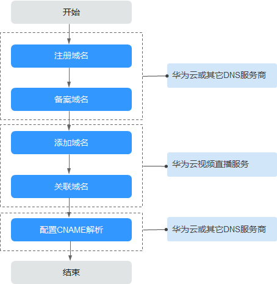

# 配置直播域名

使用直播服务前，您需要将已备案的域名添加到直播服务中。若账户的客户等级为V0或V1，则暂无域名添加权限。

## 域名准入流程

若您需要使用自有域名进行视频直播加速，请参考如下流程进行操作。

**图 1**  域名准入流程  

1.  注册域名：若还未有自有域名，您可以在华为云购买或注册域名，具体请参见[域名注册服务](https://www.huaweicloud.com/product/domain.html)。
2.  备案域名：自有域名需要在工信部完成备案，您可以在华为云[备案中心](https://beian.huaweicloud.com/)完成。
3.  添加自有域名：将已备案的域名添加到视频直播服务中，用于直播推流和视频播放，您需要分别添加推流域名和播放域名，然后完成[域名关联](关联域名.md)，具体请参见[新增域名](#section1326884516114)。
4.  配置CNAME解析：需要在域名DNS服务商处完成CNAME解析配置，将您的域名指向视频直播分配的CNAME，具体请参见[配置CNAME](配置CNAME.md)。

## 新增域名

1.  登录[视频直播控制台](https://console.huaweicloud.com/live)。
2.  在左侧导航树中选择“域名管理“，进入域名管理页面。
3.  单击“添加域名“。在弹出的“添加域名“页面输入已申请的播放或推流域名。

    **注意**：若您的域名未备案，将添加失败，并提示“**添加域名失败：ICP编号不存在**”。

    **图 2**  添加域名  
    

    **表 1**  域名参数说明

    
    <table><thead align="left"><tr id="row1763962516105"><th class="cellrowborder" valign="top" width="18.2%" id="mcps1.2.3.1.1">
参数名

    </th>
    <th class="cellrowborder" valign="top" width="81.8%" id="mcps1.2.3.1.2">
描述

    </th>
    </tr>
    </thead>
    <tbody><tr id="row17444848108"><td class="cellrowborder" valign="top" width="18.2%" headers="mcps1.2.3.1.1 ">
域名

    </td>
    <td class="cellrowborder" valign="top" width="81.8%" headers="mcps1.2.3.1.2 ">
输入推流域名或播放域名，域名长度需要在42个字符以内。

    
<strong id="b1010674910108">注意</strong>：推流域名与播放域名不能相同。

    
举例：“test-push.example.com”。

    </td>
    </tr>
    <tr id="row1336715011110"><td class="cellrowborder" valign="top" width="18.2%" headers="mcps1.2.3.1.1 ">
域名类型

    </td>
    <td class="cellrowborder" valign="top" width="81.8%" headers="mcps1.2.3.1.2 ">
若“域名”中输入的是推流域名则选择推流域名，否则，选择播放域名。

    </td>
    </tr>
    </tbody>
    </table>

    > **说明：**   
    >备案的一级域名不能直接作为推流域名或播放域名，若您的备案域名为“example.com”，则您可以使用子域名“test-push.example.com”和“test-play.example.com”作为推流域名和播放域名。  

4.  单击“确定“。

    在“域名管理“页面的列表中会新增一条“状态“为“配置中“的域名记录。当“状态“为“正常“时，域名添加成功。

    **图 3**  域名添加成功  
    

播放域名添加后，需要关联添加的推流域名才可使用直播服务，具体请参见[关联域名](关联域名.md)。

域名添加完成后，您需要在播放域名和推流域名的DNS服务商处配置CNAME，将您的域名指向CDN配置的CNAME地址。具体操作请见[配置CNAME](配置CNAME.md)，配置完成后，对应的域名会自动启用直播加速服务。

## 常见问题

-   [直播域名添加失败](https://support.huaweicloud.com/trouble-live/live150001.html)
-   [添加域名提示无权限怎么办？](https://support.huaweicloud.com/live_faq/live_08_0028.html)

