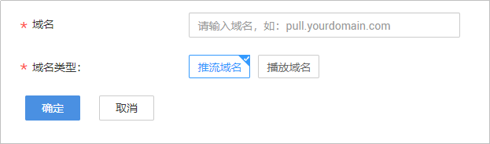
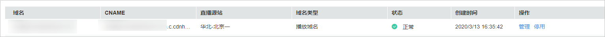
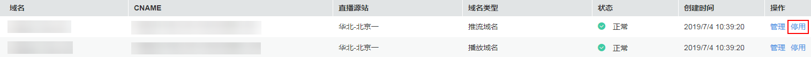
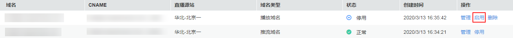

# 配置直播域名

使用直播服务前，您需要将已备案的域名添加到直播服务中。若账户的客户等级为V0或V1，则暂无域名添加权限。

## 域名准入流程

若您需要使用自有域名进行视频直播加速，请参考如下流程进行操作。

**图 1**  域名准入流程  

1.  注册域名：若还未有自有域名，您可以在华为云购买或注册域名，具体请参见[域名注册服务](https://www.huaweicloud.com/product/domain.html)。
2.  备案域名：自有域名需要在工信部完成备案，您可以在华为云[备案中心](https://beian.huaweicloud.com/)完成。
3.  添加自有域名：将已备案的域名添加到视频直播服务中，用于直播推流和视频播放，具体请参见[新增域名](#section1326884516114)。
4.  配置CNAME解析：需要在域名DNS服务商处完成CNAME解析配置，将您的域名指向视频直播分配的CNAME，具体请参见[配置CNAME](配置CNAME.md)。

## 新增域名

1.  登录[视频直播控制台](视频直播控制台https://console.huaweicloud.com/live)。
2.  在左侧导航树中选择“域名管理“，进入域名管理页面。
3.  单击“添加域名“。在弹出的“添加域名“页面输入已申请的播放和推流域名。

    **注意**：若您的域名未备案，将添加失败，并提示“**添加域名失败：ICP编号不存在**”。

    **图 2**  添加域名  
    

    **表 1**  域名参数说明

    
    <table><thead align="left"><tr id="row1763962516105"><th class="cellrowborder" valign="top" width="18.2%" id="mcps1.2.3.1.1">
参数名

    </th>
    <th class="cellrowborder" valign="top" width="81.8%" id="mcps1.2.3.1.2">
描述

    </th>
    </tr>
    </thead>
    <tbody><tr id="row7639152501012"><td class="cellrowborder" valign="top" width="18.2%" headers="mcps1.2.3.1.1 ">
播放域名

    </td>
    <td class="cellrowborder" valign="top" width="81.8%" headers="mcps1.2.3.1.2 ">
用于播放直播流的域名，必选配置项，请输入提前准备的播放域名。

    
域名长度需要在42个字符以内。

    
举例：“test-play.example.com”。

    </td>
    </tr>
    <tr id="row563942511013"><td class="cellrowborder" valign="top" width="18.2%" headers="mcps1.2.3.1.1 ">
推流域名

    </td>
    <td class="cellrowborder" valign="top" width="81.8%" headers="mcps1.2.3.1.2 ">
用于推流的域名，必选配置项，请输入提前准备的推流域名。

    
域名长度需要在42个字符以内。

    
<strong id="b1137411547540">注意</strong>：推流域名与播放域名不能相同。

    
举例：“test-push.example.com”。

    </td>
    </tr>
    <tr id="row116391625141016"><td class="cellrowborder" valign="top" width="18.2%" headers="mcps1.2.3.1.1 ">
服务许可证号

    </td>
    <td class="cellrowborder" valign="top" width="81.8%" headers="mcps1.2.3.1.2 ">
已申请的用于经营电信、互联网等业务的资质许可证编号。您也可以在域名添加后再补充。

    </td>
    </tr>
    </tbody>
    </table>

    > **说明：**   
    >备案的一级域名不能直接作为推流域名或播放域名，若您的备案域名为“example.com”，则您可以使用子域名“test-push.example.com”和“test-play.example.com”作为推流域名和播放域名。  

4.  单击“确定“。

    在“域名管理“页面的列表中会新增一条“状态“为“配置中“的域名记录。当“状态“为“正常“时，域名添加成功。

    **图 3**  域名添加成功  
    

域名添加完成后，您需要在播放域名和推流域名的DNS服务商处配置CNAME，将您的域名指向CDN配置的CNAME地址。具体操作请见[配置CNAME](配置CNAME.md)，配置完成后，对应的域名会自动启用直播加速服务。

## 管理域名

新增域名后，您还可以在域名管理页面进行如下操作：

-   查看域名基本信息

    您可以在域名管理页面，查看已添加域名的状态及创建时间。

    **图 4**  域名状态  
    

    单击右侧操作列的“管理”，可查看域名的详细基本信息。

    **图 5**  域名信息  
    

    > **说明：**   
    >“审核状态”只是表示ICP和服务许可证处于审核中，与域名是否生效无关，一个月内暂不影响直播服务的使用。但您需要在域名添加后的1个月内提交服务许可证，若在一定时间内未提交或审核未通过，华为云将会对您的直播服务进行流量限制，届时华为云技术客服将会联系到您，说明具体情况。  

-   停用域名

    若您需要停用某个域名，可以在需要停用的域名行单击“停用”。当“状态“变为“停用“时，表示域名停用成功。

    **图 6**  域名停用  
    

-   启用域名

    若您需要将某个已停用的直播域名重新启用，可以在需要启用的域名行单击“启用“。当“状态“变为“正常“时，表示域名启用成功。

    **图 7**  域名启用  
    

-   删除域名

    **注意**：仅在“停用“状态下的域名才能删除。因此，您需要先停用不需要的域名，再在需要删除的域名行单击“删除”即可。

    **图 8**  域名删除  
    

## 提交服务许可证号

若域名添加时未填写服务许可证号，您可在已添加的域名行单击“管理”，在“基本信息”页签的“备案信息”板块单击，填写服务许可证号。服务许可证的办理请参见[服务许可证是否是必须的？如何办理？](https://support.huaweicloud.com/live_faq/live080008005.html)。

**注意**：您需要在域名添加后的1个月内完成服务许可证号的提交，避免因审核未通过而影响直播服务的使用。

**图 9**  提交服务许可证号  

## 常见问题

-   [如何进行ICP备案？](https://support.huaweicloud.com/live_faq/live080008002.html)
-   [服务许可证是否是必须的？如何办理？](https://support.huaweicloud.com/live_faq/live080008005.html)
-   [直播域名添加失败](https://support.huaweicloud.com/trouble-live/live150001.html)
-   [是否支持HTTPS安全加速？](https://support.huaweicloud.com/live_faq/live080009002.html)

