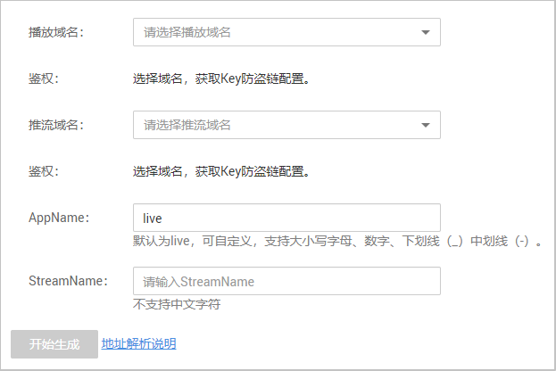
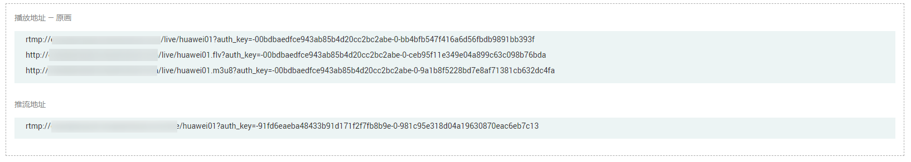

# 防盗地址生成

配置了Key防盗链后，您可以使用该工具快速生成推流域名和播放域名的鉴权URL。仅支持部署在新版视频直播服务上的域名生成对应的鉴权地址。

## 注意事项

此功能暂只支持“华北-北京四”区域。

## 前提条件

推流域名和播放域名已完成Key防盗链配置，若未配置，请参见[推流鉴权](推流鉴权.md)和[播放鉴权](Key防盗链.md)。

## 操作步骤

1.  登录[视频直播控制台](https://console.huaweicloud.com/live)。
2.  在左侧导航树中选择“工具库 \> 防盗地址生成”，进入防盗地址生成页面。
3.  选择需要生成鉴权URL的播放域名和推流域名，设置“AppName“和“StreamName“。

    > **说明：** 
    >若需要生成转码后的鉴权播放地址，请在“StreamName“中填写入“StreamName\_转码模板ID“，其中“\_转码模板ID“在视频直播控制台的“转码配置“页面获取 。示例：huawei01\_lld。

    **图 1**  鉴权地址生成  
    

4.  单击“开始生成”，即可生成对应的鉴权推流地址和播放地址。

    **图 2**  鉴权地址  
    

